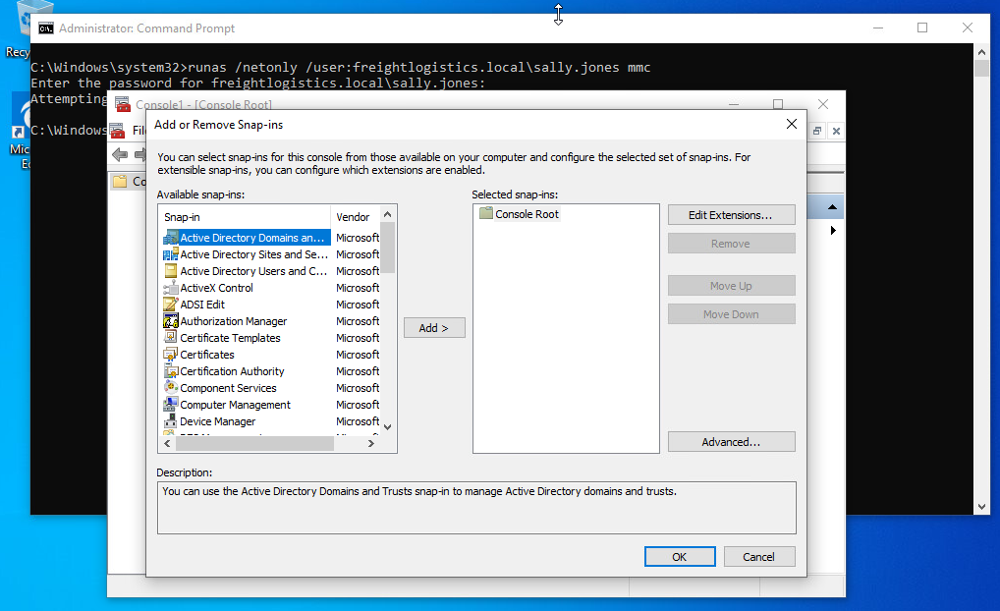
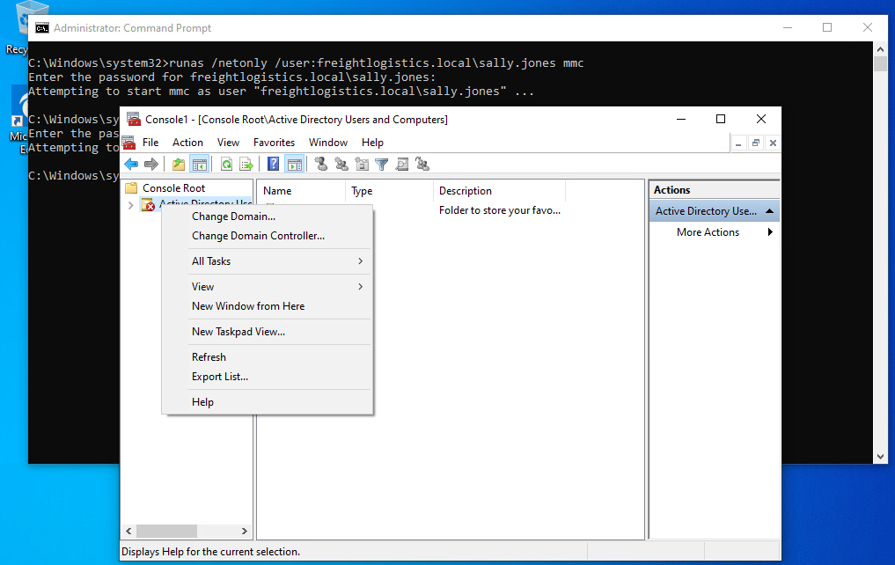

	---
title: Microsoft Management Console (MMC)
author: amandaguglieri
draft: false
TableOfContents: true
tags:
  - active directory
  - ldap
  - windows
---

#  Microsoft Management Console (MMC)

You use **Microsoft Management Console** (MMC) to create, save and open administrative tools, called consoles, which manage the hardware, software, and network components of your Microsoft Windows operating system.

We can also open the MMC Console from a non-domain joined computer using the following command syntax:

```cmd-session
runas /netonly /user:Domain_Name\Domain_USER mmc
```

Now, you will have the MMC interface:



We can add any of the RSAT snap-ins and enumerate the target domain in the context of the target user sally.jones in the freightlogistics.local domain. After adding the snap-ins, we will get an error message that the "specified domain either does not exist or could not be contacted." From here, we have to right-click on the Active Directory Users and Computers snap-in (or any other chosen snap-in) and choose Change Domain.



Type the target domain into the `Change domain` dialogue box, here `freightlogistics.local`. From here, we can now freely enumerate the domain using any of the AD RSAT snapins.