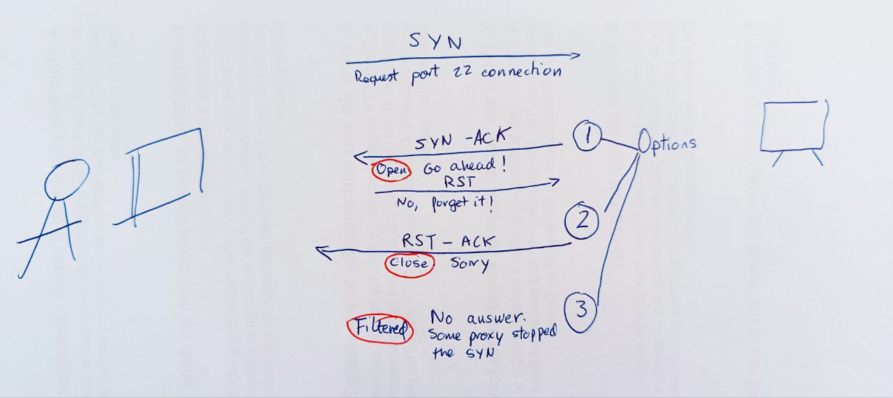

# nmap - A network exploration and security auditing tool

## Description

Network Mapper is an open source tool for network exploration and security auditing. Free and open-source scanner created by Gordon Lyon. Nmap is used to discover hosts and services on a computer network by sending packages and analyzing the responses. Another discovery feature is that of operating system detection. These features are extensible by scripts that provide more advanced service detection.

```shell-session
nmap <scan types> <options> $ip
```


```
# commonly used
nmap -sT -Pn --unprivileged --script banner $ip

# enumerate ciphers supported by the application server
nmap -sT -p 443 -Pn -unprivileged --script ssl-enum-ciphers $ip

# sync-scan the top 10,000 most well-known ports
nmap -sS $ip --top-ports 10000
```

Worthwhile for understanding how packages are sent and received is the --packet-trace option. Also --reason displays the reason for specific result.

Also, Nmap does not always recognize all information by default. Sometimes you can use [netcat](netcat.md) to interpelate a service:

```shell-session
 nc -nv $ip <PORT NUMBER>
```


## Cheat Sheet

By default, Nmap will conduct a TCP scan unless specifically requested to perform a UDP scan. 

```bash
nmap 10.0.2.1
nmap 10.0.2.1/24
nmap 10.0.2.1-254
nmap 10.0.*.*
nmap 10.0.2.1,3,17
nmap 10.0.2,4.1,3,17
nmap domain.com
nmap 10.0.2.1 -p 3389
nmap 10.0.2.1 -p 80,3389
nmap 10.0.2.1 -p 50-90
nmap 10.0.2.1 -p U:53, T:80

# ***** Saving results ******
# -----------------------------------------
# -oN: Normal output with .nmap file extension
# -oG: Grepable output with the .gnmap file extension
# -oX: XML output  with the .xml file extension
# -oA: Save results in all formats
# -oA target: Saves the results in all formats, starting the name of each file with 'target'.
sudo nmap $ip -oA path/to/target


# It forces port enumeration and it's not limited to 1000 ports
nmap $ip -p-     

# Disables port scanning. If we disable port scan (`-sn`), Nmap automatically ping scan with `ICMP Echo Requests` (`-PE`). Also called ping scan or ping sweep. More reliable that pinging the broadcast address because hosts do not reply to broadcast queries).
nmap -sn $ip

# Disables DNS resolution.
nmap -n $ip

# Disables ARP ping.
nmap $ip --disable-arp-ping

# This option skips the host discovery stage altogether. It deactivates the ICMP echo requests
nmap  -Pn  $ip  

# Scans top 100 ports.
nmap  -F  $ip 

# Shows the progress of the scan every 5 seconds.
nmap $ip --stats-every=5s

# To skip host discovery and port scan, while still allowing NMAP Scripting Engine to run, we use -Pn -sn combined.
nmap -Pn -sn $ip

# OS detection
nmap -O $ip 

# Limit OS detection to promising targets
nmap -O $ip -osscan-limit

# Guess OS more aggressively
nmap -O $ip -osscan-guess

# Version detection
nmap -sV $ip 

# Intensity level goes from 0 to 9
nmap -sV $ip –-version-intensity 8  

# tcpwrapped means that the TCP handshake was completed, 
# but the remote host closed the connection without receiving any data. 
# This means that something is blocking connectivity with the target host. 

# OS detection + version detection + script scanning + traceroute
nmap -A $ip

# Half-open scanning. SYN + SYN ACK + RST
# A well-configured IDS will still detect the scan
nmap -sS $ip

# TCP connect scan: SYN + SYN ACK + ACK + DATA (banner) +RST
# This scan gets recorded in the application logs on the target systems
nmap -sT $ip

# Scan a list of hosts. One per line in the file
nmap -sn -iL $ip hosttoscanlist.txt 

# List targets to scan
nmap -sL $ip 

# Full scanner
nmap -sC -sV -p- $ip  
# The script scan `-sC` flag causes `Nmap` to report the server headers `http-server-header` page and the page title `http-title` for any web page hosted on the webserver.


# UDP quick
nmap -sU -sV  $ip

# Called ACK scan. Returns if the port is filtered or not. Useful to determine if there is a firewall.
nmap -sA $ip 

# It sends a ACK packet. In the response we pay attention to the windows size of the TCP header. If the windows size is different from zero, the port is open. If it is zero, then port is either closed or filtered. 
nmap -sW $ip
```

To redirect results to a file > targetfile.txt


## Search and run a script in nmap

NSE: Nmap Scripting Engine.

```bash
# All scripts are located under:
/usr/share/nmaps/script


locate -r nse$|grep <term>
# if this doesn’t work, update the db with:
sudo updatedb


# Also:
locate scripts/<nameOfservice>
```

Run a script:

```bash
# Run default scripts 
nmap $ip -sC

# Run  scripts from a category. See categories below
nmap $ip --script <category>

# Run specific scripts
nmap --script <script-name>,<script-name>,<script-name> -p<port> $ip
```


NSE (Nmap Script Engine) provides us with the possibility to create scripts in Lua for interaction with certain services. There are a total of 14 categories into which these scripts can be divided: 

|**Category**|**Description**|
|---|---|
|`auth`|Determination of authentication credentials.|
|`broadcast`|Scripts, which are used for host discovery by broadcasting and the discovered hosts, can be automatically added to the remaining scans.|
|`brute`|Executes scripts that try to log in to the respective service by brute-forcing with credentials.|
|`default`|Default scripts executed by using the `-sC` option. Syntax: ```sudo nmap $ip -sC ``` |
|`discovery`|Evaluation of accessible services.|
|`dos`|These scripts are used to check services for denial of service vulnerabilities and are used less as it harms the services.|
|`exploit`|This category of scripts tries to exploit known vulnerabilities for the scanned port.|
|`external`|Scripts that use external services for further processing.|
|`fuzzer`|This uses scripts to identify vulnerabilities and unexpected packet handling by sending different fields, which can take much time.|
|`intrusive`|Intrusive scripts that could negatively affect the target system.|
|`malware`|Checks if some malware infects the target system.|
|`safe`|Defensive scripts that do not perform intrusive and destructive access.|
|`version`|Extension for service detection.|
|`vuln`|Identification of specific vulnerabilities.|

### General vulnerability assessment

```shell-session
sudo nmap $ip -p 80 -sV --script vuln 
```

#### Port 21: footprinting FTP

```bash
# Locate all ftp scripts related
find / -type f -name ftp* 2>/dev/null | grep scripts

# Run a general scanner for version, mode aggresive and perform default scripts
sudo nmap -sV -p21 -sC -A $ip
# ftp-anon NSE script checks whether the FTP server allows anonymous access.
# ftp-syst, for example, executes the `STAT` command, which displays information about the FTP server status.
```

#### Port 22: attack a ssh connection

```bash
nmap $ip -p 22 --script ssh-brute --script-args userdb=users.txt,passdb=/usr/share/nmap/nselib/data/passwords.lst
```

#### Ports 137, 138, 139, 445: footprinting SMB

```shell-session
sudo nmap $ip -sV -sC -p139,445
```


#### Grab banners of services

```bash
# Grab banner of services in an IP
nmap -sV --script=banner $ip

# Grab banners of services in a range
nmap -sV --script=banner $ip/24
```


### Enumerate samba service (smb)

```bash
# 1. Search for existing script for smb enumeration
locate -r nse$|grep <term>

# 2. Select smb-enum-shares and run it
nmap -script=smb-enum-shares $ip

# 3. Retrieve users
nmap -script=smb-enum-users $ip

# 4. Retrieve groups with passwords and user
nmap -script=smb-brute $ip

# Interact with the SMB service to extract the reported operating system version
nmap --script smb-os-discovery.nse -p445 $ip
```


## Performance

### Introducing delays or Timeouts

When Nmap sends a packet, it takes some time (Round-Trip-Time - RTT) to receive a response from the scanned port. Generally, Nmap starts with a high timeout (--min-RTT-timeout) of 100ms. 

```bash
# While connecting to the service, we noticed that the connection took longer than usual (about 15 seconds). There are some services whose connection speed, or response time, can be configured. Now that we know that an FTP server is running on this port, we can deduce the origin of our "failed" scan. We could confirm this again by specifying the minimum `probe round trip time` (`--min-rtt-timeout`) in Nmap to 15 or 20 seconds and rerunning the scan.
nmap $IP --min-rtt-timeout 15

# Optimized RTT
sudo nmap IP/24 -F --initial-rtt-timeout 50ms --max-rtt-timeout 100ms
# -F: Scans top 100 ports.
# --initial-rtt-timeout 50ms: Sets the specified time value as initial RTT timeout.
# --max-rtt-timeout 100ms: Sets the specified time value as maximum RTT timeout.
```


### Max Retries

The default value for the retry rate is 10, so if Nmap does not receive a response for a port, it will not send any more packets to the port and will be skipped.

```shell-session
sudo nmap $ip/24 -F --max-retries 0
```

### Rates

When setting the minimum rate (--min-rate) for sending packets, we tell `Nmap` to simultaneously send the specified number of packets.

```bash
sudo nmap $ip/24 -F --min-rate 300
# --min-rate 300 Sets the minimum number of packets to be sent per second.
```

### Timing

Nmap offers six different timing templates (`-T <0-5>`), being defaul one, -T 3.

| Flag | Mode|
| ---- | ------ |
| -T 0  |  Paranoid | 
| -T 1 | Sneaky | 
| -T 2 | Polite |
| -T 3 | Normal |
| -T 4 | Aggressive |
| -T 5 | Insane | 

More on [nmap documentation](https://nmap.org/book/performance-timing-templates.html).

## Firewall and IDS/IPS Evasion with nmap

An adversary uses **TCP ACK** segments to gather information about firewall or ACL configuration. The purpose of this type of scan is to discover information about filter configurations rather than port state.

1. An adversary sends TCP packets with the ACK flag set and a sequence number of zero (which means that are not associated with an existing connection to target ports).
    
2. An adversary uses the response from the target to determine the port's state. 

	- Filtered port: The target ignores the **packets**, and dropped them. No response is returned or ICMP error codes.
	- Unfiltered port: The target rejects the packets and returned an RST flag and  different types of ICMP error codes (or none at all): Net Unreachable, Net Prohibited, Host Unreachable, Host Prohibited, Port Unreachable. If a RST packet is received the target port is either closed or the ACK was sent out-of-sync. 

Unlike outgoing connections, all connection attempts (with the `SYN` flag) from external networks are usually blocked by firewalls. However, the packets with the `ACK` flag are often passed by the firewall because the firewall cannot determine whether the connection was first established from the external network or the internal network.


###  Detect a WAF

```bash
nmap -p 80 -script http-waf-detect $ip 
```

### Decoys

There are cases in which administrators block specific subnets from different regions in principle. Decoys can be used for SYN, ACK, ICMP scans, and OS detection scans. 

With the **Decoy scanning method (-D)**, Nmap generates various random IP addresses inserted into the IP header to disguise the origin of the packet sent.  

```shell-session
sudo nmap $ip -p 80 -sS -Pn -n --disable-arp-ping --packet-trace -D RND:5
# -D RND:5  Generates five random IP addresses that indicates the source IP the connection comes from.
```

Manually specify **IP address (-S)** for getting to services only accessible from individual subnets:

```shell-session
sudo nmap 10.129.2.28 -n -Pn -p 445 -O -S 10.129.2.200 -e tun0
# -n: Disables DNS resolution.
# -Pn: Disables ICMP Echo requests.
# -p 445: Scans only the specified ports.
# -O: Performs operation system detection scan.
# -S: Scans the target by using different source IP address.
# -e tun0: Sends all requests through the specified interface.
```

### DNS proxying

The DNS queries are made over the `UDP port 53`. The `TCP port 53` was previously only used for the so-called "`Zone transfers`" between the DNS servers or data transfer larger than 512 bytes. More and more, this is changing due to IPv6 and DNSSEC expansions. These changes cause many DNS requests to be made via TCP port 53.

Bypassing demilitarized zone (DMZ) by specifying DNS servers ourselves (we can use the company's DNS server). 
`--dns-server <ns>,<ns>`

We can also use TCP port 53 as a source port (`--source-port`) for our scans. If the administrator uses the firewall to control this port and does not filter IDS/IPS properly, our TCP packets will be trusted and passed through. 

Example:

```bash
# Simple SYS-Scan of a filtered port
sudo nmap $ip -p50000 -sS -Pn -n --disable-arp-ping --packet-trace
# PORT      STATE    SERVICE
# 50000/tcp filtered ibm-db2


# SYN-Scan From DNS Port
sudo nmap $ip -p50000 -sS -Pn -n --disable-arp-ping --packet-trace --source-port 53
# PORT      STATE SERVICE
# 50000/tcp open  ibm-db2
```

Following the example, a possible exploitation for this weak configuration would be:

```shell-session
nc -nv -p 53 $ip 50000
```


### UDP scans not working on VPN connections

Explanation from https://www.reddit.com/r/nmap/comments/u08lud/havin_a_rough_go_of_trying_to_scan_a_subnet_with/:

>As others have pointed out, scanning over a VPN link means you are limited to [internet-layer](https://en.wikipedia.org/wiki/Internet_protocol_suite#Key_architectural_principles) interactions and operations. The "V" in VPN stands for Virtual, and means that you are not actually on the same link as the other hosts in your subnet, so you can't get information about their link-layer connections any more than they can know whether you've connected to the VPN via Starbucks WiFi, an Ethernet cable, or a dial-up modem.
>
>You are further limited by the fact that Windows does not offer a general-purpose raw socket interface, so Nmap can't craft special packets at the network/internet layer. Usually we work around this by crafting Ethernet (link-layer) frames and injecting those with [Npcap](https://npcap.com/), but VPN links do not use Ethernet frames, so that method doesn't work. We hope to be able to add this functionality in the future, but for now, VPNs are tricky to use with Npcap, and we haven't implemented PPTP or other VPN framing in Nmap to make it work. You can still do TCP Connect scanning (`-sT`), run most NSE scripts (`-sC` or `--script`), and do service version detection (`-sV`), but things like TCP SYN scan (`-sS`), UDP scanning (`-sU`), OS detection (`-O`), and traceroute (`--traceroute`) will not work.


## How nmap works

### Ports


**Open** port:


This indicates that the connection to the scanned port has been established. These connections can be **TCP connections**, **UDP datagrams** as well as **SCTP associations**.

**Filtered** port:


Nmap cannot correctly identify whether the scanned port is open or closed because either no response is returned from the target for the port or we get an error code from the target.


**Close** port:


When the port is shown as closed, the TCP protocol indicates that the packet we received back contains an `RST` flag. This scanning method can also be used to determine if our target is alive or not.


**Unfiltered** port: 

This state of a port only occurs during the **TCP-ACK** scan and means that the port is accessible, but it cannot be determined whether it is open or closed.


**open|filtered ** port:

If we do not get a response for a specific port, Nmap will set it to that state. This indicates that a firewall or packet filter may protect the port.


**closed|filtered** port:

This state only occurs in the **IP ID idle** scans and indicates that it was impossible to determine if the scanned port is closed or filtered by a firewall.


### Probes for HOST discovery

```
TCP SYN probe (-PS <portlist>)
TCP ACK probe (-PA <portlist>)
UDP probe (-PU <portlist>)
ICMP Echo Request/Ping (-PE)
ICMP Timestamp Request (-PP)
ICMP Netmask Request (-PM)
```

List of the most filtered ports:  80, 25, 22, 443, 21, 113, 23, 53, 554, 3389, 1723. These are valuable ping ports.

### Scans

#### -sS (or TCP SYN scan)

By default, `Nmap` scans the top 1000 TCP ports with the SYN scan (`-sS`). This SYN scan is set only to default when we run it as root because of the socket permissions required to create raw TCP packets. Therefore, by default, Nmap performs a SYN Scan, though it substitutes a connect scan if the user does not have proper privileges to send raw packets (requires root access on Unix). Unprivileged users can only execute connect and FTP bounce scans.



- No connection established, but we got our response.
- Technique referred as half-open scanning, because you don't open a full TCP connection.


#### -sT (or TCP Connect scan)

TCP connect scan is the default TCP scan type when SYN scan is not an option (when not running with privileges).  The Nmap [TCP Connect Scan](https://nmap.org/book/scan-methods-connect-scan.html) (-sT) uses the TCP three-way handshake to determine if a specific port on a target host is open or closed. The scan sends an `SYN` packet to the target port and waits for a response. It is considered open if the target port responds with an SYN-ACK packet and closed if it responds with an RST packet.


#### -sN (A NULL scan)

In the SYN message that nmap sends, TCP flag header is set to 0.

If the response is:

- none: the port is open or filtered.
- RST: the port is closed.
- A response saying that it couldn't reach destiny, the port is filtered.


#### -sA (ACK scan)

Returns if the port is filtered or  not. It's useful to detect a firewall. Filtered ports reveals the existence of some kind of firewall.


A variation of the TCP ACK scan is the TCP Windows scan.


#### -sW (TCP Windows scan)

It also sends an ACK packet. In the response we pay attention to the Windows size of the TCP header_

- If the windows size is different from 0, the port is open.
- If the windows size is 0, the port is either close or filtered.


## How To Identify Operating System Using TTL Value And Ping Command

After running:

```shell-session
sudo nmap $ip -sn -oA host -PE --packet-trace --disable-arp-ping 
```

We can get:

```shell-session
Starting Nmap 7.80 ( https://nmap.org ) at 2020-06-15 00:12 CEST
SENT (0.0107s) ICMP [10.10.14.2 > 10.129.2.18 Echo request (type=8/code=0) id=13607 seq=0] IP [ttl=255 id=23541 iplen=28 ]
RCVD (0.0152s) ICMP [10.129.2.18 > 10.10.14.2 Echo reply (type=0/code=0) id=13607 seq=0] IP [ttl=128 id=40622 iplen=28 ]
Nmap scan report for 10.129.2.18
Host is up (0.086s latency).
MAC Address: DE:AD:00:00:BE:EF
Nmap done: 1 IP address (1 host up) scanned in 0.11 seconds
```

You can quickly detect whether a system is running with Linux, or Windows or any other OS by looking at the TTL value from the output of the **`ping`** command. You don't need any extra applications to detect a remote system's OS. The default initial TTL value for **Linux/Unix** is **64**, and TTL value for **Windows** is **128**.


## Saving the results

```shell-session
-oN: Normal output with .nmap file extension
-oG: Grepable output with the .gnmap file extension
-oX: XML output  with the .xml file extension
-oA: Save results in all formats
```

With the XML output, we can easily create HTML reports. To convert the stored results from XML format to HTML, we can use the tool  [xsltproc](xsltproc.md).


```shell-session
xsltproc target.xml -o target.html
```


## Quick techniques


### Host Enumeration: Determining if host is alive with ARP ping

It can be done with `-packet-trace` or  with  `--reason`. 

```shell-session
sudo nmap <IP> -sn -oA host -PE --packet-trace
# -sn 	Disables port scanning.
# -oA host 	Stores the results in all formats starting with the name 'host'.
# -PE 	Performs the ping scan by using 'ICMP Echo requests' against the target.
# --packet-trace 	Shows all packets sent and received
```

```shell-session
sudo nmap <IP> -sn -oA host -PE --reason
# -sn 	Disables port scanning.
# -oA host 	Stores the results in all formats starting with the name 'host'.
# -PE 	Performs the ping scan by using 'ICMP Echo requests' against the target.
# --reason 	Displays the reason for specific result.
```

To disable ARP requests and scan our target with the desired `ICMP echo requests`, we can disable ARP pings by setting the "`--disable-arp-ping`" option.


### Port scanning: having a clear view of a SYN scan on a port 


To have a clear view of the SYN scan on port 21,  disable the ICMP echo requests (`-Pn`), DNS resolution (`-n`), and ARP ping scan (`--disable-arp-ping`).

```shell-session
sudo nmap <IP> -p 21 --packet-trace -Pn -n --disable-arp-ping
```

### Performing a FTP bounce attack

An FTP bounce attack is a network attack that uses FTP servers to deliver outbound traffic to another device on the network. For instance, consider we are targetting an FTP Server `FTP_DMZ` exposed to the internet. Another device within the same network, `Internal_DMZ`, is not exposed to the internet. We can use the connection to the `FTP_DMZ` server to scan `Internal_DMZ` using the FTP Bounce attack and obtain information about the server's open ports.

```shell-session
nmap -Pn -v -n -p80 -b anonymous:password@$ipFTPdmz $ipINTERNALdmz
# -b The `Nmap` -b flag can be used to perform an FTP bounce attack: 
```
