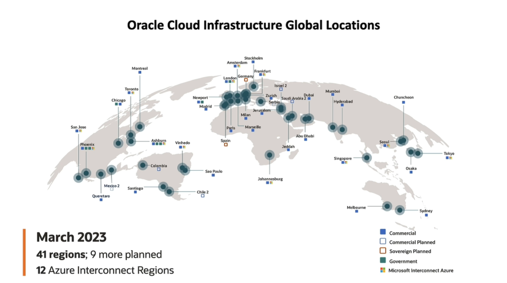
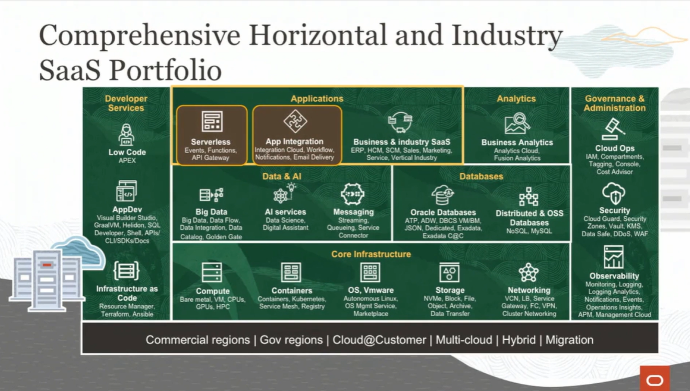
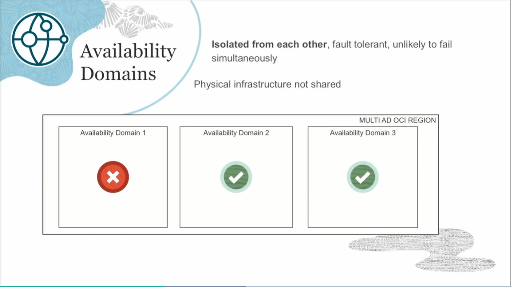
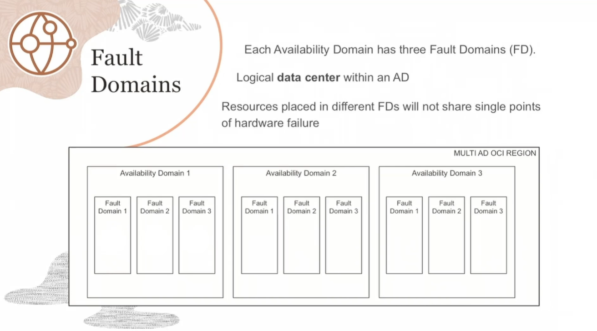
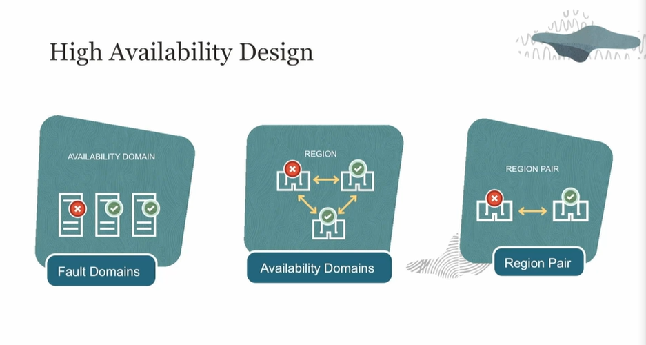

# Notes

Oci has more than 80 services.

Instead of regions and availability zones, in Oracle we have Regions and **Availability Domains**. Instead of datacenters as next level, we have fault domains.

Instead of datacenters as next level, we have fault domains.

