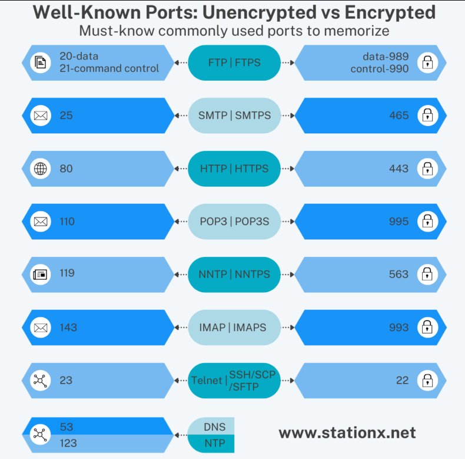

# Well known ports

Port numbers range from 1 to 65,535, with the range of well-known ports 1 to 1,023 being reserved for privileged services. Port 0 is a reserved port in TCP/IP networking and is not used in TCP or UDP messages. If anything attempts to bind to port 0 (such as a service), it will bind to the next available port above port 1,024 because port 0 is treated as a "wild card" port.

To locate easily one: [https://www.cheatsheet.wtf/PortNumbers/](https://www.cheatsheet.wtf/PortNumbers/)

All ports in raw: [https://raw.githubusercontent.com/maraisr/ports-list/master/all.csv](https://raw.githubusercontent.com/maraisr/ports-list/master/all.csv).

