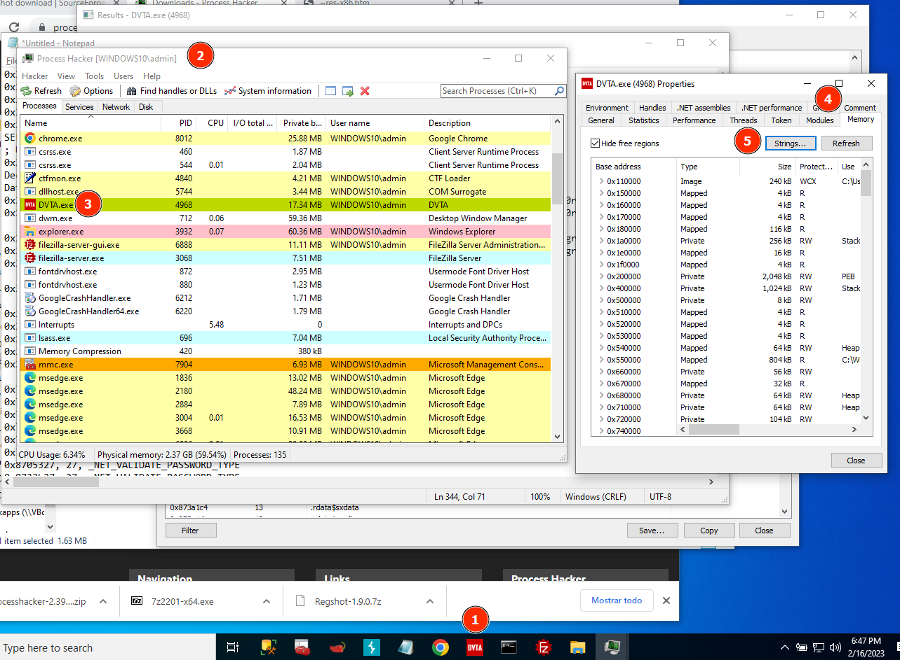

# Process Hacker tool

## Usage

In the course [Pentesting thick clients applications](thick-applications/tca-introduction.md).

We will be using the portable version.

**1.** Open the application you want to test.

**2.** Open Process Hacker Tool.

**3.** Select the application, click right on "Properties".

**4.** Select tab "Memory".

**5.** Click on "Strings".

**6.** Check "Image" and "Mapped" and search!

**7**. In the results you can use the Filter option to search for (in this case) "data source". 

Other possible searches: Decrypt.
Clear text conection string in memory reveals credentials: powned!!!

