# Thick app Attack example

!!! abstract "General index of the course"
    - [Introduction](../thick-applications/index.md).
    - [Tools for pentesting thick client applications](tools-for-thick-apps.md).
    - [Basic lab setup](tca-basic-lab-setup.md).
    - [First challenge: enabling a button](tca-first-challenge.md).
    - [Information gathering phase](tca-information-gathering-phase.md).
    - [Traffic analysis](tca-traffic-analysis.md).
    - [Attacking thick clients applications](tca-attacking-thick-clients-applications.md).
    - [Reversing and patching thick clients applications](tca-reversing-and-patching.md).    
    - [Common vulnerabilities](tca-common-vulnerabilities.md).
    - [Attack example](tca-attack-example.md)


From: https://academy.hackthebox.com/module/113/
Thick clients apps.

## Example 1

**Perform an analysis of C:\Apps\Restart-OracleService.exe and identify the credentials hidden within its source code. Submit the answer using the format username:password.**

We connect to the machine via RDP:

```
xfreerdp /v:10.129.117.65 /u:cybervaca /p:'&aue%C)}6g-d{w' /cert:ignore
```

We open the tool `ProcMon64` from [SysInternals](https://learn.microsoft.com/en-gb/sysinternals/downloads/procmon) located at c:\Tools\ProcessMonitor\Procmon64.exe. We set the filter "Process name" contains Restart-OracleService

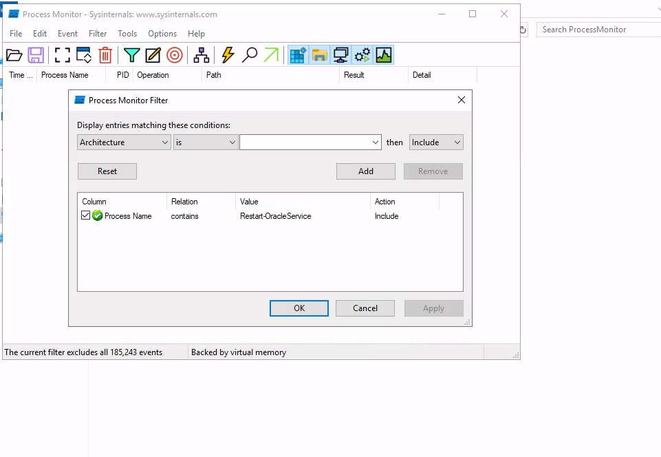

and Start the capture.


We start the C:\Apps\Restart-OracleService.exe program

```
cd C:\Apps\
.\Restart-OracleService.exe 
```

We can see in the process monitor that the temp folder is being written with some content. 

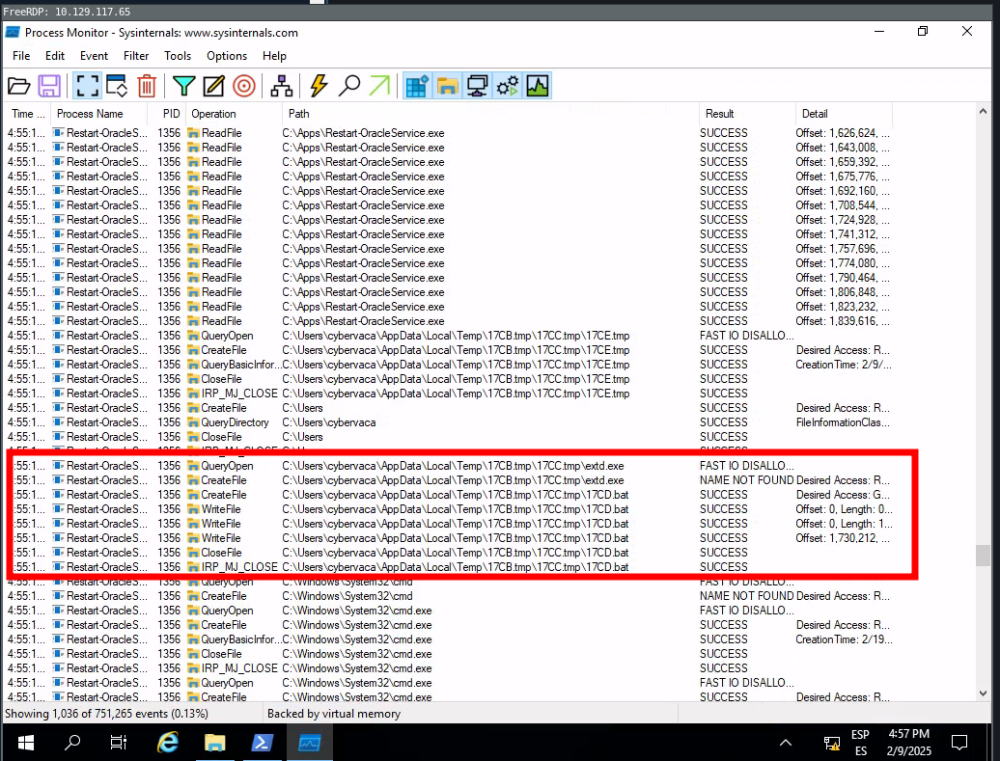

We browse to the Temp folder C:\Users\cybervaca\AppData\Local\Temp and retrieve the .bat file

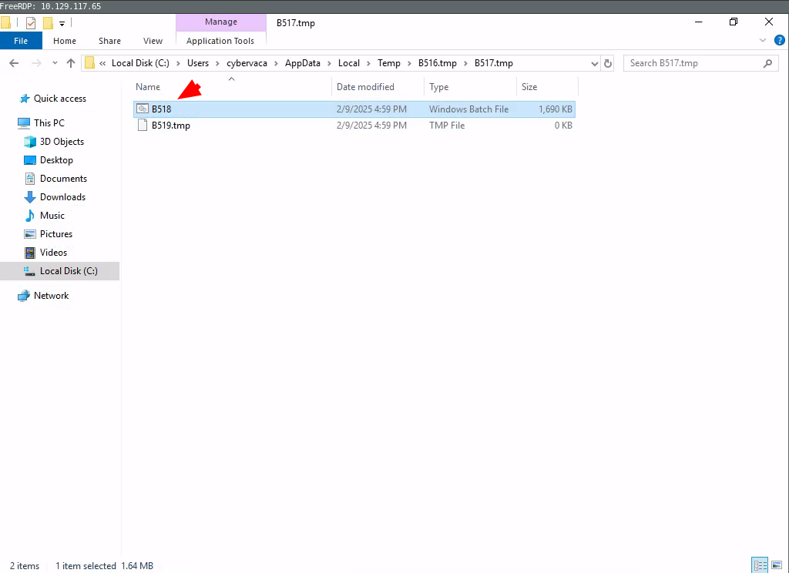

When opening witht the Notepad, we observe some lines removing some scripts and the executable. We can remove the del lines and execute again the program:

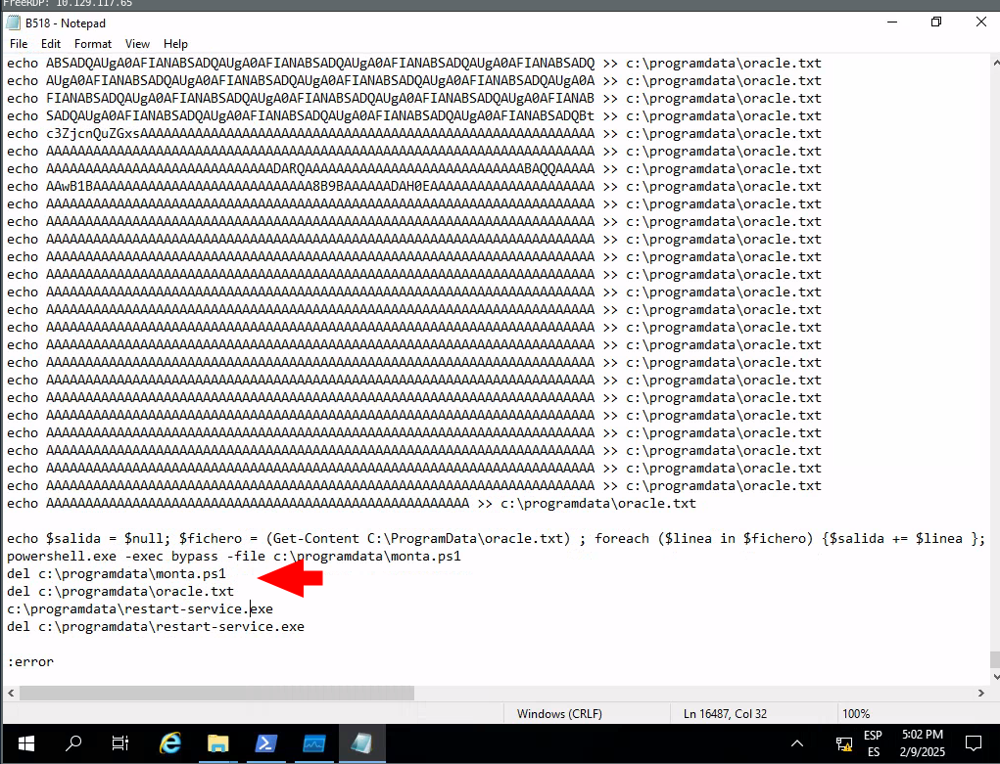

```
.\Restart-OracleService.exe 
```

Now, if we browse to c:\ProgramData we will see the new files monta.ps1, oracle.txt:

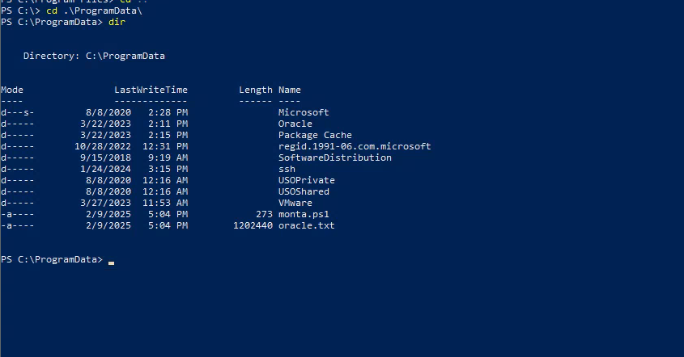

We can read the script:

```powershell
cat C:\programdata\monta.ps1
```

```powershell
$salida = $null; $fichero = (Get-Content C:\ProgramData\oracle.txt) ; foreach ($linea in $fichero) {$salida += $linea }; $salida = $salida.Replace(" ",""); [System.IO.File]::WriteAllBytes("c:\programdata\restart-service.exe", [System.Convert]::FromBase64String($salida))
```

This script simply reads the contents of the `oracle.txt` file and decodes it to the `restart-service.exe` executable. Running this script gives us a final executable that we can further analyze.

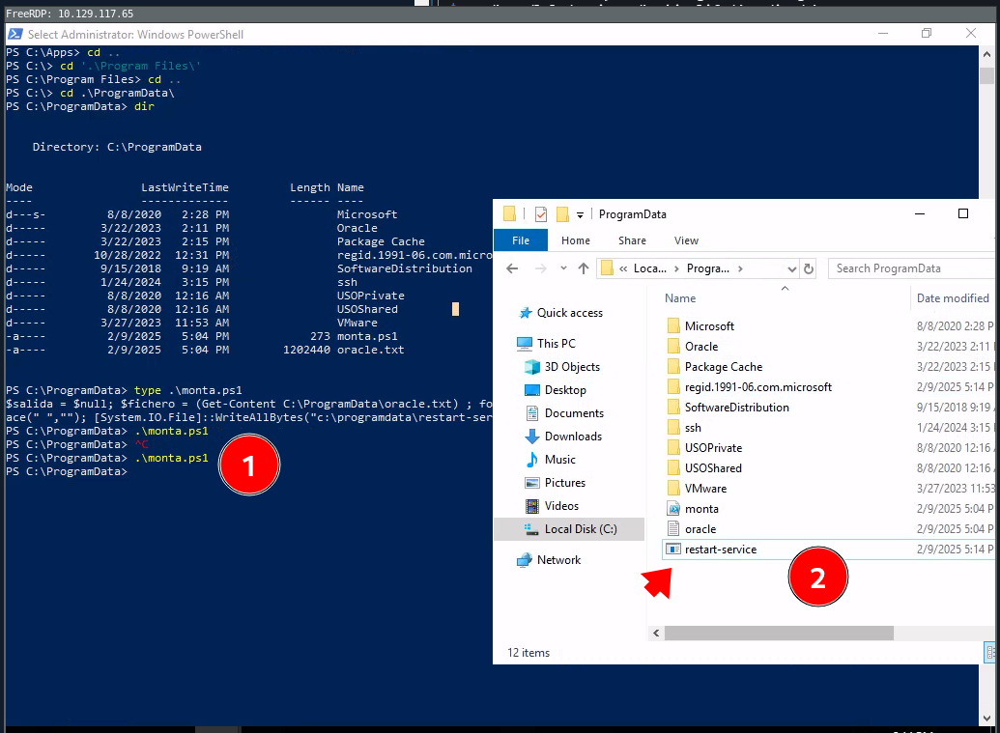

Now, we will start procmon64, and modify the filter to catch those process name that contains restart-service string. And we launch the restart-service.

We will  start `x64dbg`, navigate to `Options` -> `Preferences`, and uncheck everything except `Exit Breakpoint`: By unchecking the other options, the debugging will start directly from the application's exit point, and we will avoid going through any `dll` files that are loaded before the app starts.

Then, we can select `file` -> `open` and select the `restart-service.exe` to import it and start the debugging. Once imported, we right click inside the `CPU` view and `Follow in Memory Map`.

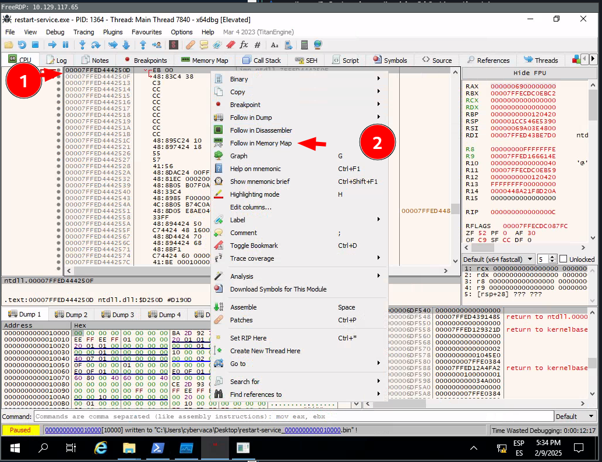

We will double click on the first line:

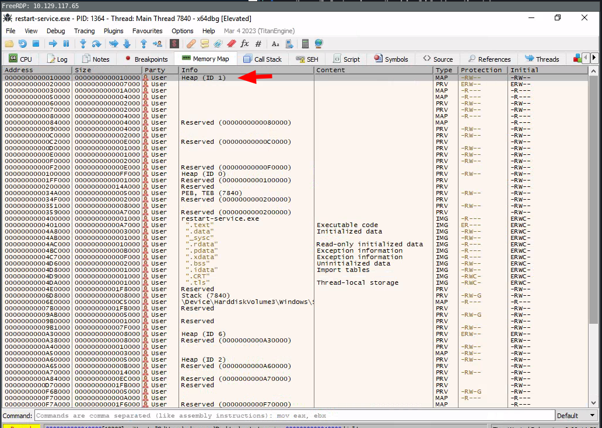

If we double-click on it, we will see the magic bytes `MZ` in the `ASCII` column that indicates that the file is a [DOS MZ executable](https://en.wikipedia.org/wiki/DOS_MZ_executable). Memory-mapped files allow applications to access large files without having to read or write the entire file into memory at once. Instead, the file is mapped to a region of memory that the application can read and write as if it were a regular buffer in memory. This could be a place to potentially look for hardcoded credentials.

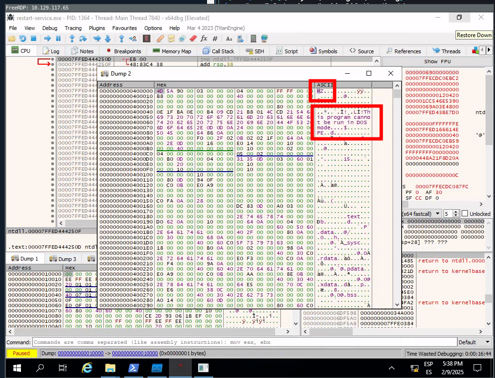

Let's return to the Memory Map pane, then export the newly discovered mapped item from memory to a dump file by right-clicking on the address and selecting `Dump Memory to File`.

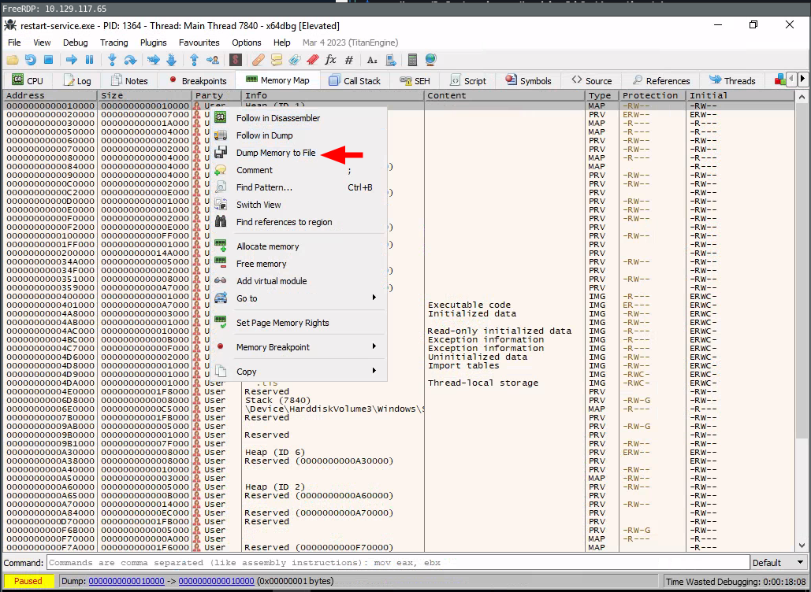

We run Strings and notice that it  contains a binary:

```
.\strings.exe C:\Users\cybervaca\Desktop\restart-service_0000000000A50000.bin
```

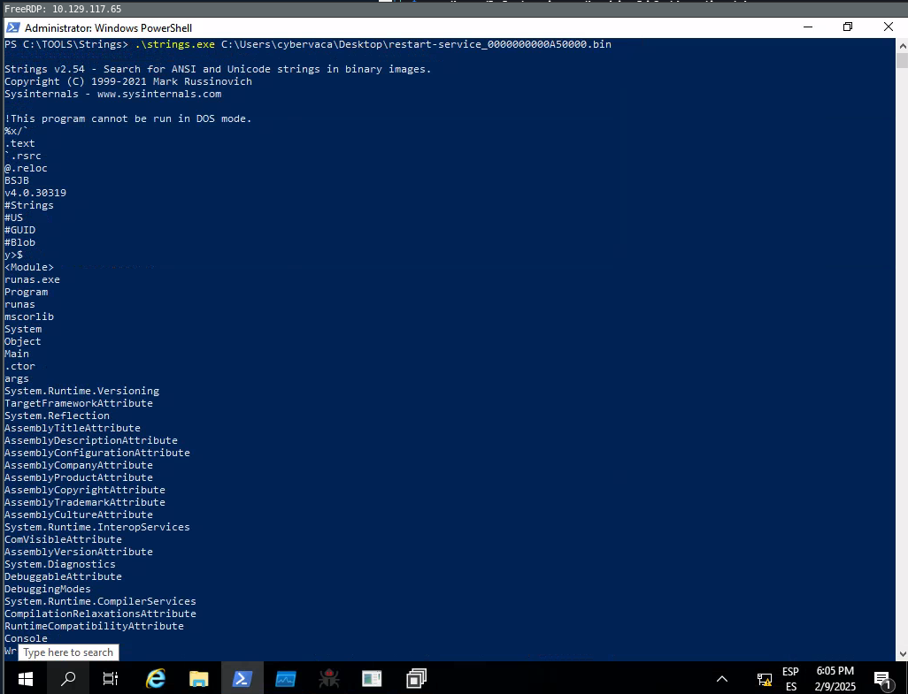

If we open it with dnspy, we will be able to see some creds:

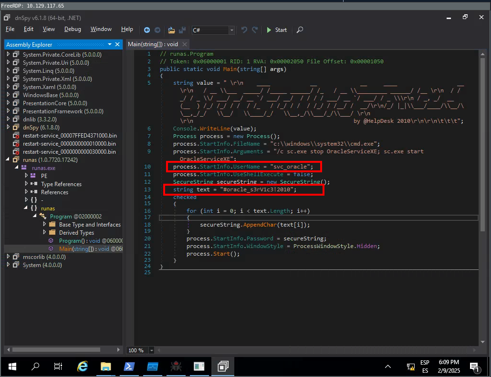

Results: svc_oracle:#oracle_s3rV1c3!2010

## Example 2

During penetration testing, it is common for someone to encounter a thick client application that connects to a server to communicate with the database. The following scenario demonstrates a case where the tester has found the following files while enumerating an FTP server that provides `anonymous` user access.

- fatty-client.jar
- note.txt
- note2.txt
- note3.txt