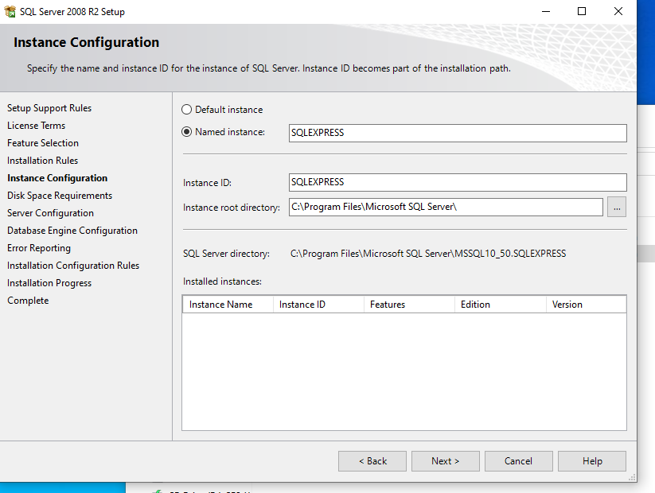
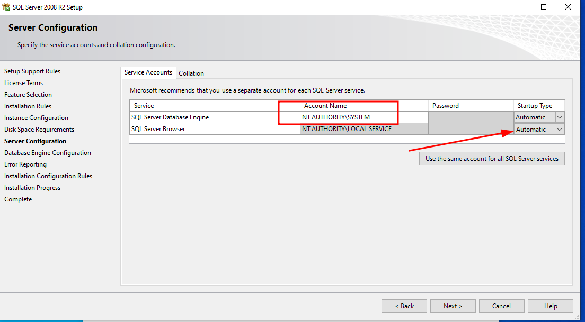
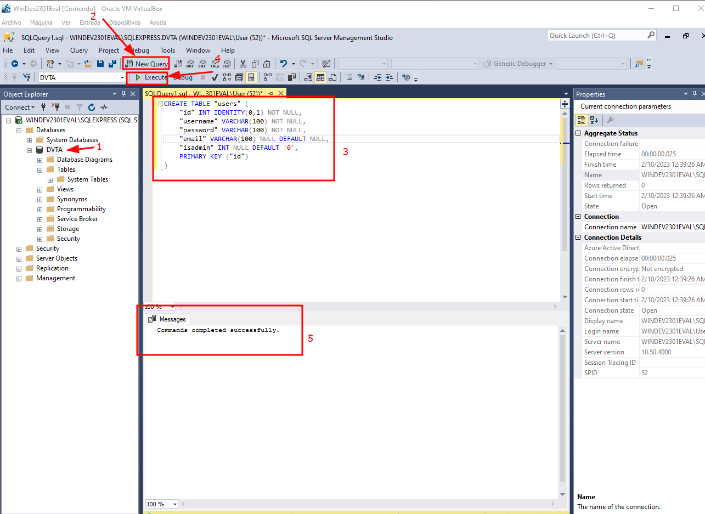
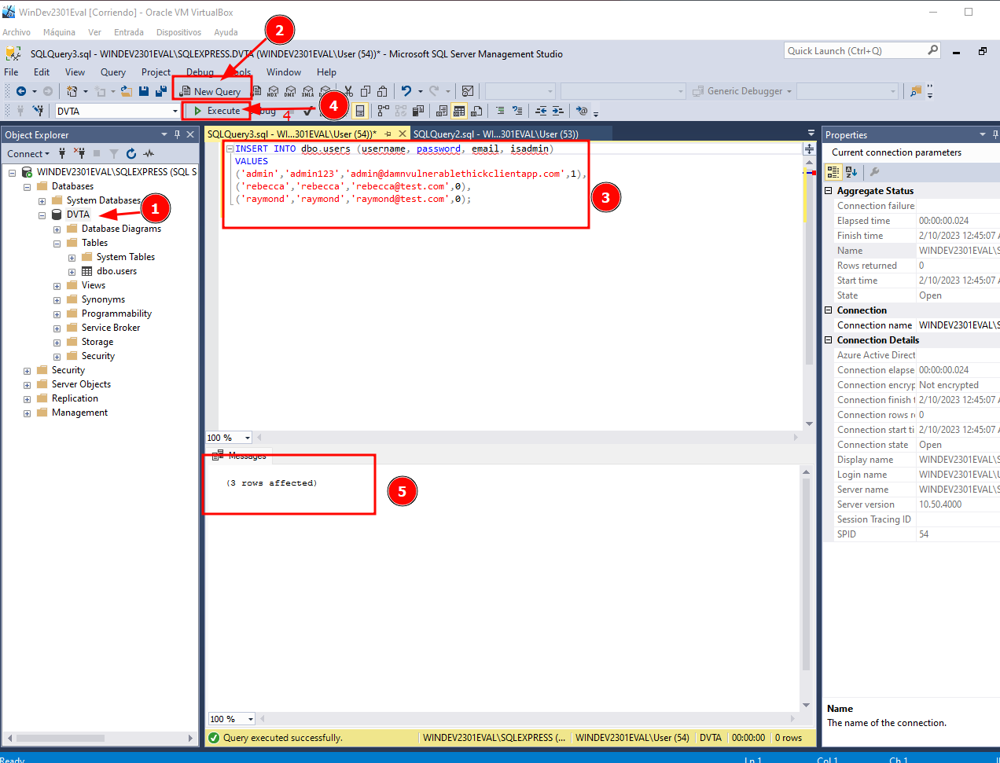
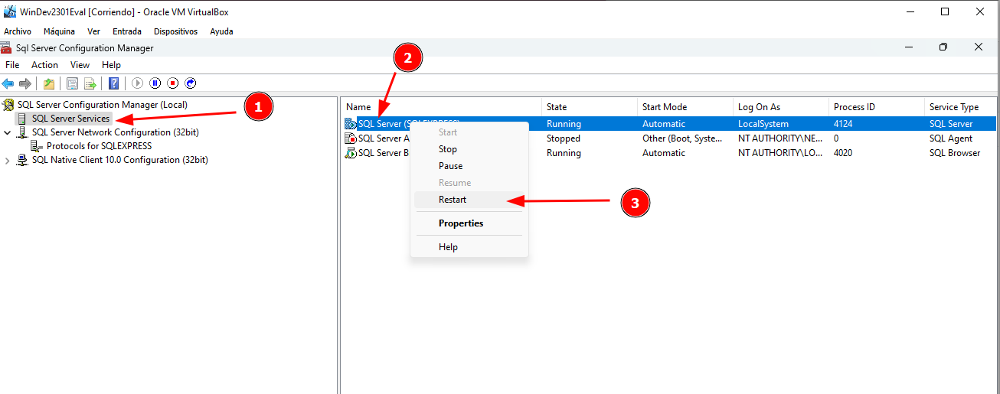
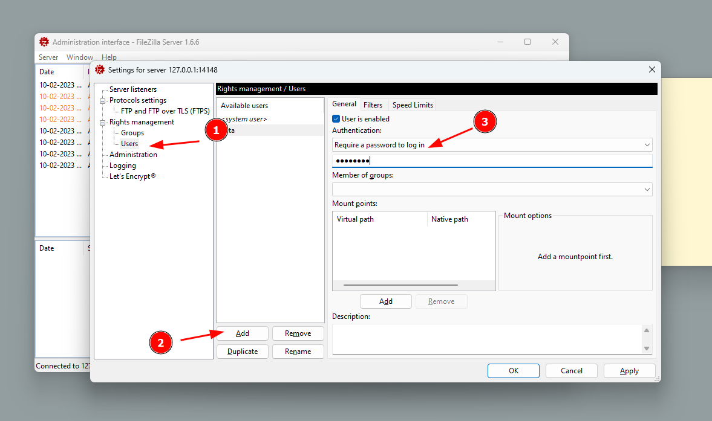
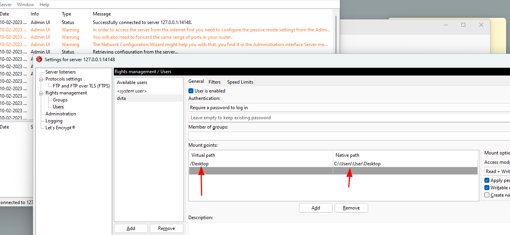

# Basic Lab Setup - Thick client Applications 

!!! abstract "General index of the course"
    - [Tools for pentesting thick client applications](tools-for-thick-apps.md).
    - [Introduction](tca-introduction.md).
    - [Basic lab setup](tca-basic-lab-setup.md).
    - [First challenge: enabling a button](tca-first-challenge.md).
    - [Information gathering phase](tca-information-gathering-phase.md).
    - [Traffic analysis](tca-traffic-analysis.md).
    - [Attacking thick clients applications](tca-attacking-thick-clients-applications.md).
    - [Reversing and patching thick clients applications](tca-reversing-and-patching.md).    
    - [Common vulnerabilities](tca-common-vulnerabilities.md).

## Environment description

- VirtualBox or VMWare Installation workstation.
- Windows 10 VM 1 (database) -> SQL server.
-  (optional) Windows 10 VM 2 (client) -> DVTA.

**In the course we will be using an unique Windows 10 machine with both the SQL server and the DVTA application installed. Therefore, there will not be the need to have a second Windows 10 VM since all the needed applications will be installed on this unique virtual machine.**

## Software resources

- Get windows 10 iso from: [Repo for legacy Operating system](../operating-systems.md).
- Damn Vulnerable Thick Client Application DVTA (modified version given in the course): https://drive.google.com/open?id=1u46XDgVpCiN6eGAjILnhxsGL9Pl2qgcD.
- SQL Server Express 2008: [SQL Server® 2008 R2 SP2](https://www.microsoft.com/en-US/download/details.aspx?id=30438).
- SQL Server Management Studio [SQL Server Management Studio (SSMS)](https://learn.microsoft.com/en-us/sql/ssms/download-sql-server-management-studio-ssms?view=sql-server-ver16#download-ssms).
- Filezilla FTP Server: [FileZilla Server for Windows (64bit x86) (filezilla-project.org)](https://filezilla-project.org/download.php?type=server).


Now, open the Windows 10 VM and start the lab setup!

## 1. Install SQL Server Express 2008

In the [Download page](https://www.microsoft.com/en-US/download/details.aspx?id=30438) we will choose SQLEXPR_x64_ENU.exe. 

Some helpful tips and screenshots about the installation:






## 2. Install SQL Server Management Studio 19.0.1

This installation is pretty straighforward. [Download page](https://learn.microsoft.com/en-us/sql/ssms/download-sql-server-management-studio-ssms?view=sql-server-ver16#download-ssms)


### Creating database DTVA four our vuln thick app

We will create the database "DVTA" and we will populate it with some users and expenses:

**1.** Open SSMS (SQL Server Management Studio) and right click on the "Database" object, and create a new database called DVTA.


**2.**  Create a new table "users" in the database DVTA.



Here is the query:

```
CREATE TABLE "users" (
    "id" INT IDENTITY(0,1) NOT NULL,
    "username" VARCHAR(100) NOT NULL,
    "password" VARCHAR(100) NOT NULL,
    "email" VARCHAR(100) NULL DEFAULT NULL,
    "isadmin" INT NULL DEFAULT '0',
    PRIMARY KEY ("id")
)
```

**3**. Populate the database with 3 given users:



Here is the query:

```
INSERT INTO dbo.users (username, password, email, isadmin)
VALUES
('admin','admin123','admin@damnvulnerablethickclientapp.com',1),
('rebecca','rebecca','rebecca@test.com',0),
('raymond','raymond','raymond@test.com',0);
```

**4.**  Create the  table "expenses" in the database DVTA.


Here is the query:

```
CREATE TABLE "expenses" (
    "id" INT IDENTITY(0,1) NOT NULL,
    "email" VARCHAR(100) NOT NULL,
    "item" VARCHAR(100) NOT NULL,
    "price" VARCHAR(100) NOT NULL,
    "date" VARCHAR(100) NOT NULL,
    "time" VARCHAR(100) NULL DEFAULT NULL,
    PRIMARY KEY ("id")
)
```

### Adittional configurations 

Some configurations need to be done so the conection works: 

**1.** Open  SQL Server Configuration Manager and enable TCP/IP Protocol conections:


**2**. Also in SQL Server Configuration Manager, restart SQL Server (SQLEXPRESS)




## 3. Install Filezilla FTP server

**1.** Download Filezilla Server, install it and initiate a connection: [Download page](https://filezilla-project.org/download.php?type=server)

As for the conection initiation, I'm using localhost 127.0.0.1, port 14148 and password "filezilla": 


**2.** Add a user. Name "dvta" and password "p@ssw0rd"



**3.** Add a Shared folder. Be careful with slashes and backslashes (wink!) not to get the typical error "error on row number 1 virtual path must be absolute".


