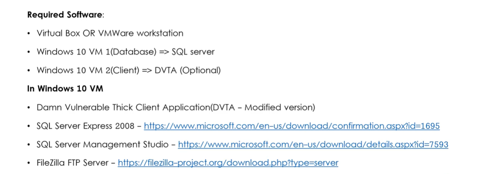

# Basic Lab Setup - Thick client Applications 

??? abstract "General index of the course"
    - [Introduction](tca-introduction.md)
    - [Basic lab setup](tca-basic-lab-setup.md)
    - [First challenge: enabling a button](tca-first-challenge.md)
    - [Information gathering phase](tca-information-gathering-phase.md).
    - [Traffic analysis](tca-traffic-analysis.md).
    - [Attacking thick clients applications](tca-attacking-thick-clients-applications.md).
    - [Reversing and patching thick clients applications](tca-reversing-and-patching.md)




In my case, I'm using a Windows 11 machine. Downloaded from [https://developer.microsoft.com/en-us/windows/downloads/virtual-machines/](https://developer.microsoft.com/en-us/windows/downloads/virtual-machines/)

**1.** Open your windows machine in virtual box and install : 

- SQL Server Express 2008. SQLEXPR_x64_ENU.exe downloaded from: [Download Microsoft® SQL Server® 2008 R2 SP2 - Express Edition from Official Microsoft Download Center](https://www.microsoft.com/en-US/download/details.aspx?id=30438)


- SQL Server Management Studio 19.0.1, downloaded from [Download SQL Server Management Studio (SSMS) - SQL Server Management Studio (SSMS) | Microsoft Learn](https://learn.microsoft.com/en-us/sql/ssms/download-sql-server-management-studio-ssms?view=sql-server-ver16#download-ssms)

- Filezilla FTP Server.
- Damn Vulnerable Thick Client Application (DVTA).


**2.** Open SSMS (SQL Server Management Studio) and right click on the "Database" object, and create a new database called DVTA.


**3.**  Create a new table "users" in the database DVTA.


Here is the query:

```
CREATE TABLE "users" (
    "id" INT IDENTITY(0,1) NOT NULL,
    "username" VARCHAR(100) NOT NULL,
    "password" VARCHAR(100) NOT NULL,
    "email" VARCHAR(100) NULL DEFAULT NULL,
    "isadmin" INT NULL DEFAULT '0',
    PRIMARY KEY ("id")
)
```

**4**. Populate the database with 3 given users:


Here is the query:

```
INSERT INTO dbo.users (username, password, email, isadmin)
VALUES
('admin','admin123','admin@damnvulnerablethickclientapp.com',1),
('rebecca','rebecca','rebecca@test.com',0),
('raymond','raymond','raymond@test.com',0);
```

**5.**  Create the  table "expenses" in the database DVTA.


Here is the query:

```
CREATE TABLE "expenses" (
    "id" INT IDENTITY(0,1) NOT NULL,
    "email" VARCHAR(100) NOT NULL,
    "item" VARCHAR(100) NOT NULL,
    "price" VARCHAR(100) NOT NULL,
    "date" VARCHAR(100) NOT NULL,
    "time" VARCHAR(100) NULL DEFAULT NULL,
    PRIMARY KEY ("id")
)
```

**6.** Open  SQL Server Configuration Manager and enable TCP/IP Protocol conections:


**7**. Also in SQL Server Configuration Manager, restart SQL Server (SQLEXPRESS)


**8.** Download Filezilla Server, install it and initiate a connection.
In my case, I downloaded it from: [Download FileZilla Server for Windows (64bit x86) (filezilla-project.org)](https://filezilla-project.org/download.php?type=server)
As for the conection initiation, I'm using localhost 127.0.0.1, port 14148 and password "filezilla": 


**9.** Add a user. Name "dvta" and password "p@ssw0rd"


**10.** Add a Shared folder. Be careful with slashes and backslashes (wink!) not to get the typical error "error on row number 1 virtual path must be absolute".


