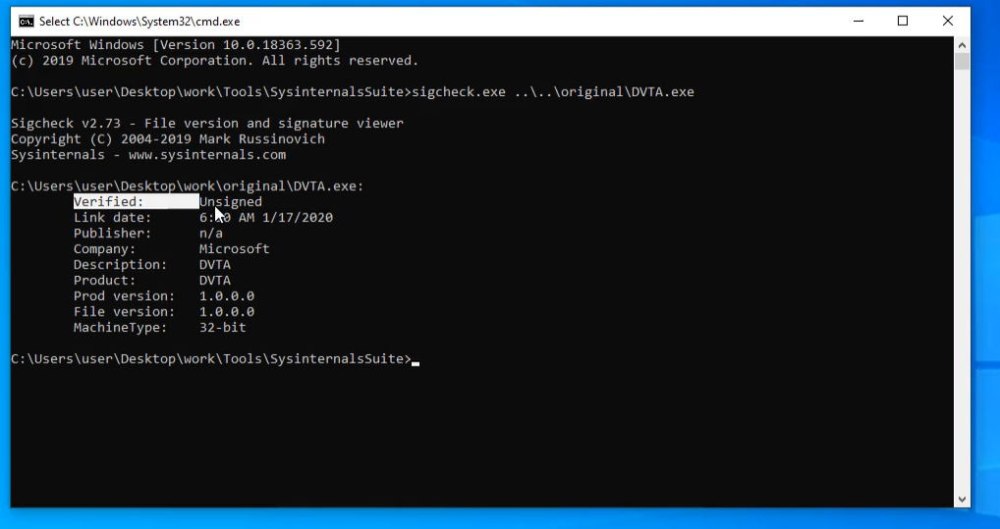

# Common vulnerabilities

!!! abstract "General index of the course"
    - [Tools for pentesting thick client applications](tools-for-thick-apps.md).
    - [Introduction](tca-introduction.md).
    - [Basic lab setup](tca-basic-lab-setup.md).
    - [First challenge: enabling a button](tca-first-challenge.md).
    - [Information gathering phase](tca-information-gathering-phase.md).
    - [Traffic analysis](tca-traffic-analysis.md).
    - [Attacking thick clients applications](tca-attacking-thick-clients-applications.md).
    - [Reversing and patching thick clients applications](tca-reversing-and-patching.md).    
    - [Common vulnerabilities](tca-common-vulnerabilities.md).


## Application Signing

For checking if the application is signed, we use the tool sigcheck, from SysInternals Suite.

From command line we run sigcheck.exe and check if DVTA.exe is signed.




## Compiler protection

We will use the tool binscope, provided by Microsoft. 

Download it from: https://www.microsoft.com/en-us/download/details.aspx?id=44995

Install it by double-clicking on it.

Now from command line:

```
.\binscope.exe /verbose /html /logfile c:/path/to/outputreport.html C:/path/to/application/toAudit/DVTA.exe
```

After executing the command you will obtain a report of some basic checks that binscope run on the application.


## Automated source code scanning

### Visual Code Grepper

Download it from: https://sourceforge.net/projects/visualcodegrepp/

To run a scan:

**1.** Open the application in dotpeek and export it as a visual Studio project. This will export the decompiled code of the application where we indicate. 

**2.** Open Visual Code Grepper. In menu FILE, first option, specify the target directory (where we saved the decompiled files). If error message says that "no files for the specified language", change language in menu Settings (C#).

**3.** Click on menu Scan> Full scan.

