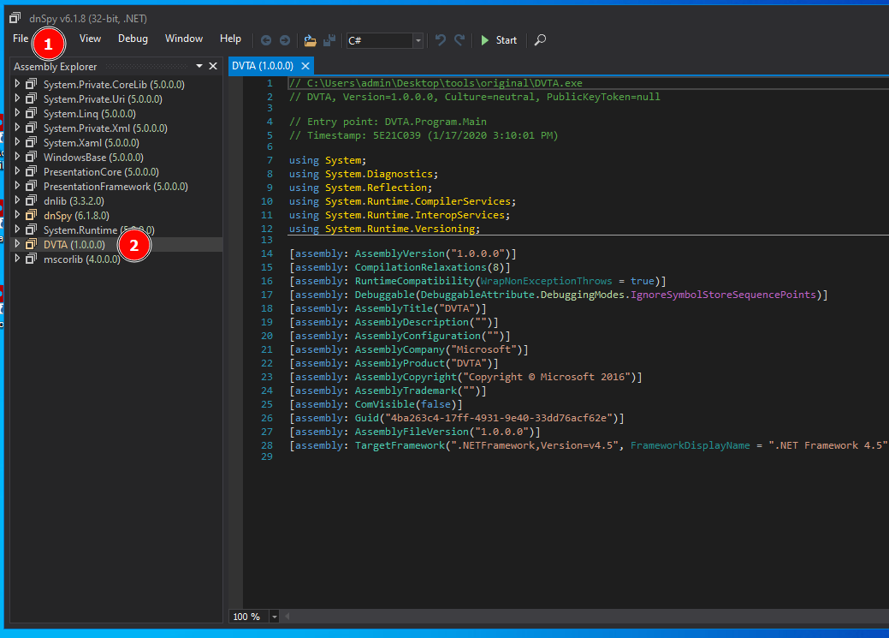
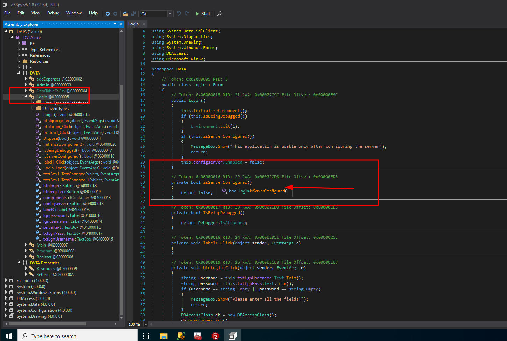
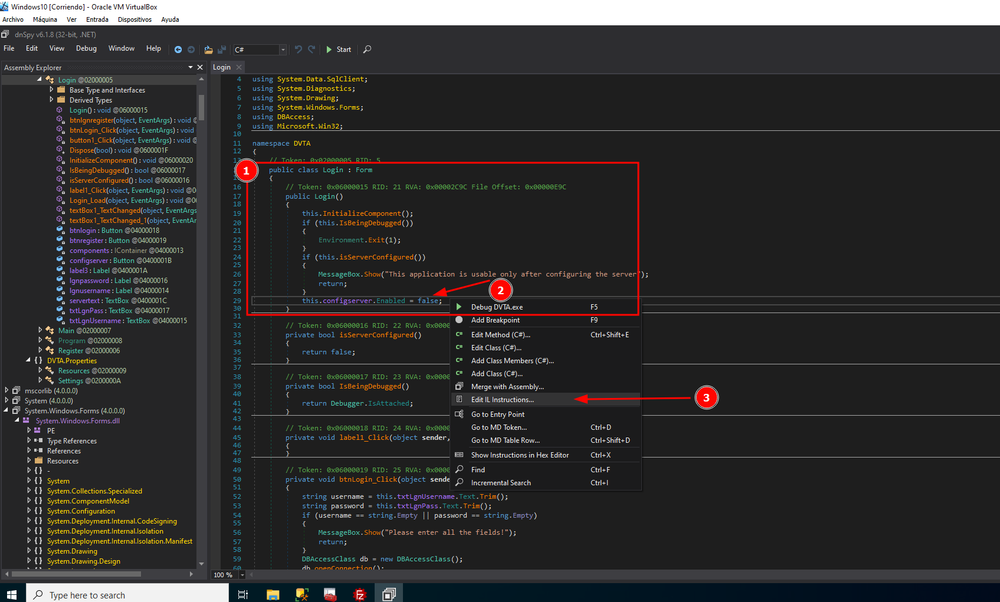
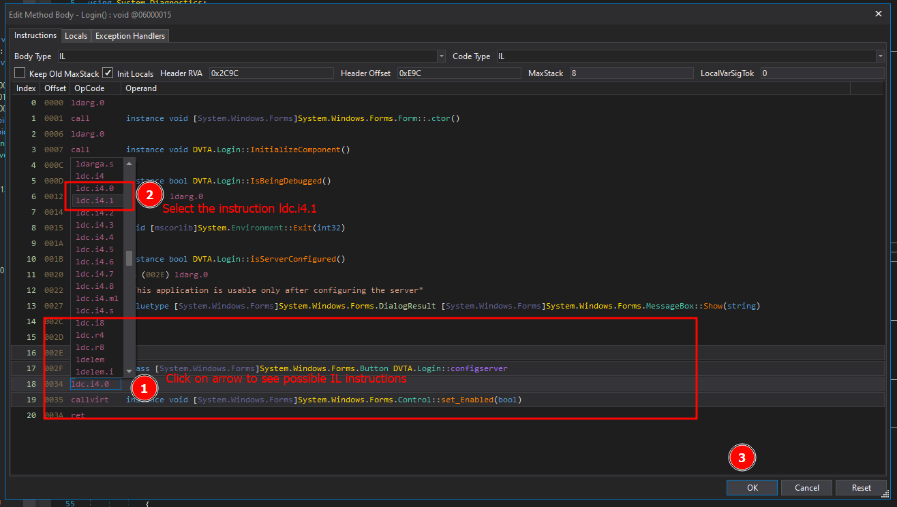
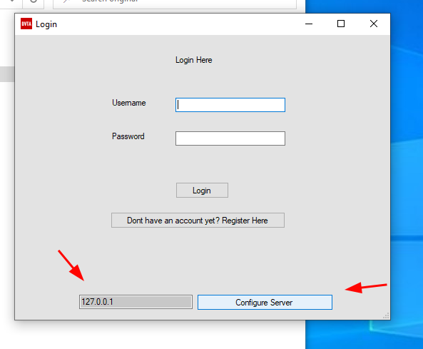

# First challenge: enabling a button

??? abstract "General index of the course"
    - [Introduction](tca-introduction.md)
    - [Basic lab setup](tca-basic-lab-setup.md)
    - [First challenge: enabling a button](tca-first-challenge.md)
    - [Information gathering phase](tca-information-gathering-phase.md).
    - [Traffic analysis](tca-traffic-analysis.md).
    - [Attacking thick clients applications](tca-attacking-thick-clients-applications.md).
    - [Reversing and patching thick clients applications](tca-reversing-and-patching.md)

Setting up the server in the vulnerable app (DVTA)

If we launch the vulnerable app, DVTA, we will check that the button labelled as "Configure Server" is not enable. We will use the tool  [dnspy](../dnspy.md)  to enable that button.

How is it done?

**1.** We will use dnspy 32 bit version, since dvta is a 32 bit app. Open the version 32 bit of dnspy, and go to FILE  > Open > [Select de DVTA.exe file] and you will see it in the sidebar of dnspy:

**2.** Expand DVTA, go to the decompiled object that is being used in the login and read the code. You will see the function isserverConfigured(). Also in the opening tooltip you can read that this function is receiving a BOOLEAN value. 

**3.** Edit the function in IL instructions

**4.**  Modify the value of the boolean in the IL instruction 

**5.** Save the module

**6.** Now when you open the DVTA application the button will be enabled and we will be able to setup the server. Our server is going to be that one of the database that we just configure for our application (127.0.0.1)

If we browse the configuration file (DVTA.exe.Config) we will see that the configuration has taken place:

