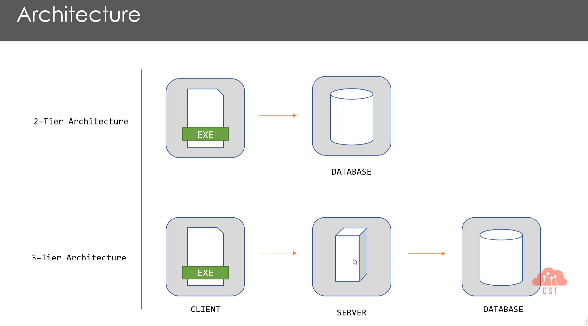

# Introduction to Pentesting Thick Clients Applications

!!! abstract "General index of the course"
    - [Introduction](tca-introduction.md)
    - [Basic lab setup](tca-basic-lab-setup.md)
    - [First challenge: enabling a button](tca-first-challenge.md)
    - [Information gathering phase](tca-information-gathering-phase.md).
    - [Traffic analysis](tca-traffic-analysis.md).
    - [Attacking thick clients applications](tca-attacking-thick-clients-applications.md).
    - [Reversing and patching thick clients applications](tca-reversing-and-patching.md)

Thick clients applications  are the applications that are run as standalone applications on the desktop.  Thick clients have two attack surfaces:

- Static. 
- Dynamic.

They are quite different from web services in the sense that thick applications, most of the tasks are performed at the client end, so these apps heavily depend on client's system resources like CPU, RAM or memory, for instance.

They are usually written in these languages:

- .NET
- C/C++
- Java applets etc
- Native android / IOS mobile applications: Obtictive C, swift 
- and more

They are considered old, but still might be found in some organizations.

## Basic Architecture

- 1-Tier Architecture: It's a standalone application.
- 2-Tier Architecture: EXE/web-based launcher / java-based app + database. Business logic will be in the application. The app directly communicates to the database server. Thinhs to consider when pentesting:  login or registering feature, DB connection, strings, TLS/SSL, Register keys. 
- 3-Tier Architecture: EXE + server + database. Business logic can be move to the server so security findings will be less common. These apps don't have proxy settings in them so for sending traffic to a proxy server, some changes need to be done in the system host file.

## Decompilation tools

+ C++ decompilation: [https://ghidra-sre.org](https://ghidra-sre.org "https://ghidra-sre.org/")
+ JetBrains dotPeek

