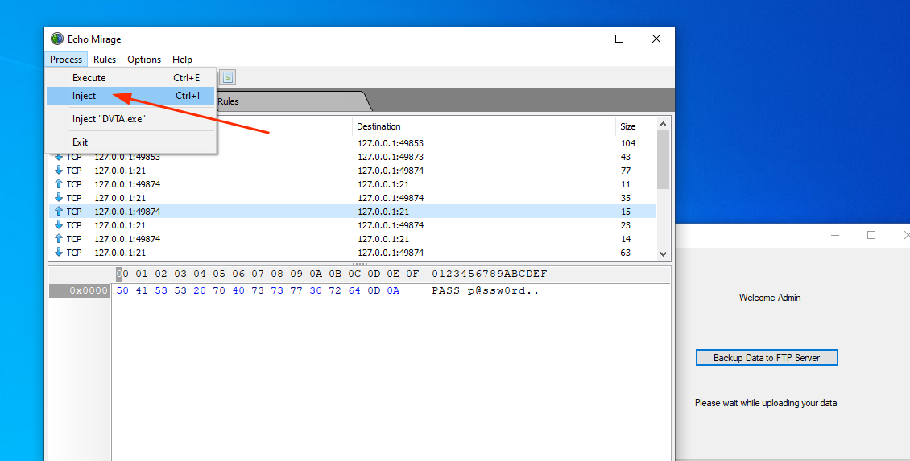
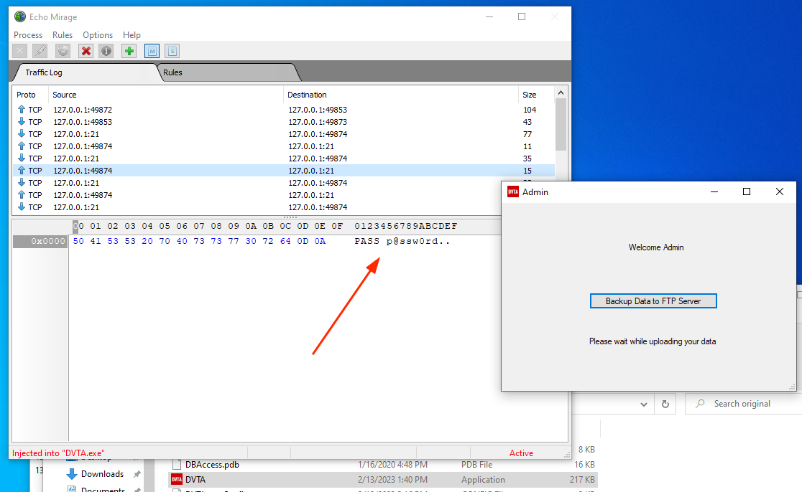
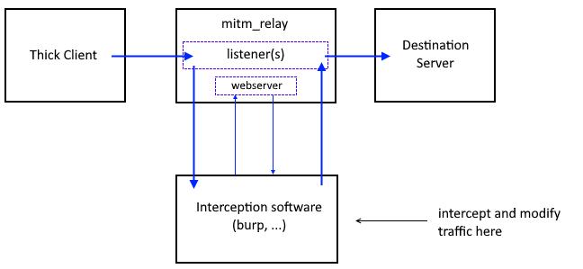
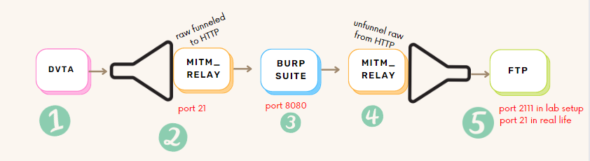
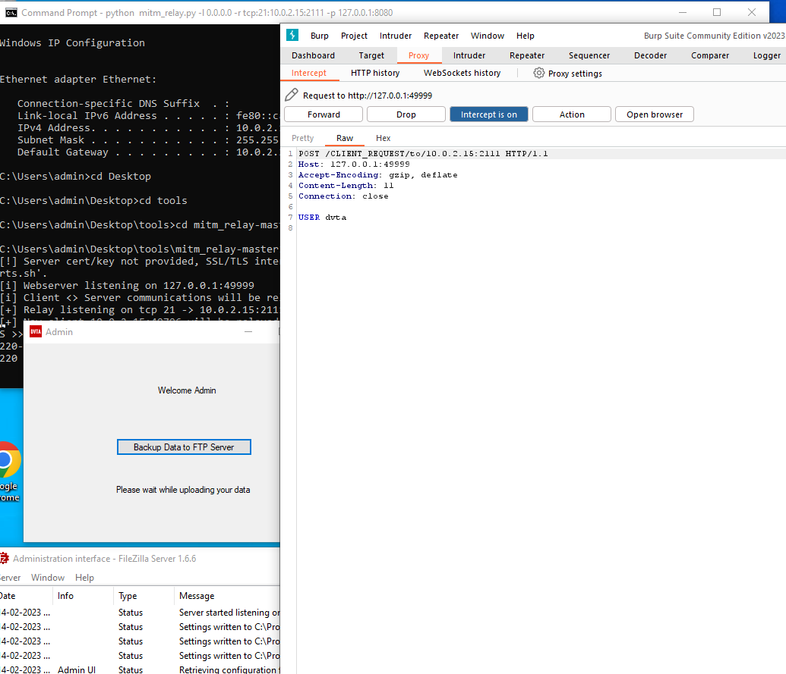

# Traffic analysis - Thick client Applications 

!!! abstract "General index of the course"
    - [Tools for pentesting thick client applications](tools-for-thick-apps.md).
    - [Introduction](tca-introduction.md).
    - [Basic lab setup](tca-basic-lab-setup.md).
    - [First challenge: enabling a button](tca-first-challenge.md).
    - [Information gathering phase](tca-information-gathering-phase.md).
    - [Traffic analysis](tca-traffic-analysis.md).
    - [Attacking thick clients applications](tca-attacking-thick-clients-applications.md).
    - [Reversing and patching thick clients applications](tca-reversing-and-patching.md).    
    - [Common vulnerabilities](tca-common-vulnerabilities.md).


## Tools needed

- [BurpSuite](../burpsuite.md)
- [Echo mirage](../echo-mirage.md), very old and not maintained.
- [mitm_relay](../mitm-relay.md) 
- Wireshark

Difficult part here is when the thick app is not using http/https protocol. In that case, BurpSuite alone is out of consideration and we will need to use:

- wireshark, it's ok if we just want to monitor. 
- [Echo mirage](../echo-mirage.md), very old and not maintained.
- [mitm_relay](../mitm-relay.md) + [BurpSuite](../burpsuite.md).

## Traffic monitoring with Wireshark

**1.** We make sure  that port 21 is listening in the Filezilla Server.


And we start the capture with Wireshark. We will open DVTA with admin credentials and we will click on "Back up Data to the FTP Server". If we filter the capture in wireshark leaving only FTP traffic we will be able to retrieve user and password in plain text:


## Traffic monitoring with Echo mirage

**1.** Open Echo Mirage and add a rule to intercept all inbound and outbound traffic in port 21.

**2.**  In TAB "Process" > Inject, and select the application.



**3.** In the vulnerable app DVTA login as admin and click on action "Backup Data to FTP Server". Now in Echo Mirage you will be intercepting the traffic. This way we can capture USER and PASSWORD:



Also, modifying the payload you will be tampering the request.

## Traffic monitoring with mitm_relay + Burpsuite

In DVTA we will configure the server to the IP of the local machine. In my lab setup, my IP was 10.0.2.15.

In FTP, we will configure the listening port to 2111. Also, we will disable IP check for this lab setup to work.

From [https://github.com/jrmdev/mitm_relay](https://github.com/jrmdev/mitm_relay):




This is what we're doing:



**1.** DVTA application sends traffic to port 21, so to intercept it we configure MITM_relay to be listening on port 21.

**2.** mitm_relay encapsulates the application traffic (no matter the protocol) into HTTP protocol so BurpSuite can read it.

**3.** Burp Suite will read the traffic. And we can tamper here our code.

**4.** mitm_relay will "unfunnel" the traffic from the HTPP protocol into the raw one.

**5.** In a lab setup FTP server will be in the same network, so to not get in conflict with mitm_relay we will modify FTP listen port to 2111. In real life this change is not necessary


Running mitm_relay:

```
python mitm_relay.py -l 0.0.0.0 -r tcp:21:10.0.2.15:2111 -p 127.0.0.1:8080
# -l listening address for mitm_relay (0.0.0.0 means we all listening in all interfaces)
# -r relay configuration: <protocol>:<listeningPort>:<IPofDestinationserver>:<listeningPortonDestinationServer>
# -p Proxy configuration: <IPofProxy>:<portOfProxy> 
```


And this is how the interception looks like:



