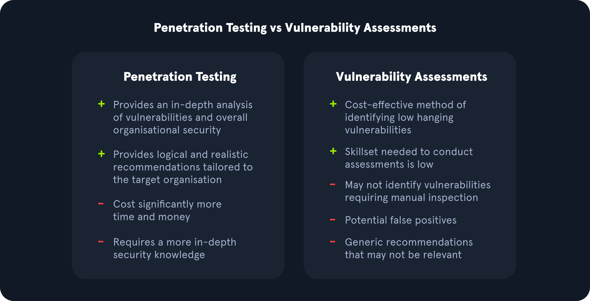
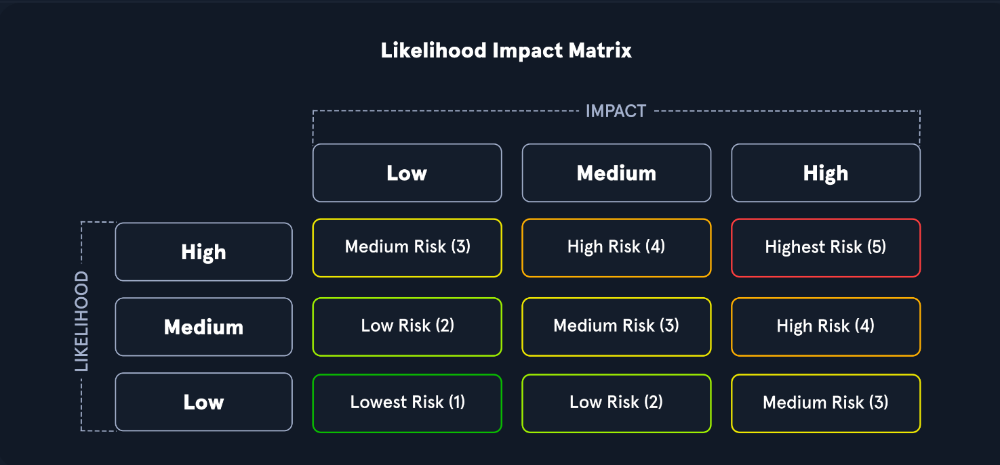

# Vulnerability assessment

## Vulnerability assessment versus pentesting

`Vulnerability Assessments` and Penetration Tests are two completely different assessments. Vulnerability assessments look for vulnerabilities in networks without simulating cyber attacks.

`Penetration tests`, depending on their type, evaluate the security of different assets and the impact of the issues present in the environment. Penetration tests can include manual and automated tactics to assess an organization's security posture. 

### Other Types of Security Assessments

- `Security audits` are typically requirements from outside the organization, and they're typically mandated by `government agencies` or `industry associations` to assure that an organization is compliant with specific security regulations.
- `Bug bounty programs` are implemented by all kinds of organizations. They invite members of the general public, with some restrictions (usually no automated scanning), to find security vulnerabilities in their applications.
- Companies with larger budgets and more resources can hire their own dedicated `red teams` or use the services of third-party consulting firms to perform red team assessments. A red team consists of offensive security professionals who have considerable experience with penetration testing. A red team plays a vital role in an organization's security posture.
- `Purple teams` are formed when `offensive` and `defensive` security specialists work together with a common goal, to improve the security of their network. Red teams find security problems, and blue teams learn about those problems from their red teams and work to fix them.

## Methodology

## Compliance standards

The big compliance players in information security are `PCI`, `HIPAA`, `FISMA`, and `ISO 27001`:

- Payment Card Industry Data Security Standard (PCI DSS).
- Health Insurance Portability and Accountability Act (HIPAA)
- Federal Information Security Management Act (FISMA)
- ISO 27001 is a standard used worldwide to manage information security. The International Organization for Standardization (ISO).

OWASP maintains a few different standards and helpful guides for assessment various technologies:

- [Web Security Testing Guide (WSTG)](https://owasp.org/www-project-web-security-testing-guide/)
- [Mobile Security Testing Guide (MSTG)](https://owasp.org/www-project-mobile-security-testing-guide/)
- [Firmware Security Testing Methodology](https://github.com/scriptingxss/owasp-fstm)

### How to asset a risk

One tool is the [Common Vulnerability Scoring System](cvss-common-vulnerability-scoring-system.md). 

Additionally. we have Common Vulnerabilities and Exposures (CVE), a publicly available catalog of security issues sponsored by the United States Department of Homeland Security (DHS). Each security issue has a unique CVE ID number assigned by the CVE Numbering Authority (CNA).
 

Tools:  [nessus](nessus.md), [openvas](openvas.md) 