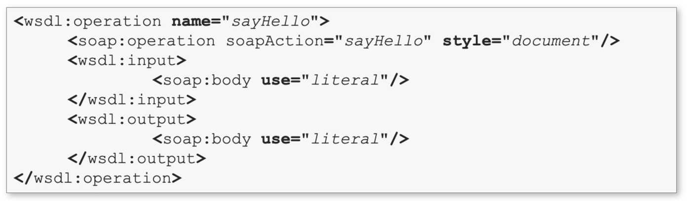
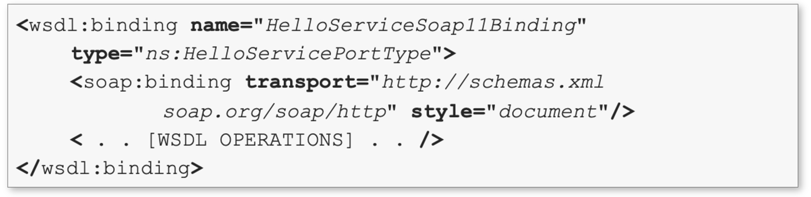
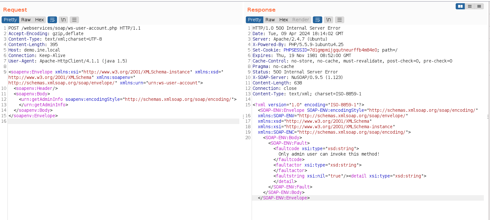
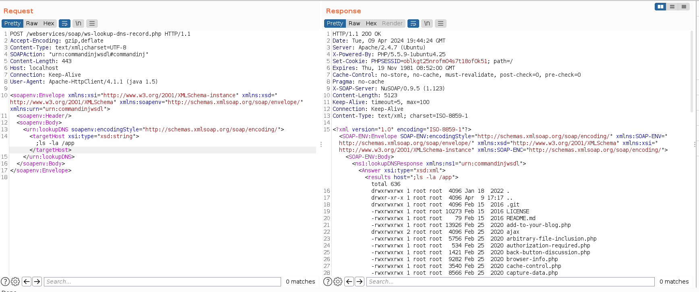
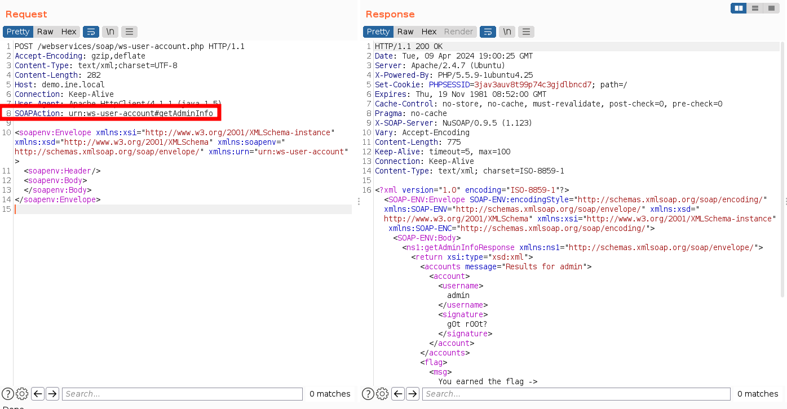

# Pentesting web services
## Web services vs. Web applications

- Interoperability: Web services promote interoperability by providing a standardized way for applications to communicate.  They rely on open standards like HTTP, XML, SOAP, REST, and JSON to ensure compatibility.
- Platform-agnostic: Web services are not tied to a specific  operating system or programming language. They can be  developed in various technologies, making them versatile and accessible.

## Web services vs. APIs

Web services and APIs (Application Programming Interfaces) are related concepts in web development, but they have distinct differences.  Web services are a broader category of technologies used to enable machine-to-machine communication and data exchange over the internet. They encompass various protocols and data  formats. APIs, on the other hand, are a set of rules and tools that allow developers to access the functionality or data of a service, application, or platform.

## Implementation of web services

Web service implementations refer to the different ways in which web services can be created, deployed, and used. There are several methods and technologies  available for implementing web services.

- SOAP (Simple Object Access Protocol): SOAP is a protocol for exchanging structured information in the implementation of web services. SOAP-based web services use XML as their message format and can be implemented using various programming languages.
- JSON-RPC and XML-RPC: JSON-RPC and XML-RPC are lightweight protocols for remote procedure calls (RPC) using JSON or XML, respectively. These are simpler alternatives to SOAP for implementing web services. 
- REST (Representational State Transfer): REST is an architectural style for designing networked applications, and it uses HTTP as its communication protocol.

### XML-RPC

- XML-RPC (Extensible Markup Language - Remote Procedure Call) created in 1998, is a protocol and a set of conventions for encoding and decoding data in XML  format and using it for remote procedure calls (RPC). 
- It is a simple and lightweight protocol for enabling communication between  software applications running on different systems, often over a network like the internet.
- XML-RPC has been used as a precursor to more modern web service protocols like SOAP and REST. 
- It works by sending HTTP requests that call a single method implemented on the remote system.

### JSON-RPC

- JSON-RPC (Remote Procedure Call) is a remote procedure call (RPC) protocol encoded in JSON (JavaScript Object Notation). 
- Like XML-RPC, JSON-RPC enables communication between software components or systems running on different machines or platforms.
- JSON-RPC is known for its simplicity and ease of use and has become popular in web development and microservices architectures.
- JSON-RPC is very similar to XML-RPC, however, it is usually used because it provides much more human-readable messages and takes less data to for communication.
- JSON-RPC allows a client to invoke methods or functions on a remote server by sending a JSON object that specifies the method to call and its parameters.
- The message sent to invoke a method is a request with a single object serialized using JSON. It has three properties:
	- method: name of the method to invoke 
	- params: an array of objects to pass as arguments 
	- id: request ID used to match the responses/requests

### SOAP

SOAP (Simple Object Access Protocol) is a protocol for exchanging structured information in the implementation of web services. It is a protocol that defines a set of rules and conventions for structuring messages, defining remote procedure calls (RPC), and handling communication between software components over a network, typically the internet.

SOAP is seen as the natural successor to XML-RPC and is known for its strong typing and extensive feature set, which includes security, reliability, and transaction support.

SOAP Web Services may also provide a Web Services Definition language (WSDL) declaration that specifies how they may be used or interacted with.

### REST (RESTful APIs)

REST, which stands for Representational State Transfer, is an architectural style for designing networked applications. It is not a protocol or technology itself but rather a set of principles and constraints that guide the design of web services and APIs (Application Programming Interfaces).

REST is widely used for building scalable, stateless, and easy-to-maintain web services/APIs that can be accessed over the internet. REST web services generally use JSON or XML, but any other message transport format like plain-text can be used.

## WSDL Language Fundamentals

WSDL, which stands for Web Services Description Language, is an XML-based language used to describe the functionality and interface of a web service, typically, SOAP-based web services (Simple Object Access Protocol).

Versions: At the time of writing, WSDL can be distinguished in two main versions: 1.1 and 2.0. Although 2.0 is the current version, many web services still use WSDL 1.1.

### The WSDL Document

A WSDL document is typically created to describe a SOAP-based web service. It defines the service's operations, their input and output message structures, and how they are bound to the SOAP protocol. 

First of all, it is important to know that WSDL documents have abstract and concrete definitions:

- Abstract: describes what the service does, such as the operation provided, the input, the output and the fault messages used by each operation 
- Concrete: adds information about how the web service communicates and where the functionality is offered

The WSDL document effectively documents the API provided by the service. The WSDL document serves as a contract between the service provider and consumers. It specifies how clients should construct SOAP requests to interact with the service. This contract defines the operations, their input parameters, and expected responses.

### WSDL components

- Types: The `<types>` section defines the data types used in the web service. It typically includes XML Schema Definitions (XSD) that specify the structure and constraints of input and output data.
- Message: The `<message>` element defines the data structures used in the messages exchanged between the client and the service. Messages can have multiple parts, each with a name and a type definition referencing the types defined in the `<types>` section.
- Port Type: The `<portType>` element describes the operations that the web service supports. Each operation corresponds to a method or function that a client can invoke. It specifies the input and output messages for each operation.
	
	The operation object defined within a port type, represents a specific action that a service can perform. It specifies the name of the operation, the input message structure, the output message structure, and, optionally, fault messages that can occur during the operation.
	
- Binding: The `<binding>`  element specifies how the service operations are bound to a particular protocol, such as SOAP over HTTP. It defines details like the protocol, message encoding, and endpoint addresses.
	
- Service: The `<service>` element provides information about the service itself. It includes the service's name and its endpoint address, which is the URL where clients can access the service.

Instead of portType, WSDL v. 2.0 uses interface elements which define a set of operations representing an interaction between the client and the service. Each operation specifies the types of messages that the service can send or receive. 

Unlike the old portType, interface elements do not point to messages anymore (it does not exist in v. 2.0). Instead, they point to the schema elements contained within the types element

## Web Service Security Testing

Web service security testing is the process of evaluating the security of web services to identify vulnerabilities, weaknesses, and potential threats that could compromise the confidentiality, integrity, or availability of the service or its data.

### Information Gathering and Analysis

**1.** Identify the SOAP web services that need to be tested. 

**2.** Identify the WSDL file for the SOAP web service. 

Once the SOAP service has been identified, a way to discover WSDL files is by appending ?wsdl,.wsdl, ?disco or wsdl.aspx to the end of the service URL:

**3.** With WSDL document identified we may gather information about the web service endpoints, operations, and data exchanged. 

**4.** Understand the security requirements, authentication methods, and authorization mechanisms in place. 

### Authentication and Authorization Testing

**Invoke hidden methods**

- Test the authentication mechanisms in place (e.g., username/password, tokens) to ensure they prevent unauthorized access. 
- Verify that users are correctly authenticated and authorized to access specific operations and resources. 
- Input Validation Testing: 
	- Test for input validation vulnerabilities, such as SQL injection, cross-site scripting (XSS), and XML-based attacks. 

- Send malicious input data to the web service's input parameters to identify potential security weaknesses. For instance, command injection attacks:

### The SOAPAction header

The SOAPAction header is a transport protocol header (either HTTP or JMS). It is transmitted with SOAP messages, and provides information about the intention of the web service request, to the service. The WSDL interface for a web service defines the SOAPAction header value used for each operation. Some web service implementations use the SOAPAction header to determine behavior.

