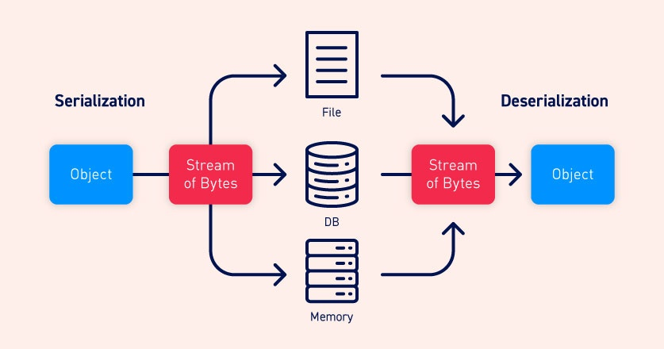

# Insecure deserialization

## What is deserialization

**Serialization** is the process of converting complex data structures, such as objects and their fields, into a "flatter" format that can be sent and received as a sequential stream of bytes.

**Deserialization** is the process of restoring this byte stream to a fully functional replica of the original object, in the exact state as when it was serialized.



 Exactly how objects are serialized depends on the language. Some languages serialize objects into binary formats, whereas others use different string formats, with varying degrees of human readability.  Note that all of the original object's attributes are stored in the serialized data stream, including any private fields. To prevent a field from being serialized, it must be explicitly marked as "transient" in the class declaration.
 
Insecure deserialization is when user-controllable data is deserialized by a website. This potentially enables an attacker to manipulate serialized objects in order to pass harmful data into the application code.

## Identifying 

### PHP

PHP uses a mostly human-readable string format, with letters representing the data type and numbers representing the length of each entry. 

For example, consider a `User` object with the attributes:

`$user->name = "carlos"; $user->isLoggedIn = true;`

When serialized, this object may look something like this:

`O:4:"User":2:{s:4:"name":s:6:"carlos"; s:10:"isLoggedIn":b:1;}`

```
- `O:4:"User"` - An object with the 4-character class name `"User"`
- `2` - the object has 2 attributes
- `s:4:"name"` - The key of the first attribute is the 4-character string `"name"`
- `s:6:"carlos"` - The value of the first attribute is the 6-character string `"carlos"`
- `s:10:"isLoggedIn"` - The key of the second attribute is the 10-character string `"isLoggedIn"`
- `b:1` - The value of the second attribute is the boolean value `true`
```

The native methods for PHP serialization are `serialize()` and `unserialize()`. If you have source code access, you should start by looking for `unserialize()` anywhere in the code and investigating further.

### Java

Some languages, such as Java, use binary serialization formats.

To distinguish it: serialized Java objects always begin with the same bytes, which are encoded as `ac ed` in hexadecimal and `rO0` in Base64.

Any class that implements the interface `java.io.Serializable` can be serialized and deserialized.

If you have source code access, take note of any code that uses the `readObject()` method, which is used to read and deserialize data from an `InputStream`.

##  Attacks
### 1. Manipulate serialized objects

If you have source code access, take note of any code that uses the `readObject()` method, which is used to read and deserialize data from an `InputStream`.

As a simple example, consider a website that uses a serialized `User` object to store data about a user's session in a cookie. If an attacker spotted this serialized object in an HTTP request, they might decode it to find the following byte stream:

`O:4:"User":2:{s:8:"username";s:6:"carlos";s:7:"isAdmin";b:0;}`

The `isAdmin` attribute is an obvious point of interest. An attacker could simply change the boolean value of the attribute to `1` (true), re-encode the object, and overwrite their current cookie with this modified value. In isolation, this has no effect. However, let's say the website uses this cookie to check whether the current user has access to certain administrative functionality:

```
$user = unserialize($_COOKIE); 
if ($user->isAdmin === true)
{ // allow access to admin interface }
```

This vulnerable code would instantiate a `User` object based on the data from the cookie, including the attacker-modified `isAdmin` attribute. At no point is the authenticity of the serialized object checked. This data is then passed into the conditional statement and, in this case, would allow for an easy privilege escalation.

??? example "Burpsuite lab"
    []()

### 2. Modify data types

PHP-based logic is particularly vulnerable to this kind of manipulation due to the behavior of its loose comparison operator (`==`) when comparing different data types.

**Reference**:  [PHP type juggling](php-type-juggling-vulnerabilities.md)

Additionally, if we spot a session cookie base64-encoded with an object, such as this PHP one, we can try to modify it. 


```
Cookie: session=Tzo0OiJVc2VyIjoyOntzOjg6InVzZXJuYW1lIjtzOjY6IndpZW5lciI7czoxMjoiYWNjZXNzX3Rva2VuIjtzOjMyOiJieno5ZmJ2OHV6YXM3MTRlcnJuaGExcTVwcGJ6eWY1aCI7fQ%3d%3d
```

Decoded from base64

```
O:4:"User":2:{s:8:"username";s:6:"wiener";s:12:"access_token";s:32:"bzz9fbv8uzas714errnha1q5ppbzyf5h";}
```

`s` refers to string, and `i` to integer. We could modify the input and the data type modifying the object to: 

```
O:4:"User":2:{s:8:"username";s:13:"administrator";s:12:"access_token";i:0:"";}
```

Afterwards, base64 encode the object to insert it as the cookie session:

```
Cookie: session=Tzo0OiJVc2VyIjoyOntzOjg6InVzZXJuYW1lIjtzOjEzOiJhZG1pbmlzdHJhdG9yIjtzOjEyOiJhY2Nlc3NfdG9rZW4iO2k6MDoiIjt9
```

> *Explanation*:  Let's say an attacker modified the password attribute so that it contained the integer `0` instead of the expected string. As long as the stored password does not start with a number, the condition would always return `true`, enabling an authentication bypass. Note that this is only possible because deserialization preserves the data type. If the code fetched the password from the request directly, the `0` would be converted to a string and the condition would evaluate to `false`.


??? example "Burpsuite lab"
    []()

### 3. Abuse application functionality

A website's functionality might also perform dangerous operations on data from a deserialized object. In this case, you can use insecure deserialization to pass in unexpected data and leverage the related functionality to do damage.

For example, as part of a website's "Delete user" functionality, the user's profile picture is deleted by accessing the file path in the `$user->image_location` attribute. If this `$user` was created from a serialized object, an attacker could exploit this by passing in a modified object with the `image_location` set to an arbitrary file path.


??? example "Burpsuite lab"
    []()

### 4. Magic methods

Magic methods are a special subset of methods that are invoked automatically whenever a particular event or scenario occurs.  One of the most common examples in PHP is `__construct()`, which is invoked whenever an object of the class is instantiated, similar to Python's `__init__`. Typically, constructor magic methods like this contain code to initialize the attributes of the instance. However, magic methods can be customized by developers to execute any code they want.

**PHP** -> Most importantly in this context, some languages have magic methods that are invoked automatically **during** the deserialization process. For example, PHP's `unserialize()` method looks for and invokes an object's `__wakeup()` magic method.

**JAVA** -> In Java deserialization, the same applies to the `ObjectInputStream.readObject()` method, which is used to read data from the initial byte stream and essentially acts like a constructor for "re-initializing" a serialized object. However, `Serializable` classes can also declare their own `readObject()` method as follows:

```
private void readObject(ObjectInputStream in) throws IOException, ClassNotFoundException 
{ 
    // implementation 
}
```

A `readObject()` method declared in exactly this way acts as a magic method that is invoked during deserialization. This allows the class to control the deserialization of its own fields more closely.

You should pay close attention to any classes that contain these types of magic methods. They allow you to pass data from a serialized object into the website's code before the object is fully deserialized. This is the starting point for creating more advanced exploits.

### 5. Inject arbitrary objects

 The methods available to an object are determined by its class. Deserialization methods do not typically check what they are deserializing. This means that you can pass in objects of any serializable class that is available to the website, and the object will be deserialized.
 
 The fact that this object is not of the expected class does not matter. The unexpected object type might cause an exception in the application logic, but the malicious object will already be instantiated by then.

??? example "Burpsuite lab"
    []()


### 6. Gadget chains

Classes containing these deserialization magic methods can also be used to initiate more complex attacks involving a long series of method invocations, known as a "gadget chain".

A "gadget" is a snippet of code that exists in the application that can help an attacker to achieve a particular goal. An individual gadget may not directly do anything harmful with user input. However, the attacker's goal might simply be to invoke a method that will pass their input into another gadget. By chaining multiple gadgets together in this way, an attacker can potentially pass their input into a dangerous "sink gadget", where it can cause maximum damage.

**Java**: [ysoserial](../ysoserial.md)
