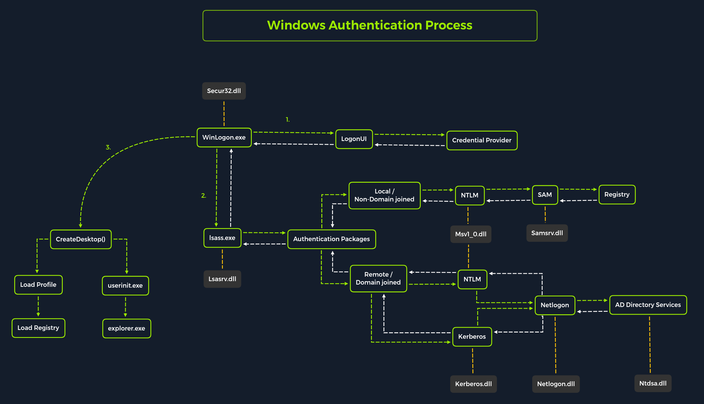

# Windows credentials storage

[Microsoft documentation](https://learn.microsoft.com/en-us/windows-server/security/windows-authentication/credentials-processes-in-windows-authentication).

## How login happens

The Local Security Authority (LSA) is a protected subsystem that authenticates users and logs them into the local computer.


Source: HackTheBox Academy. Module Password attacks.

### LSASS

Local Security Authority Subsystem Service (LSASS) is a collection of many modules and has access to all authentication processes that can be found in `%SystemRoot%\System32\Lsass.exe`. This service is responsible for the local system security policy, user authentication, and sending security audit logs to the Event log.

The LSA has the following components:

_Netlogon.dll_ . The Net Logon service. Net Logon maintains the computer's secure channel to a domain controller. It passes the user's credentials through a secure channel to the domain controller and returns the domain security identifiers and user rights for the user. In Windows 2000, the Net Logon service uses DNS to resolve names to the Internet Protocol (IP) addresses of domain controllers. Net Logon is the replication protocol for Microsoft® Windows NT® version 4.0 primary domain controllers and backup domain controllers.

_Msv1_0.dll_ . The NTLM authentication protocol. This protocol authenticates clients that do not use Kerberos authentication.

_Schannel.dll_ . The Secure Sockets Layer (SSL) authentication protocol. This protocol provides authentication over an encrypted channel instead of a less-secure clear channel.

_Kerberos.dll_ . The Kerberos v5 authentication protocol.

_Kdcsvc.dll_ . The Kerberos Key Distribution Center (KDC) service, which is responsible for granting ticket-granting tickets to clients.

_Lsasrv.dll_ . The LSA server service, which enforces security policies.

_Samsrv.dll_ . The Security Accounts Manager (SAM), which stores local security accounts, enforces locally stored policies, and supports APIs.

_Ntdsa.dll_ . The directory service module, which supports the Windows 2000 replication protocol and Lightweight Directory Access Protocol (LDAP), and manages partitions of data.

_Secur32.dll_ . The multiple authentication provider that holds all of the components together.

Upon initial logon, LSASS will:

- Cache credentials locally in memory
- Create [access tokens](https://docs.microsoft.com/en-us/windows/win32/secauthz/access-tokens)
- Enforce security policies
- Write to Windows [security log](https://docs.microsoft.com/en-us/windows/win32/eventlog/event-logging-security)

### GINA

Each interactive logon session creates a separate instance of the Winlogon service. The Graphical Identification and Authentication (GINA) architecture is loaded into the process area used by Winlogon, receives and processes the credentials, and invokes the authentication interfaces via the LSALogonUser function.

### SAM Database

The [Security Account Manager](https://docs.microsoft.com/en-us/previous-versions/windows/it-pro/windows-server-2003/cc756748(v=ws.10)?redirectedfrom=MSDN) (`SAM`) is a database file in Windows operating systems that stores users' passwords. It can be used to authenticate local and remote users. User passwords are stored in a hash format in a registry structure as either an `LM` hash or an `NTLM` hash. This file is located in `%SystemRoot%/system32/config/SAM` and is mounted on HKLM/SAM. 

SYSTEM level permissions are required to view it.

Windows systems can be assigned to either a workgroup or domain during setup. If the system has been assigned to a workgroup, it handles the SAM database locally and stores all existing users locally in this database. However, if the system has been joined to a domain, the Domain Controller (`DC`) must validate the credentials from the Active Directory database (`ntds.dit`), which is stored in `%SystemRoot%\ntds.dit`.

Microsoft introduced a security feature in Windows NT 4.0 to help improve the security of the SAM database against offline software cracking. This is the SYSKEY (syskey.exe) feature, which, when enabled, partially encrypts the hard disk copy of the SAM file so that the password hash values for all local accounts stored in the SAM are encrypted with a key.

Credential Manager is a feature built-in to all Windows operating systems that allows users to save the credentials they use to access various network resources and websites. Saved credentials are stored based on user profiles in each user's `Credential Locker`. Credentials are encrypted and stored at the following location:

```powershell-session
PS C:\Users\[Username]\AppData\Local\Microsoft\[Vault/Credentials]\
```

### Domain Controllers

Each Domain Controller hosts a file called `NTDS.dit` that is kept synchronized across all Domain Controllers with the exception of [Read-Only Domain Controllers](https://docs.microsoft.com/en-us/windows/win32/ad/rodc-and-active-directory-schema). NTDS.dit is a database file that stores the data in Active Directory, including but not limited to:

- User accounts (username & password hash)
- Group accounts
- Computer accounts
- Group policy objects


## Tools for dumping credentials

- [CrackMapExec](crackmapexec.md).
- [John The Ripper](john-the-ripper.md).
- [Hydra](hydra.md).
- [Metasploit](metasploit.md).
- [Mimikatz](mimikatz.md).
- [pypykatz](pypykatz.md).
- [Lazagne](lazagne.md).

#### findstr

We can also use [findstr](https://docs.microsoft.com/en-us/windows-server/administration/windows-commands/findstr) to search from patterns across many types of files.

```cmd-session
C:\> findstr /SIM /C:"password" *.txt *.ini *.cfg *.config *.xml *.git *.ps1 *.yml
```