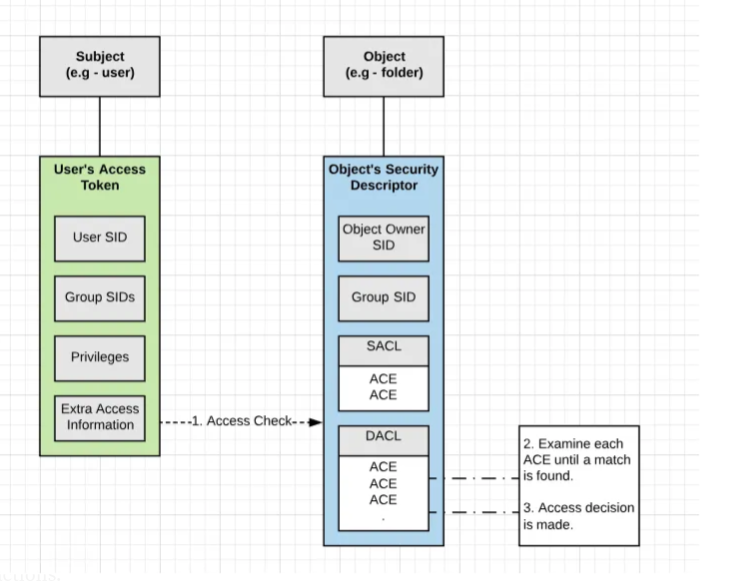

# Windows User Privileges


??? abstract "Resources"
	- [Scripts for enabling privileges](https://github.com/amandaguglieri/Privescalation/tree/main/EnablePrivilegeScripts).
	- [Tools for exploiting Enabled privileges](https://github.com/amandaguglieri/Privescalation/tree/main/tools).


## What are my privileges?


```powershell
whoami /priv
whoami /groups
whoam /all
```

--- 

## Enumerating User privileges vulns with PrivescCheck 

Quickly identify common Windows **vulnerabilities** and **configuration issues** that are not necessarily covered by public security standards, and collect useful information for exploitation and post-exploitation tasks.

>See the [latest release](https://github.com/itm4n/PrivescCheck/releases/latest/)-  Download the script here: [PrivescCheck.ps1](https://github.com/itm4n/PrivescCheck/releases/latest/download/PrivescCheck.ps1) 

Run:

```powershell
powershell -ep bypass -c ". .\PrivescCheck.ps1; Invoke-PrivescCheck"
```


---

## Enabling privileges: well-known scripts 

My own recap of well known scripts: [https://github.com/amandaguglieri/Privescalation/tree/main/EnablePrivilegeScripts](https://github.com/amandaguglieri/Privescalation/tree/main/EnablePrivilegeScripts)


---

## Abusing User privileges 

Depending on group membership, and other factors such as privileges assigned via domain and local Group Policy, users can have various rights assigned to their account. 

| Setting [Constant](https://docs.microsoft.com/en-us/windows/win32/secauthz/privilege-constants) | Description                                                                                                                                                                                                                                                                                                                                                                                                                                                                                                                                                                                                                          | Explotation                                                                                                                                                                                                                                                                                                                                                                  |
| ----------------------------------------------------------------------------------------------- | ------------------------------------------------------------------------------------------------------------------------------------------------------------------------------------------------------------------------------------------------------------------------------------------------------------------------------------------------------------------------------------------------------------------------------------------------------------------------------------------------------------------------------------------------------------------------------------------------------------------------------------ | ---------------------------------------------------------------------------------------------------------------------------------------------------------------------------------------------------------------------------------------------------------------------------------------------------------------------------------------------------------------------------- |
| SeAssignPrimaryToken                                                                            | In Windows, every process has a token that has information about the account that is running it. These tokens are not considered secure resources, as they are just locations within memory. To utilize the token, the `SeImpersonate` privilege is needed.  It is only given to administrative accounts.                                                                                                                                                                                                                                                                                                                            | <br><br>[Abusing seimpersonateprivilege](seimpersonateprivilege.md)                                                                                                                                                                                                                                                                                                          |
| SeBackupPrivilege                                                                               |                                                                                                                                                                                                                                                                                                                                                                                                                                                                                                                                                                                                                                      | [Abusing SeBackupPrivilege](seBackupPrivilege.md)                                                                                                                                                                                                                                                                                                                            |
| SeDebugPrivilege                                                                                |                                                                                                                                                                                                                                                                                                                                                                                                                                                                                                                                                                                                                                      | <br><br>[Abusing SeDebugPrivilege](sedebugprivilege.md).                                                                                                                                                                                                                                                                                                                     |
| SeImpersonatePrivilege                                                                          | This privilege can be used to capture sensitive information from system memory, or access/modify kernel and application structures. A user might be assigned the SeDebugPrivilege without belonging to the administrators group.                                                                                                                                                                                                                                                                                                                                                                                                     | In Windows, every process has a token that has information about the account that is running it. These tokens are not considered secure resources, as they are just locations within memory. To utilize the token, the `SeImpersonate` privilege is needed.  It is only given to administrative accounts.<br><br>[Abusing seimpersonateprivilege](seimpersonateprivilege.md) |
| SeLoadDriverPrivilege                                                                           | [Print Operators](https://docs.microsoft.com/en-us/windows/security/identity-protection/access-control/active-directory-security-groups#print-operators) is another highly privileged group, which grants its members the `SeLoadDriverPrivilege`, rights to manage, create, share, and delete printers connected to a Domain Controller, as well as the ability to log on locally to a Domain Controller and shut it down.<br>!!! tip "Note"<br>	Note: Since Windows 10 Version 1803, the "SeLoadDriverPrivilege" is not exploitable, as it is no longer possible to include references to registry keys under "HKEY_CURRENT_USER". | [Abusing SeLoadDriverPrivilege](seloaddriverprivilege.md).                                                                                                                                                                                                                                                                                                                   |
| SeManageVolume                                                                                  |                                                                                                                                                                                                                                                                                                                                                                                                                                                                                                                                                                                                                                      | [Abusing SeManageVolume](semanagevolumeprivilege.md).                                                                                                                                                                                                                                                                                                                        |
| SeNetworkLogonRight                                                                             | Administrators, Authenticated Users                                                                                                                                                                                                                                                                                                                                                                                                                                                                                                                                                                                                  |                                                                                                                                                                                                                                                                                                                                                                              |
| SeRemoteInteractiveLogonRight                                                                   | Administrators, Remote Desktop Users                                                                                                                                                                                                                                                                                                                                                                                                                                                                                                                                                                                                 |                                                                                                                                                                                                                                                                                                                                                                              |
| SeRestorePrivilege                                                                              | Administrators                                                                                                                                                                                                                                                                                                                                                                                                                                                                                                                                                                                                                       | [Abusing SeRestorePrivilege](serestoreprivilege.md).                                                                                                                                                                                                                                                                                                                         |
| SeSecurityPrivilege                                                                             | Administrators                                                                                                                                                                                                                                                                                                                                                                                                                                                                                                                                                                                                                       |                                                                                                                                                                                                                                                                                                                                                                              |
| SeTakeOwnershipPrivilege                                                                        | [SeTakeOwnershipPrivilege](https://docs.microsoft.com/en-us/windows/security/threat-protection/security-policy-settings/take-ownership-of-files-or-other-objects) grants a user the ability to take ownership of any "securable object," meaning Active Directory objects, NTFS files/folders, printers, registry keys, services, and processes. This privilege assigns [WRITE_OWNER](https://docs.microsoft.com/en-us/windows/win32/secauthz/standard-access-rights) rights over an object, meaning the user can change the owner within the object's security descriptor.                                                          | [Abusing SeTakeOwnershipPrivilege](setakeownershipprivilege.md).                                                                                                                                                                                                                                                                                                             |
| SeTcbPrivilege                                                                                  |                                                                                                                                                                                                                                                                                                                                                                                                                                                                                                                                                                                                                                      | [Abusing SeTcbPrivilege](setcbprivilege.md).                                                                                                                                                                                                                                                                                                                                 |


---


## C++ tools for abusing user privileges


Example with the  [https://github.com/amandaguglieri/Privescalation/tree/main/EnablePrivilegeScripts/enable-priv-tools](https://github.com/amandaguglieri/Privescalation/tree/main/EnablePrivilegeScripts/enable-priv-tools) where I have cloned the awesome work of https://github.com/3gstudent.

Compile `EnableSeLoadDriverPrivilege.exe` . I've set up Visual Studio 2022 in a Windows Virtual Machine. 

```
# Go to https://github.com/amandaguglieri/Privescalation/tree/main/tools/enabling-privileges and access to the .cpp files. In the case of EnableSeLoadDriverPrivilege.cpp, download it


# Add the following libraries to the EnableSeLoadDriverPrivilege.cpp file
#include <windows.h>
#include <assert.h>
#include <winternl.h>
#include <sddl.h>
#pragma comment(lib,"advapi32.lib") 
#pragma comment(lib,"user32.lib") 
#pragma comment(lib,"Ntdll.lib")
#include <stdio.h>
#include "tchar.h"

# Now, from the terminal (CTRL+ñ), compile:
cl /DUNICODE /D_UNICODE EnableSeLoadDriverPrivilege.cpp
# This will generate the required EnableSeLoadDriverPrivilege.exe. Save it to the folder from where you want to serve the payload to the target host.
```


## Windows Authorization Process

**Windows Authorization Process in a nugshell:**  the process started when a user attempts to access a securable object such as a folder on a file share. During this process, the user's access token (including their user SID, SIDs for any groups they are members of, privilege list, and other access information) is compared against [Access Control Entries (ACEs)](https://docs.microsoft.com/en-us/windows/win32/secauthz/access-control-entries) within the object's [security descriptor](https://docs.microsoft.com/en-us/windows/win32/secauthz/security-descriptors) (which contains security information about a securable object such as access rights (discussed below) granted to users or groups). Once this comparison is complete, a decision is made to either grant or deny access. This entire process happens almost instantaneously whenever a user tries to access a resource on a Windows host. As part of our enumeration and privilege escalation activities, we attempt to use and abuse access rights and leverage or insert ourselves into this authorization process to further our access towards our goal.




### Rights and Privileges in Windows

| **Group**                   | **Description**                                                                                                                                                                                                                                                                                                                                                                                    |
| --------------------------- | -------------------------------------------------------------------------------------------------------------------------------------------------------------------------------------------------------------------------------------------------------------------------------------------------------------------------------------------------------------------------------------------------- |
| Default Administrators      | Domain Admins and Enterprise Admins are "super" groups.                                                                                                                                                                                                                                                                                                                                            |
| Server Operators            | Members can modify services, access SMB shares, and backup files.                                                                                                                                                                                                                                                                                                                                  |
| Backup Operators            | Members are allowed to log onto DCs locally and should be considered Domain Admins. They can make shadow copies of the SAM/NTDS database, read the registry remotely, and access the file system on the DC via SMB. This group is sometimes added to the local Backup Operators group on non-DCs.                                                                                                  |
| Print Operators             | Members can log on to DCs locally and "trick" Windows into loading a malicious driver.                                                                                                                                                                                                                                                                                                             |
| Hyper-V Administrators      | If there are virtual DCs, any virtualization admins, such as members of Hyper-V Administrators, should be considered Domain Admins.                                                                                                                                                                                                                                                                |
| Account Operators           | Members can modify non-protected accounts and groups in the domain.                                                                                                                                                                                                                                                                                                                                |
| Remote Desktop Users        | Members are not given any useful permissions by default but are often granted additional rights such as `Allow Login Through Remote Desktop Services` and can move laterally using the RDP protocol.                                                                                                                                                                                               |
| Remote Management Users     | Members can log on to DCs with PSRemoting (This group is sometimes added to the local remote management group on non-DCs).                                                                                                                                                                                                                                                                         |
| Group Policy Creator Owners | Members can create new GPOs but would need to be delegated additional permissions to link GPOs to a container such as a domain or OU.                                                                                                                                                                                                                                                              |
| Schema Admins               | Members can modify the Active Directory schema structure and backdoor any to-be-created Group/GPO by adding a compromised account to the default object ACL.                                                                                                                                                                                                                                       |
| DNS Admins                  | Members can load a DLL on a DC, but do not have the necessary permissions to restart the DNS server. They can load a malicious DLL and wait for a reboot as a persistence mechanism. Loading a DLL will often result in the service crashing. A more reliable way to exploit this group is to [create a W](https://web.archive.org/web/20231115070425/https://cube0x0.github.io/Pocing-Beyond-DA/) |


### Detection

By logging event [4672: Special privileges assigned to new logon](https://docs.microsoft.com/en-us/windows/security/threat-protection/auditing/event-4672) which will generate an event if certain sensitive privileges are assigned to a new logon session. This can be fine-tuned in many ways, such as by monitoring privileges that should _never_ be assigned or those that should only ever be assigned to specific accounts.

### Other resources

- [Windows Privilege Abuse: Auditing, Detection, and Defense](https://blog.palantir.com/windows-privilege-abuse-auditing-detection-and-defense-3078a403d74e)


