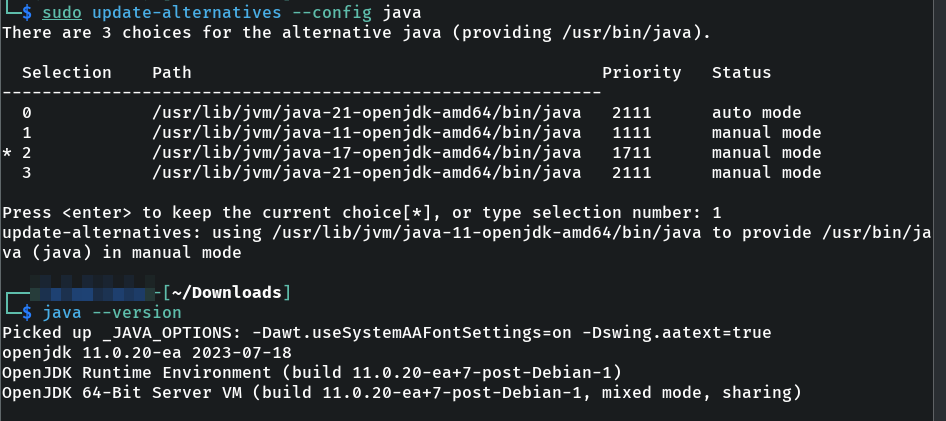

# ysoserial - A tool for Java deserialization


## Installation

Repository: https://github.com/frohoff/ysoserial

```
git clone https://github.com/frohoff/ysoserial.git
```

Requires Java 1.7+ and Maven 3.x+

```
sudo apt-get install maven
```


As ysoserial presented some issues with java 21 version, be sure of your version

```
java --version
```

Check your installations:

```
sudo update-alternatives --config java
```

Results:

```
  Selection    Path                                         Priority   Status
------------------------------------------------------------
* 0            /usr/lib/jvm/java-21-openjdk-amd64/bin/java   2111      auto mode
  1            /usr/lib/jvm/java-17-openjdk-amd64/bin/java   1711      manual mode
  2            /usr/lib/jvm/java-21-openjdk-amd64/bin/java   2111      manual mode
```


Download Java 11:

```
sudo apt-get install openjdk-11-jdk 
```

Run again

```
sudo update-alternatives --config java
```

And select the new installation. Then check out java version:



Additional debugging: [Java not found in “update-alternatives — config java” after installing java on linux](https://irsyadsec.medium.com/java-not-found-in-update-alternatives-config-java-after-installing-java-on-linux-d88e499e5c4f)


After using ysoserial you may reconfigure to use your latest java version.

Build the app:

```
mvn clean package -DskipTests
```


## Basic usage


```
java -jar ysoserial-all.jar [payload] "[command]"
```

See lab: [Burpsuite Lab](burpsuite/burpsuite-insecure-deserialization.md#exploiting-java-deserialization-with-apache-commons)


In Java versions 16 and above, you need to set a series of command-line arguments for Java to run ysoserial. For example:

```
java -jar ysoserial-all.jar \ --add-opens=java.xml/com.sun.org.apache.xalan.internal.xsltc.trax=ALL-UNNAMED \ --add-opens=java.xml/com.sun.org.apache.xalan.internal.xsltc.runtime=ALL-UNNAMED \ --add-opens=java.base/java.net=ALL-UNNAMED \ --add-opens=java.base/java.util=ALL-UNNAMED \ [payload] '[command]'
```


